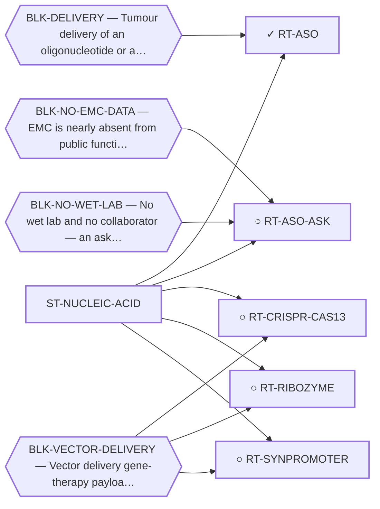

<!-- GENERATED FILE — DO NOT EDIT. Regenerate with:
     python3 systems/systems_check.py --write-views
     Source of truth: systems/graph/*.json -->

# ST-NUCLEIC-ACID — Nucleic-acid and genetic therapeutics

**Thesis.** The junction is the only truly tumour-exclusive feature of this disease. A molecule that reads sequence rather than shape can discriminate perfectly, so the selectivity problem that dominates every protein-directed family simply does not arise. The bet moves entirely to delivery.

**Portfolio role:** `hedge` · **state:** ✓ blocked · computed · confidence moderate

> The strongest structural argument in the portfolio and the family that retires the most blockers — it is the only one that is genuinely fusion-selective rather than target-selective. Its single gate is engineering, not biology.

## What this family may NOT be used to claim

- Delivery of an oligonucleotide to a non-hepatic solid tumour has no validated solution, and this is not solvable in silico today.
- Predicted specificity rests in part on a conservative heuristic rather than a calibrated cleavage-activity model.
- The vector-delivered sub-routes carry a second, distinct delivery problem that must not be conflated with the oligonucleotide one.

## Is this family blocked as a unit, or route by route?

**Reading it.** ⭐ **No blocker points at the family node**, and that is the finding: the routes here are *not* held down by one shared thing. They are blocked individually, for different reasons — so retiring any one blocker frees some routes and not others, and there is no single unlock for the family.

*What this family RETIRES for the portfolio is listed below rather than drawn — it is a property of the family, not an edge between these nodes.*

## Routes

| route | state | maturity | readiness today | next action |
|---|---|---|---|---|
| **[RT-ASO](L2-rt-aso.md)** Fusion-junction ASO / siRNA (the deliverable) | ✓ blocked | computed | `chemrxiv` | Publish the complete in-silico arc with delivery named as the gate, and keep the delivery watch running. |
| **[RT-ASO-ASK](L2-rt-aso-ask.md)** Junction knockdown + parental sparing in EMC lines (the ask behind the ASO) | ○ blocked | scoped | `experimental_proposal` | Send the ask alongside the preprint. The proposal is ready; the missing input is a person. |
| **[RT-CRISPR-CAS13](L2-rt-crispr-cas13.md)** CRISPR/Cas9 intron-targeted fusion disruption; Cas13 fusion-RNA knockdown | ○ parked | concept | `internal_note` | Keep registered. Watch vector delivery, not the nuclease. |
| **[RT-RIBOZYME](L2-rt-ribozyme.md)** Trans-splicing ribozyme → suicide gene, triggered by the fusion transcript | ○ parked | concept | `internal_note` | Keep registered at low priority. |
| **[RT-SYNPROMOTER](L2-rt-synpromoter.md)** Fusion-driven synthetic promoter → suicide gene | ○ closed | scoped | `internal_note` | Keep registered with the premise stated. If an EMC dataset lands, re-read the binding specificity before re-cl |
## What this family buys the portfolio — blockers it RETIRES

- **BLK-NOT-FUSION-SELECTIVE** (`fundamental_biological_limit`) — The route also engages the wild-type protein (NR4A3 LBD, or EWSR1's low-complexity half)
- **BLK-PARALOGUE-DDG** (`requires_better_simulation_accuracy`) — The paralogue ΔΔG margin — selectivity that reduces to exp(−ΔΔG/RT)
- **BLK-TERNARY-GEOMETRY** (`requires_better_structure_prediction`) — Ternary geometry — assembly, E3, exit vector, ubiquitin transfer

## Best next action

Keep the in-silico arc complete and publishable; watch for a delivery technology or a characterised EMC-enriched surface antigen to serve as a targeting arm.

*Cost:* $0

[← L0](L0-ecosystem.md)
