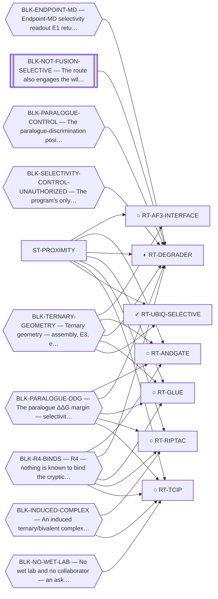

<!-- GENERATED FILE — DO NOT EDIT. Regenerate with:
     python3 systems/systems_check.py --write-views
     Source of truth: systems/graph/*.json -->

# ST-PROXIMITY — Induced-proximity therapeutics

**Thesis.** The NR4A3 ligand-binding domain does not need to be inhibited, only ENGAGED, because the therapeutic effect comes from what the molecule recruits rather than from what it blocks. This converts an undruggable transcription factor into a tractable target, at the price of needing a second binding site, a linker geometry and a productive assembly.

**Portfolio role:** `lead` · **state:** ◐ blocked · computed · confidence low

> This is the program's north star and the family that has absorbed most of its effort. It is also the family whose failures reorganise every other row in the portfolio.

## What this family may NOT be used to claim

- No molecule in this family has been shown to bind NR4A3 at all — the pocket every route here depends on has no known ligand of any kind.
- No NR4A3 ternary complex has been correctly assembled by anyone, so every geometry claim in this family is a prediction from an instrument that has never been pointed at this system.
- Nothing in this family asserts efficacy, safety, a therapeutic window or clinical readiness.

## Is this family blocked as a unit, or route by route?

**Reading it.** ⭐ **No blocker points at the family node**, and that is the finding: the routes here are *not* held down by one shared thing. They are blocked individually, for different reasons — so retiring any one blocker frees some routes and not others, and there is no single unlock for the family.

*What this family RETIRES for the portfolio is listed below rather than drawn — it is a property of the family, not an edge between these nodes.*

## Routes

| route | state | maturity | readiness today | next action |
|---|---|---|---|---|
| **[RT-AF3-INTERFACE](L2-rt-af3-interface.md)** AF3 on a druggable interface | ○ parked | concept | `internal_note` | Watch for an induced-complex benchmark reporting inter-chain accuracy on post-training-horizon structures. In- |
| **[RT-ANDGATE](L2-rt-andgate.md)** AND-gate bivalent degrader (avidity coincidence detection) | ○ parked | concept | `internal_note` | Keep as a registered design option; do not build. Its value is that it names what a second arm would buy, so t |
| **[RT-DEGRADER](L2-rt-degrader.md)** NR4A3-LBD PROTAC degrader | ◐ blocked | computed | `preprint` | Ask for the decision on the binary selectivity control. It is the highest-leverage unrun item in the portfolio |
| **[RT-GLUE](L2-rt-glue.md)** Molecular glue instead of a PROTAC | ○ parked | concept | `internal_note` | Watch for a prospectively validated glue design method. Nothing to build until one exists. |
| **[RT-RIPTAC](L2-rt-riptac.md)** RIPTAC — bind the tumour protein, poison an essential one | ○ parked | concept | `internal_note` | Keep registered. Do not build while the routes it is dominated by are still blocked. |
| **[RT-TCIP](L2-rt-tcip.md)** TCIP — transcriptional chemically-induced proximity on EWSR1::NR4A3 | ○ blocked | scoped | `reproducible_workflow` | Run the paired anchor-plus-effector reach enumeration with a transcriptional-effector second terminus, reusing |
| **[RT-UBIQ-SELECTIVE](L2-rt-ubiq-selective.md)** Fusion-selective ubiquitination — discriminate at the transfer step | ✓ parked | computed | `internal_note` | Keep the categorical inventory as a disclosed-limitation supplement. Do not restate it as a degradation-geomet |
## What this family buys the portfolio — blockers it RETIRES

- **BLK-TERNARY-GEOMETRY** (`requires_better_structure_prediction`) — Ternary geometry — assembly, E3, exit vector, ubiquitin transfer

## Best next action

Resolve the paralogue selectivity question at its cheapest decisive point — the binary selectivity control that is built, staged and unrun.

*Cost:* $0 to decide; the run itself points at the pricing home

[← L0](L0-ecosystem.md)
