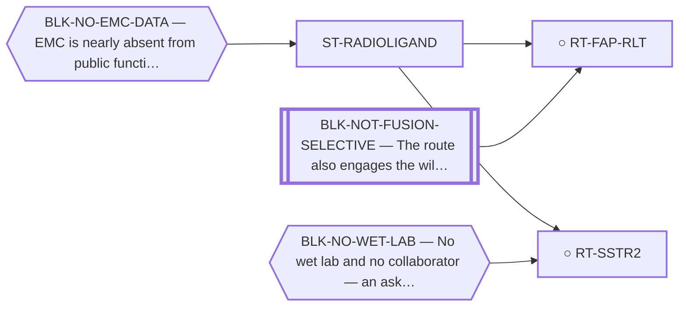

<!-- GENERATED FILE — DO NOT EDIT. Regenerate with:
     python3 systems/systems_check.py --write-views
     Source of truth: systems/graph/*.json -->

# ST-RADIOLIGAND — Radioligand and theranostic approaches

**Thesis.** A radioligand does not need the target to be a driver, only to be present and accessible. That decouples the therapy entirely from the fusion biology that blocks every other family.

**Portfolio role:** `cheap_option` · **state:** ○ blocked · concept · confidence unknown

> The family with the cheapest possible negative: a single scan settles whether the target is there. It retires the paralogue and ternary blockers completely, and inherits only the data blocker.

## What this family may NOT be used to claim

- Target expression in EMC is unmeasured; the case is currently inherited from neuroendocrine and stromal biology rather than observed in this disease.
- A radioligand target is not a driver, so nothing here would be evidence about the fusion.

## Is this family blocked as a unit, or route by route?

**Reading it.** 1 blocker point at the FAMILY node: every route here inherits it, so the family stands or falls as a unit on that. The rest point at individual routes.

*What this family RETIRES for the portfolio is listed below rather than drawn — it is a property of the family, not an edge between these nodes.*

## Routes

| route | state | maturity | readiness today | next action |
|---|---|---|---|---|
| **[RT-FAP-RLT](L2-rt-fap-rlt.md)** FAP-targeted radioligand therapy (FAPI-RLT) | ○ blocked | concept | `internal_note` | Keep registered for automatic re-grade when EMC expression data lands. |
| **[RT-SSTR2](L2-rt-sstr2.md)** SSTR2 / neuroendocrine theranostic | ○ blocked | concept | `experimental_proposal` | Keep on the ask list. Frame it as a cheap decisive negative rather than as a promising lead — that is the hone |

## Family-level bets — blockers EVERY route here inherits

If one of these is never retired, the whole family is dead. That is a different risk from any
single route failing, and it is only visible at this level.

- **BLK-NO-EMC-DATA** (`insufficient_data`) — EMC is nearly absent from public functional-genomics data (one DepMap line, n = 1, no CRISPR data)

## What this family buys the portfolio — blockers it RETIRES

- **BLK-NOT-FUSION-SELECTIVE** (`fundamental_biological_limit`) — The route also engages the wild-type protein (NR4A3 LBD, or EWSR1's low-complexity half)
- **BLK-PARALOGUE-DDG** (`requires_better_simulation_accuracy`) — The paralogue ΔΔG margin — selectivity that reduces to exp(−ΔΔG/RT)
- **BLK-TERNARY-GEOMETRY** (`requires_better_structure_prediction`) — Ternary geometry — assembly, E3, exit vector, ubiquitin transfer

## Best next action

Keep on the ask list — a negative scan kills it cheaply and that is worth having.

*Cost:* $0

[← L0](L0-ecosystem.md)
