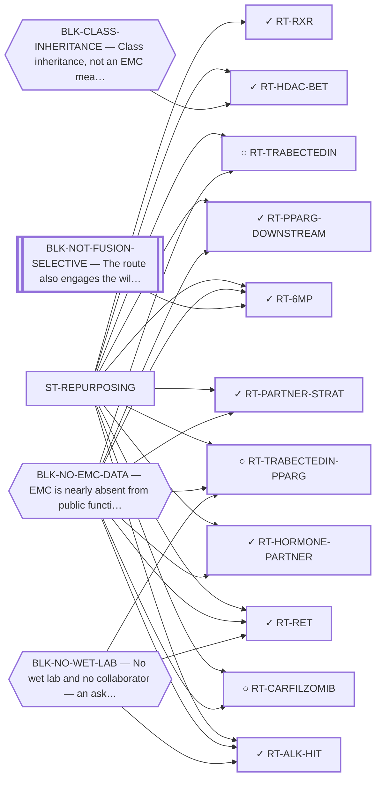

<!-- GENERATED FILE — DO NOT EDIT. Regenerate with:
     python3 systems/systems_check.py --write-views
     Source of truth: systems/graph/*.json -->

# ST-REPURPOSING — Repurposing approved and late-stage agents

**Thesis.** An approved drug skips discovery, synthesis, toxicology and most of the cost of being right. For an ultra-rare disease with no targeted agent, a mechanism-fit repurposing candidate is the shortest path from a computational finding to a patient.

**Portfolio role:** `cheap_option` · **state:** ✓ blocked · computed · confidence low

> The shortest-latency family in the portfolio and the one whose blockers are almost entirely about DATA rather than chemistry. It carries the repository's earlier computational layer — a target-driven enumeration and a knowledge-graph model's zero-shot ranking — whose divergence from mechanism-based reasoning is itself a reportable limitation result.

## What this family may NOT be used to claim

- EMC is nearly absent from public functional-genomics data, so mechanism fit is argued from class membership rather than measured in this disease.
- Several routes here rest on a direction of effect that has never been read in EMC tissue; an expression readout would settle them cheaply and does not exist.
- A repurposing hypothesis is a hypothesis. Nothing here asserts efficacy in EMC.

## Is this family blocked as a unit, or route by route?

**Reading it.** ⭐ **No blocker points at the family node**, and that is the finding: the routes here are *not* held down by one shared thing. They are blocked individually, for different reasons — so retiring any one blocker frees some routes and not others, and there is no single unlock for the family.

*What this family RETIRES for the portfolio is listed below rather than drawn — it is a property of the family, not an edge between these nodes.*

## Routes

| route | state | maturity | readiness today | ends in | next action |
|---|---|---|---|---|---|
| **[RT-6MP](L2-rt-6mp.md)** 6-mercaptopurine / AF-1 agonism of the fusion | ✓ closed | scoped | `internal_note` | [PUB-CLOSED-ROUTES](L3-publications.md) ◐ *contributing* | Nothing. Cite the closure — it is the clearest example in the register of wild-type pharmacology failing to tr |
| **[RT-ALK-HIT](L2-rt-alk-hit.md)** Follow-up of the ALK/ROS1-class ex-vivo screen hit | ✓ parked | computed | `internal_note` | [PUB-KINASE-LEADS](L3-publications.md) ◔ *contributing* | Report it in the kinase paper as a CORRECTED reading of a lead: the screen's dominant signal is a class the bo |
| **[RT-CARFILZOMIB](L2-rt-carfilzomib.md)** Carfilzomib ± anthracycline (± venetoclax) | ○ ready | concept | `internal_note` | [PUB-REPURPOSING](L3-publications.md) ◐ *primary* | Treat as landscape context; the ex-vivo result is banked and needs no further lookup. |
| **[RT-HDAC-BET](L2-rt-hdac-bet.md)** HDAC / BET to lower fusion expression | ✓ parked | concept | `internal_note` | [PUB-CLOSED-ROUTES](L3-publications.md) ◐ *contributing* | Nothing. Cite the closure when the idea resurfaces. |
| **[RT-HORMONE-PARTNER](L2-rt-hormone-partner.md)** Hormonal therapy for hormone-responsive 5′ fusion partners | ✓ parked | computed | `internal_note` | [PUB-NR-OUTSIDE-NR4A3](L3-publications.md) ◔ *primary* | ⭐ THE $0 STEP THIS FIELD NAMED IS DONE (2026-08-28) AND THE ROUTE IS NOW GENUINELY PARKED. Superseded, retaine |
| **[RT-PARTNER-STRAT](L2-rt-partner-strat.md)** NR4A3 5' fusion partner as a treatment-stratification variable | ✓ ready | computed | `preprint` | [PUB-FUSION-PARTNER](L3-publications.md) ◐ *primary* | Post the preprint at research/manuscripts/fusion-partner/emc-fusion-partner-stratification.md, and in the same |
| **[RT-PPARG-DOWNSTREAM](L2-rt-pparg-downstream.md)** PPARG downstream-effector (repurpose TZDs) | ✓ blocked | concept | `internal_note` | [PUB-REPURPOSING](L3-publications.md) ◐ *contributing* | The literature half is CLOSED (research/manuscripts/repurposing/pparg-direction-emc.md). What remains is a PPA |
| **[RT-RET](L2-rt-ret.md)** RET-selective inhibitors | ✓ parked | computed | `internal_note` | [PUB-KINASE-LEADS](L3-publications.md) ◔ *contributing* | Report it as the kinase paper's strongest lead and its clearest cautionary case: the one kinase reported activ |
| **[RT-RXR](L2-rt-rxr.md)** RXR-heterodimer modulation of the fusion | ✓ closed | scoped | `internal_note` | [PUB-CLOSED-ROUTES](L3-publications.md) ◐ *contributing* | Nothing. The scan carries the one observation that would reopen it. |
| **[RT-TRABECTEDIN](L2-rt-trabectedin.md)** Trabectedin (± RT or combination) | ○ ready | concept | `internal_note` | [PUB-EMC-PROGRAM](L3-publications.md) ◐ *context* | Keep as cited landscape context. Do not overstate a single response. |
| **[RT-TRABECTEDIN-PPARG](L2-rt-trabectedin-pparg.md)** Trabectedin + a PPARγ agonist (all approved drugs) | ○ blocked | concept | `experimental_proposal` | [PUB-REPURPOSING](L3-publications.md) ◐ *contributing* | Hold the ask until the PPARγ direction can be stated. Re-grade automatically when EMC expression data lands. |
## What this family buys the portfolio — blockers it RETIRES

- **BLK-PARALOGUE-DDG** (`requires_better_simulation_accuracy`) — The paralogue ΔΔG margin — selectivity that reduces to exp(−ΔΔG/RT)
- **BLK-R4-BINDS** (`requires_wet_lab`) — R4 — nothing is known to bind the cryptic pocket at all
- **BLK-TERNARY-GEOMETRY** (`requires_better_structure_prediction`) — Ternary geometry — assembly, E3, exit vector, ubiquitin transfer

## Best next action

Watch for a fetchable public EMC expression dataset — it is the single input that would convert most of this family from class-inherited argument to measurement.

*Cost:* $0

[← L0](L0-ecosystem.md)
