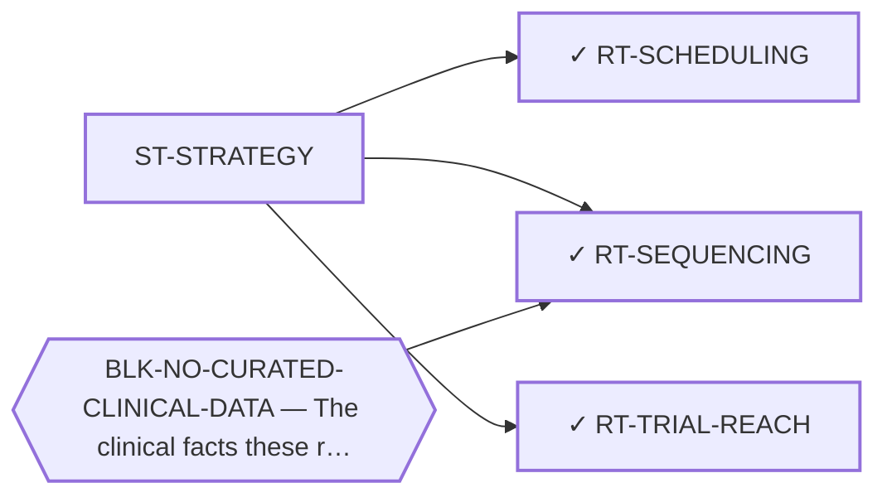

<!-- GENERATED FILE — DO NOT EDIT. Regenerate with:
     python3 systems/systems_check.py --write-views
     Source of truth: systems/graph/*.json -->

# ST-STRATEGY — Treatment strategy, scheduling and reachability

**Thesis.** For a disease measured in years, when and in what order the existing agents are given may matter as much as which they are — and none of that has been studied here. The same reasoning reaches further: a portfolio whose every endpoint is a paper needs the step after the paper to be a registered route too, or the chain from result to patient has a missing link nobody owns.

**Portfolio role:** `cheap_option` · **state:** ○ ready · concept · confidence low

> Minted 2026-08-09 from the modality census. The 2026-08-07 sweep named this as one of four categories structurally invisible to every prior search here -- not rejected, never queried -- and a category nothing could be filed under is a category that stays invisible.

## What this family may NOT be used to claim

- Nothing in this family produces a new agent, so the ceiling of every route here is bounded by what the existing agents can do.
- Scheduling and sequencing questions are normally settled by randomised trials, and this disease will not have one — so every route here ends in a modelled or observational argument whose limits must travel with it.
- The reachability routes act on institutions rather than on biology, which is a domain where this program has no track record and where a wrong answer is not falsifiable by computation.
- Nothing in this family asserts efficacy, safety, a therapeutic window or clinical readiness.

## Is this family blocked as a unit, or route by route?

**Reading it.** ⭐ **No blocker points at the family node**, and that is the finding: the routes here are *not* held down by one shared thing. They are blocked individually, for different reasons — so retiring any one blocker frees some routes and not others, and there is no single unlock for the family.

*What this family RETIRES for the portfolio is listed below rather than drawn — it is a property of the family, not an edge between these nodes.*

## Routes

| route | state | maturity | readiness today | ends in | next action |
|---|---|---|---|---|---|
| **[RT-SCHEDULING](L2-rt-scheduling.md)** Adaptive and metronomic scheduling of existing agents | ✓ blocked | computed | `internal_note` | [PUB-STRATEGY-ARCH](L3-publications.md) ◐ *contributing* | Build the two-population model with each median carried separately as its own parameter interval, and the one  |
| **[RT-SEQUENCING](L2-rt-sequencing.md)** Treatment sequencing and line ordering | ✓ parked | computed | `internal_note` | [PUB-STRATEGY-ARCH](L3-publications.md) ◐ *contributing* | Unchanged in substance and sharpened in content: report the negative, now with the specific gap it fills — the |
| **[RT-TRIAL-REACH](L2-rt-trial-reach.md)** Trial reachability and access pathways | ✓ ready | computed | `internal_note` | [PUB-STRATEGY-ARCH](L3-publications.md) ◐ *contributing* | Publish the eligibility map — this is the one route in the portfolio whose output could reach a patient withou |
## Best next action

Pool the curated cohorts' progression-free-survival data to state what the published record can and cannot support about scheduling and ordering.

*Cost:* $0

[← L0](L0-ecosystem.md)
