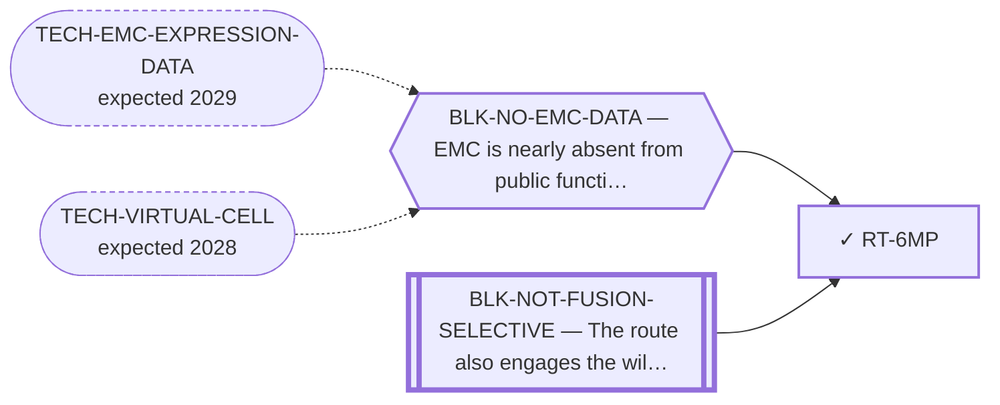

<!-- GENERATED FILE — DO NOT EDIT. Regenerate with:
     python3 systems/systems_check.py --write-views
     Source of truth: systems/graph/*.json -->

# RT-6MP — 6-mercaptopurine / AF-1 agonism of the fusion

**Family:** [ST-REPURPOSING](L1-st-repurposing.md) · **state:** ✓ closed · scoped · confidence moderate · verified 2026-08-06

**Grade** (owned by [`research/manuscripts/program/emc-post-degrader-options.md`](../../research/manuscripts/program/emc-post-degrader-options.md)): ✕ closed on DIRECTION OF EFFECT (6-MP enhances NR4A3; the fusion is gain-of-function) and on non-selectivity — NOT on the refuted 'domain the fusion replaces'

## What has to land for this route to move

**Reading it.** A solid arrow is what holds this route down today. A dashed arrow is a capability that WOULD retire a blocker — dashed because it has not landed, and the date beside it is a forecast, not a schedule.

⛔ **1 of these is permanent** (`BLK-NOT-FUSION-SELECTIVE`) — a fact about the biology, drawn double-walled, with no way out by definition. No technology arrives to fix it.

## Scientific rationale

6-MP is the one approved drug that activates NR4A3, acting through the AF-1 rather than the LBD. ⚠ The AF-1 IS RETAINED in the chimera — the fusion does not delete it — so the original closure reasoning does not hold. What closes the route is that 6-MP ENHANCES NR4A3 activity while the fusion is a gain-of-function oncoprotein, and that it cannot distinguish the chimera from wild-type NR4A3. No efficacy, safety or clinical-readiness claim is made.

## Remaining unknowns

- Whether an INTERNALISED AF-1 — preceded by EWSR1(1-264) and neighboured by a strong independent activation domain — remains SRC-2-competent and 6-MP-responsive. Untested; this is the AF-1 analogue of BLK-FUNCTIONAL-ACTIONABILITY and it is a bench question.
- Whether 6-MP's direction of effect on the FUSION matches its direction on wild-type NR4A3. No direct loss-of-function experiment in any EMC cell line exists.

## Required validation

| what | instrument | feasible today | blocked by |
|---|---|---|---|
| A primary measurement of 6-MP's direction of effect on the EWSR1::NR4A3 fusion, not on wild-type NR4A3  ⭐ ADJUDICATED 2026-09-02 (AUT-PD-116, seat s31-emc-data-blocks, applying S41). BLOCKER DEFENSIBLE AND KEPT; BLK-NO-WET-LAB ADDED, NOTHING REMOVED. A primary perturbation measurement on the fusion is functional-genomics data, so a deposited dataset would satisfy it — but the precise residual is a bench, and the entry did not say so. ⚠ Bookkeeping only: the route is closed on direction of effect and no ranking consequence follows. Per-entry justification: research/autonomy/sprint-2026-09-01/S41-BLOCKED-ROUTE-AUDIT.md and S41-proposed-routes-patch.json. The rule this applies has one home: research/modalities/emc-fourth-cohort-route-readout.json → "⭐ the_rule_this_adjudication_applies". | ⛔ none built | **no** | BLK-NO-EMC-DATA, BLK-NO-WET-LAB |

## Blockers

| blocker | kind | what would retire it |
|---|---|---|
| **BLK-NOT-FUSION-SELECTIVE** | `fundamental_biological_limit` | *permanent* |
| **BLK-NO-EMC-DATA** | `insufficient_data` | `TECH-EMC-EXPRESSION-DATA`, `TECH-VIRTUAL-CELL` |

## Not to be confused with

| route | the axis it turns on | blockers the distinction turns on | why |
|---|---|---|---|
| [RT-MONOVALENT](L2-rt-monovalent.md) | which domain the mechanism lives in | `BLK-NOT-FUSION-SELECTIVE` | ⚠ SCOPED SO IT IS NOT OVER-READ: this closes 6-MP, NOT LBD-directed modulation generally. The published LBD-borne functional result was read out on a Gal4-NOR-1-LBD construct that is itself AF-1-less |

## Readiness — what this could become today

**`internal_note`**

Closed on DIRECTION OF EFFECT, not definitionally: 6-MP enhances NR4A3 activity while the fusion is gain-of-function. The output is the reasoning, which is a useful worked example of why wild-type pharmacology does not transfer to a fusion — and, since the original AF-1-deletion premise was measured false (closure_kind premise_false, 2026-08-06 route audit X9), of how a closure can survive its own grounds being retracted.

## Where this route ends — the paper

**[PUB-CLOSED-ROUTES](L3-publications.md)** — [Seven routes closed on argument rather than on experiment — the negative record of an EWSR1::NR4A3 route search](../../research/manuscripts/methods-record/closed-routes-negative-record.md)

`contributing` · ◐ `drafted` · aimed at `preprint`

**This route contributes:** The worked example of wild-type pharmacology failing to transfer to a fusion, which is the single most reusable argument in the set.

**The paper would claim:** A route can be closed rigorously without an experiment when the closure is definitional or is arithmetic over a fixed measured fact, and separating those permanent closures from the merely instrument-limited ones is what keeps a portfolio from re-litigating settled questions — with wild-type NR4A3 pharmacology failing to transfer to the chimera as the worked example.

## Strategic timing — the wait equation

**Recommendation: `closed`**

Closed on direction of effect, not on domain loss. Only a primary measurement showing 6-MP suppresses rather than enhances fusion output, or that an internalised AF-1 behaves differently, would reopen it.

## Claim ceiling — what this route may NOT be used to claim

*Inherited from [ST-REPURPOSING](L1-st-repurposing.md), which is where these are asserted — a family limitation binds every route inside it.*

- EMC is nearly absent from public functional-genomics data, so mechanism fit is argued from class membership rather than measured in this disease.
- Several routes here rest on a direction of effect that has never been read in EMC tissue; an expression readout would settle them cheaply and does not exist.
- A repurposing hypothesis is a hypothesis. Nothing here asserts efficacy in EMC.

## Closure

`premise_false` — ⛔ THE ORIGINAL CLOSURE PREMISE IS REFUTED (route framing audit, 2026-08-06). It read: 'NOR-1 residues 1-112 sit inside the 1-260 stretch the fusion REPLACES with EWSR1-LC — a ligand whose mechanism lives in a domain the disease DELETES cannot act on the chimera at any dose.' MEASURED: NR4A3 transcript exons 1 and 2 are entirely NON-CODING (coding_nt_in_exon: 0; utr5_len 699; first_transcript_exon_is_coding false), so 'NR4A3 exon 3' IS residue 1 and EWSR1(1-264)::NR4A3(1-626) RETAINS the AF1, DBD, hinge and LBD. AF1 is present in all 9 DBD-retaining breakpoint windows. EWSR1-LC is ADDITIVE, not a replacement. ⚠ The repo had already resolved this on 2026-08-02 — one day BEFORE this closure was written — in target-route-census.json `fusion_model_disagreement.resolution`, the same artifact the closure cites; the closure cited check B (lysine/cysteine COUNTS) instead of check C (the junction resolution).  WHAT NOW CLOSES IT, and it is NOT definitional: (1) 6-MP is not fusion-selective — retention is precisely what makes that bite, since an AF-1 present in the chimera is identically present in wild-type NR4A3; (2) ⭐ DIRECTION OF EFFECT, the strongest surviving objection and one the record never made: 6-MP ENHANCES NR4A3 activity (published-warhead-registry.json), and the fusion is a transcriptionally active GAIN-of-function oncoprotein, so 6-MP is a candidate AGONIST of the oncoprotein. That is a stronger argument than the one on file — but it rests on a prior, not a demonstration (no direct loss-of-function experiment in any EMC cell line exists), so it is premise_false, not definitional. ⚠ Scoped: this closes 6-MP, NOT LBD-directed modulation.  ⚠ OPEN FOR TRIMCRAE: whether to re-close on direction-of-effect (as filed here, mirroring RT-RXR) or to REOPEN as `parked` pending the genuinely open question the correction creates — in the chimera the AF-1 is INTERNAL, preceded by EWSR1(1-264) and neighboured by a strong independent activation domain, and whether an internalised AF-1 stays SRC-2-competent and 6-MP-responsive is untested. That is a scientific call, not an audit action.

## Best next action

Nothing. Cite the closure — it is the clearest example in the register of wild-type pharmacology failing to transfer.

*Cost:* $0

## What this route rests on — drill down

*L4 instruments and L5 objects, evidence and artifacts. Every row here is asserted by this route; the [evidence base](L5-evidence-base.md) shows the same edges from the other end.*

**L5 objects:** [OBJ-EWSR1-WT](L5-evidence-base.md#objects--the-biological-and-molecular-entities-the-program-reasons-about), [OBJ-FUS-T1](L5-evidence-base.md#objects--the-biological-and-molecular-entities-the-program-reasons-about), [OBJ-NR4A3-AF1](L5-evidence-base.md#objects--the-biological-and-molecular-entities-the-program-reasons-about)

**L5 evidence:** [EV-WANSA-2003](L5-evidence-base.md#evidence--the-literature-this-program-cites)

**L5 artifacts:** [ART-TARGET-ROUTE-CENSUS](L5-evidence-base.md#artifacts--the-files-a-claim-can-be-checked-against)

[← ST-REPURPOSING](L1-st-repurposing.md) · [← L0](L0-ecosystem.md)
