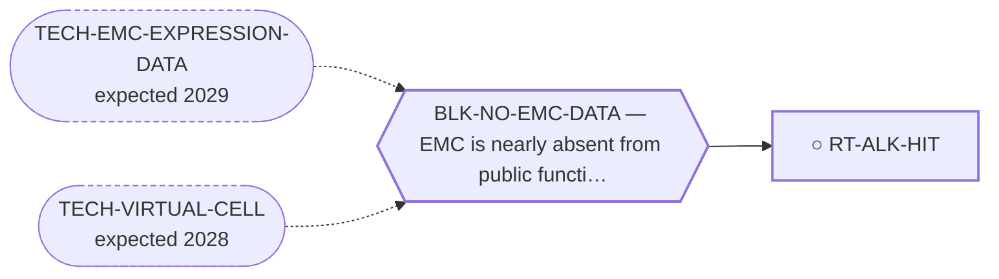

<!-- GENERATED FILE — DO NOT EDIT. Regenerate with:
     python3 systems/systems_check.py --write-views
     Source of truth: systems/graph/*.json -->

# RT-ALK-HIT — Follow-up of the ALK/ROS1-class ex-vivo screen hit

**Family:** [ST-REPURPOSING](L1-st-repurposing.md) · **state:** ○ blocked · concept · confidence low · verified 2026-08-09

**Grade** (owned by [`research/manuscripts/cancer-modality-census.md`](../../research/manuscripts/cancer-modality-census.md#33--kinase-leads-with-emc-specific-evidence-that-nobody-followed)): ⭑ Registered 2026-08-09 from the modality census; the underlying observation is committed here and was never followed.

## What has to land for this route to move

**Reading it.** A solid arrow is what holds this route down today. A dashed arrow is a capability that WOULD retire a blocker — dashed because it has not landed, and the date beside it is a forecast, not a schedule.

## Scientific rationale

An ALK/ROS1-class inhibitor was among the low-IC50 hits of a 221-drug screen run on a patient-derived model of this disease, and nothing here has ever followed it up. The hit does not establish which target produced it, because that agent inhibits several kinases, so the route's first job is to separate the observation from the hypothesis.

## Remaining unknowns

- Which of the agent's targets is responsible, which the screen was not designed to resolve.
- Whether a single-model screen hit transfers, given how few models of this disease exist.

## Required validation

| what | instrument | feasible today | blocked by |
|---|---|---|---|
| The $0 corroboration named in this route's next action | ⛔ none built | yes | — |
| A response measurement in a fusion-positive EMC model | ⛔ none built | **no** | BLK-NO-WET-LAB |

## Blockers

| blocker | kind | what would retire it |
|---|---|---|
| **BLK-NO-EMC-DATA** | `insufficient_data` | `TECH-EMC-EXPRESSION-DATA`, `TECH-VIRTUAL-CELL` |

## Readiness — what this could become today

**`internal_note`**

Nothing has been run. This route was registered on 2026-08-09 from the modality census and is at concept maturity, so the only honest output today is the question and its cheapest next observation.

**Missing:**
- a re-read of the committed drug-screen artifact and its controls

## Where this route ends — the paper

**[PUB-KINASE-LEADS](L3-publications.md)** — *Four kinase observations in extraskeletal myxoid chondrosarcoma that nobody followed up* (unwritten)

`contributing` · ○ `unwritten` · aimed at `preprint`

**This route contributes:** One of four kinase observations specific to this disease that exist in the published or curated record and that nobody has followed up.

**The paper would claim:** Four kinase-directed observations specific to this disease exist in the published and curated record — one reported as expressed and activated, one positive across a small series with an internal control, one an interaction curated on the driver protein itself, one an ex-vivo screen hit — and none has been followed up by anyone, in a disease with no targeted agent.

**It is not written because:** Its purpose is to consolidate four leads that are each individually thin, and the consolidation has not been done — three of the four were surfaced two days before this endpoint was registered.

## Strategic timing — the wait equation

**Recommendation: `pursue_now`**

The next step costs nothing and needs nobody's cooperation, so there is no reason to defer it; what it returns decides whether this route is worth more than a row.

| horizon | effect |
|---|---|
| Cost trend | flat |

## Claim ceiling — what this route may NOT be used to claim

*Inherited from [ST-REPURPOSING](L1-st-repurposing.md), which is where these are asserted — a family limitation binds every route inside it.*

- EMC is nearly absent from public functional-genomics data, so mechanism fit is argued from class membership rather than measured in this disease.
- Several routes here rest on a direction of effect that has never been read in EMC tissue; an expression readout would settle them cheaply and does not exist.
- A repurposing hypothesis is a hypothesis. Nothing here asserts efficacy in EMC.

## Best next action

Re-read the committed drug-screen artifact for the full hit list and its controls, then read each of the agent's principal targets across the expression cohorts.

*Cost:* $0

[← ST-REPURPOSING](L1-st-repurposing.md) · [← L0](L0-ecosystem.md)
