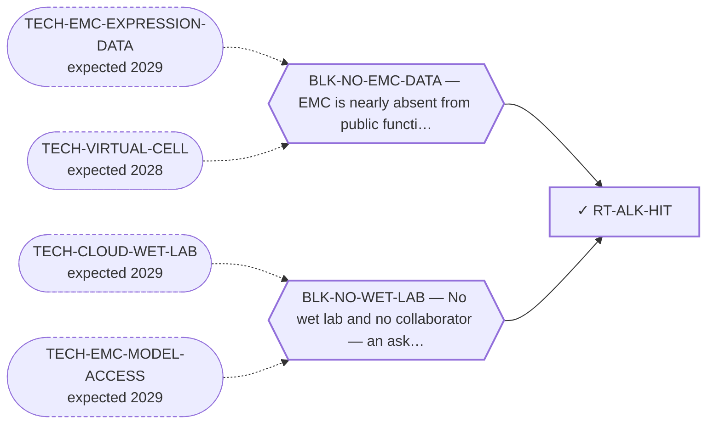

<!-- GENERATED FILE — DO NOT EDIT. Regenerate with:
     python3 systems/systems_check.py --write-views
     Source of truth: systems/graph/*.json -->

# RT-ALK-HIT — Follow-up of the ALK/ROS1-class ex-vivo screen hit

**Family:** [ST-REPURPOSING](L1-st-repurposing.md) · **state:** ✓ parked · computed · confidence low · verified 2026-08-09

**Grade** (owned by [`research/modalities/census-route-expression-grading.json`](../../research/modalities/census-route-expression-grading.json)): ⛔ UNATTRIBUTABLE BY EXPRESSION, AND THE RE-READ DEMOTES THE LEAD (2026-08-09). The route's own first step was to re-read the committed screen, and doing it changes what the lead is: the screen returned THREE low-IC50 agents and TWO of them are the same pan-HDAC class, read from this repository's own curated target records rather than recalled. That is a within-screen class replication the one-agent framing could not show — and that class is already on the board, closed on selectivity rather than on activity. ⛔ The named kinases cannot be read at all: ALK and ROS1 have NO PROBE on either platform, so the target group emits no score. That is an instrument statement, never a biological negative. The one readable named target, EGFR, is lower in EMC on both platforms. ⚠ The curated record names ALK and EGFR and does NOT name ROS1, though the lead calls this the ALK/ROS1 class. ⭐ AND THE DEPENDENCY PRIOR, RUN 2026-08-09, POINTS THE SAME WAY AS THE HIT LIST. Across the 91 SCREENED sarcoma lines NEITHER named kinase is a dependency in a SINGLE line — mean gene effects of about -0.04 and +0.11, fraction dependent 0.0 for both — while one class I HDAC is a dependency in 82% of them, mean about -0.92. ⚠ This does not prove the hit was not on-target for the named kinase in that particular line: a gene-effect score is a knockout phenotype and an inhibitor's IC50 is not, and the screen ran on a line absent from this panel. But it makes the class attribution the better-supported reading on two independent axes. ⛔ DENOMINATOR CORRECTED 2026-08-27: this grade was written on 2026-08-09 saying 176 sarcoma lines. 176 is the number of sarcoma MODELS in DepMap 24Q4; only 91 of them carry CRISPR gene-effect data, and every per-gene row of research/modalities/depmap-sarcoma-dependency.json reads n_sarcoma: 91 (depmap_sarcoma_dependency.py computes it as len of the non-null sarcoma column, while n_sarcoma_models at the top level is len of the sarcoma model list). The percentages and gene effects are unchanged — they were always computed on the screened subset — but the denominator overstated the evidence base by almost double. The identical error was found and corrected in the MTAP/PRMT5 manuscript's correction register on 2026-08-09/10 (across 176 sarcoma cell lines → across the 91 screened sarcoma cell lines, described there as a real error in the direction that overstated the evidence base), and the fix was never carried back into this graph. ⚠ Other routes' grades and research/modalities/census-route-expression-grading.json still carry the superseded 176; correcting those is a separate item, not this route's.

## What has to land for this route to move

**Reading it.** A solid arrow is what holds this route down today. A dashed arrow is a capability that WOULD retire a blocker — dashed because it has not landed, and the date beside it is a forecast, not a schedule.

## Scientific rationale

An ALK/ROS1-class inhibitor was among the low-IC50 hits of a 221-drug screen run on a patient-derived model of this disease, and nothing here has ever followed it up. The hit does not establish which target produced it, because that agent inhibits several kinases, so the route's first job is to separate the observation from the hypothesis.

## Supporting evidence

| ref | supports | strength |
|---|---|---|
| `ART-CENSUS-ROUTE-GRADING` | the two kinases the lead names are unreadable on both platforms so the screen hit cannot be attributed by expression, and two of the screen's three hits belong to a single class already assessed on the board | `direct` |
| `ART-DEPMAP-SARCOMA-DEP` | neither named kinase is a dependency in any of 176 sarcoma lines while one class I HDAC is a dependency in the large majority, which points the same way as the screen's own hit list | `class_inherited` |

## Remaining unknowns

- Which of the agent's targets produced the hit — unanswerable by abundance in principle, since an IC50 reflects dependency and a target at the array floor can still be the one that matters.
- Whether a single-model screen hit transfers, given how few models of this disease exist.
- Whether the class the screen actually favoured has any activity window in this disease, which is the board's existing open question for it and is not reopened by this reading.

## Required validation

| what | instrument | feasible today | blocked by |
|---|---|---|---|
| ⛔ TAKEN 2026-08-09 — re-read the committed drug-screen artifact for the full hit list and read each agent's curated targets across the expression cohorts | ⛔ none built | yes | — |
| A sarcoma-class dependency prior for the hit agents' targets, queued in the dependency panel because the arrays cannot see two of them at all | ⛔ none built | yes | — |
| An attribution experiment in the line the screen ran on — a knockdown or a target-selective agent, which is the only thing that separates the observation from the hypothesis | ⛔ none built | **no** | BLK-NO-WET-LAB |

## Blockers

| blocker | kind | what would retire it |
|---|---|---|
| **BLK-NO-EMC-DATA** | `insufficient_data` | `TECH-EMC-EXPRESSION-DATA`, `TECH-VIRTUAL-CELL` |
| **BLK-NO-WET-LAB** | `requires_external_collaboration` | `TECH-CLOUD-WET-LAB`, `TECH-EMC-MODEL-ACCESS` |

## Readiness — what this could become today

**`internal_note`**

The expression instrument could only ever have ruled a target out, and for the two it was raised to test it could not even do that.

**Missing:**
- a dependency prior for the named targets, which is queued and $0
- an attribution experiment, which needs the model the screen ran on

## Where this route ends — the paper

**[PUB-KINASE-LEADS](L3-publications.md)** — *Four kinase observations in extraskeletal myxoid chondrosarcoma that nobody followed up* (unwritten)

`contributing` · ◔ `outlined` · aimed at `preprint`

**This route contributes:** One of four kinase observations specific to this disease that exist in the published or curated record and that nobody has followed up.

**The paper would claim:** Four kinase-directed observations specific to this disease exist in the published and curated record — one reported as expressed and activated, one positive across a small series with an internal control, one an interaction curated on the driver protein itself, one an ex-vivo screen hit — and none has been followed up by anyone, in a disease with no targeted agent.

**It is not written because:** ⚠ ITS BLOCKER IS RETIRED — THE CONSOLIDATION IS DONE AND IT INVERTED THE PAPER. All four leads are graded as of 2026-08-09, and reading each one's own primary record demoted THREE of them in ways the leads' prose did not predict: the activation claim behind the strongest lead is a single paywalled abstract sentence with no recoverable denominator, and the approved agents address a molecular state this disease is not reported to be in; the screen hit turns out to sit beside two same-class hits belonging to a class the board already holds, and its named kinases have no probe on either platform so the arrays could never have attributed it; the interaction lead was measured on wild-type protein in a non-sarcoma tissue from one source. The fourth is discordant on the kinase and concordant on its substrate. ⭐ THAT IS THE PAPER NOW, and it is a better one than the consolidation that was planned: four EMC-specific kinase observations that the field has cited or left for one to two decades, each traced to what was actually measured, with the gap between the citation and the measurement stated. ⛔ Superseded, retained: "the consolidation has not been done — three of the four were surfaced two days before this endpoint was registered." ⚠ Two of the four gradings came from records that had been committed since 2026-08-07 and that the routes were registered without reading.

## Strategic timing — the wait equation

**Recommendation: `monitor`**

Attribution needs the model, not the arrays. The screen's own weight sits with a class the board has already assessed.

| horizon | effect |
|---|---|
| Cost trend | flat |

**Revisit when:**
- **TECH-EMC-MODEL-ACCESS** — Access to a patient-derived EMC model through a collaborator, or through a solo-affordable cloud or robotic wet-lab service with E *(expected 2029, basis `speculative`)*

## Claim ceiling — what this route may NOT be used to claim

*Inherited from [ST-REPURPOSING](L1-st-repurposing.md), which is where these are asserted — a family limitation binds every route inside it.*

- EMC is nearly absent from public functional-genomics data, so mechanism fit is argued from class membership rather than measured in this disease.
- Several routes here rest on a direction of effect that has never been read in EMC tissue; an expression readout would settle them cheaply and does not exist.
- A repurposing hypothesis is a hypothesis. Nothing here asserts efficacy in EMC.

## Best next action

Report it in the kinase paper as a CORRECTED reading of a lead: the screen's dominant signal is a class the board already holds, and the arrays structurally cannot attribute the kinase hit.

*Cost:* $0

[← ST-REPURPOSING](L1-st-repurposing.md) · [← L0](L0-ecosystem.md)
