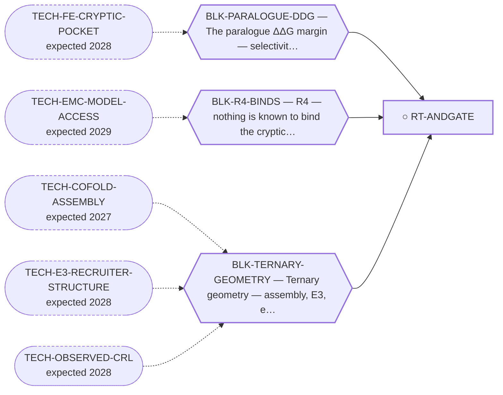

<!-- GENERATED FILE — DO NOT EDIT. Regenerate with:
     python3 systems/systems_check.py --write-views
     Source of truth: systems/graph/*.json -->

# RT-ANDGATE — AND-gate bivalent degrader (avidity coincidence detection)

**Family:** [ST-PROXIMITY](L1-st-proximity.md) · **state:** ○ parked · concept · confidence low · verified 2026-08-05

**Grade** (owned by [`research/manuscripts/fusion-selective-andgate-degrader-paper.md`](../../research/manuscripts/fusion-selective-andgate-degrader-paper.md)): ⏸ hold — arm-2 chemistry does not exist

## What has to land for this route to move

**Reading it.** A solid arrow is what holds this route down today. A dashed arrow is a capability that WOULD retire a blocker — dashed because it has not landed, and the date beside it is a forecast, not a schedule.

## Scientific rationale

Avidity turns two weak interactions into one strong one only when both partners are on the same molecule. A degrader with one arm against the NR4A3 half and one against the EWSR1 half would therefore engage the chimera far more strongly than either wild-type protein — coincidence detection rather than affinity. It is the most elegant answer to the selectivity problem in the portfolio.

## Remaining unknowns

- Whether any ligand exists for the EWSR1 half — the second arm's chemistry does not exist.
- Whether avidity in this geometry is large enough to matter, which needs the ternary geometry the whole family lacks.

## Required validation

| what | instrument | feasible today | blocked by |
|---|---|---|---|
| A ligand for the second arm, which does not exist | ⛔ none built | **no** | BLK-TERNARY-GEOMETRY |

## Blockers

| blocker | kind | what would retire it |
|---|---|---|
| **BLK-TERNARY-GEOMETRY** | `requires_better_structure_prediction` | `TECH-COFOLD-ASSEMBLY`, `TECH-E3-RECRUITER-STRUCTURE`, `TECH-OBSERVED-CRL` |
| **BLK-PARALOGUE-DDG** | `requires_better_simulation_accuracy` | `TECH-FE-CRYPTIC-POCKET` |
| **BLK-R4-BINDS** | `requires_wet_lab` | `TECH-EMC-MODEL-ACCESS` |

## Readiness — what this could become today

**`internal_note`**

There is no second arm, so there is nothing to compute and nothing to report beyond the design argument.

**Missing:**
- arm-2 chemistry

## Strategic timing — the wait equation

**Recommendation: `monitor`**

Nothing can be built until a ligand for the shared low-complexity half exists, and that is a hard target that this program has separately closed as a direct route. Monitoring costs nothing; building costs everything and returns nothing.

| horizon | effect |
|---|---|
| Six months | None. |
| Two years | Only if generative design reaches disordered-region ligands, which would be a major advance. |
| Cost trend | flat |
| Automation outlook | Not automatable — the gap is chemical matter, not effort. |

**Revisit when:**
- **TECH-GLUE-DESIGN** — A validated prospective molecular-glue design method or glue-interface selectivity predictor, demonstrated on a neosubstrate inter *(expected 2027H2, basis `extrapolated`)*
- **TECH-COFOLD-ASSEMBLY** — A sequence-only co-folder evaluated on ternary ASSEMBLY — inter-chain accuracy on post-training-horizon induced complexes — rather *(expected 2027, basis `evidence_based`)*

## Closure

`instrument_limit` — Arm-2 chemistry does not exist and it inherits the degrader's ternary instruments.

## Best next action

Keep as a registered design option; do not build. Its value is that it names what a second arm would buy, so that a ligand for the EWSR1 half would immediately have a use.

*Cost:* $0

[← ST-PROXIMITY](L1-st-proximity.md) · [← L0](L0-ecosystem.md)
