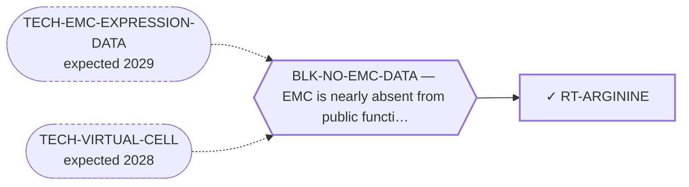

<!-- GENERATED FILE — DO NOT EDIT. Regenerate with:
     python3 systems/systems_check.py --write-views
     Source of truth: systems/graph/*.json -->

# RT-ARGININE — Arginine deprivation (ASS1-silenced tumours)

**Family:** [ST-DEPENDENCY](L1-st-dependency.md) · **state:** ✓ parked · computed · confidence moderate · verified 2026-08-09

**Grade** (owned by [`research/modalities/census-route-expression-grading.json`](../../research/modalities/census-route-expression-grading.json)): ⛔ Premise NOT supported (2026-08-09). ASS1 — the biomarker the class is given on — is HIGHER in EMC than in comparator sarcomas on BOTH readable platforms, and sits at the 92nd array percentile on one. The route was registered and graded against the same day.

## What has to land for this route to move

**Reading it.** A solid arrow is what holds this route down today. A dashed arrow is a capability that WOULD retire a blocker — dashed because it has not landed, and the date beside it is a forecast, not a schedule.

## Scientific rationale

A metabolic class that is biomarker-selected rather than proliferation-coupled — it exploits a silenced enzyme, which is a state rather than a growth rate. It has been taken to late-phase trials in soft-tissue sarcoma specifically, and its biomarker is a single transcript readable in data already committed here. The census found the whole metabolic group had been dismissed as a block, and this row does not share the group's reasoning.

## Supporting evidence

| ref | supports | strength |
|---|---|---|
| `ART-CENSUS-ROUTE-GRADING` | ASS1 is not low in EMC tumour tissue on either readable array platform, so the selecting feature for arginine deprivation is absent at transcript level | `direct` |

## Remaining unknowns

- Whether ASS1 PROTEIN is present, which is what the arginine-deprivation literature actually selects on — a transcript read is a reason not to prioritise a stain, not a substitute for one.
- Whether any EMC subset is ASS1-low, which n=6 and n=10 cannot address.

## Required validation

| what | instrument | feasible today | blocked by |
|---|---|---|---|
| The expression or committed-artifact lookup that selects this class | ⛔ none built | yes | — |
| A measurement in a fusion-positive EMC model | ⛔ none built | **no** | BLK-NO-WET-LAB |

## Blockers

| blocker | kind | what would retire it |
|---|---|---|
| **BLK-NO-EMC-DATA** | `insufficient_data` | `TECH-EMC-EXPRESSION-DATA`, `TECH-VIRTUAL-CELL` |

## Readiness — what this could become today

**`internal_note`**

A single contradicted transcript-level premise in two small archival series is a paragraph in the census paper, not a paper.

**Missing:**
- nothing — the $0 observation this route was registered for has been taken, and it came back against the premise

## Where this route ends — the paper

**[PUB-BIOMARKER-DEP](L3-publications.md)** — *Biomarker-selected therapeutic classes in an ultra-rare sarcoma: what the available expression data excludes* (unwritten)

`contributing` · ◔ `outlined` · aimed at `preprint`

**This route contributes:** One of six biomarker-selected classes whose selecting feature is readable in expression data already public for this disease, and whose most useful output is exclusion.

**The paper would claim:** Six therapeutic classes are selected by a molecular state rather than by a growth rate, every selecting feature is readable in expression data already public for this disease, and the useful output is which classes the data rules out rather than which it nominates.

**It is not written because:** ⚠ ITS STATED BLOCKER IS RETIRED AND THE PAPER CHANGED SHAPE. Every lookup it was waiting on ran on 2026-08-09: of the five biomarker-selected classes it covers, FOUR are now graded against their own selecting feature (MOD-ARGININE-DEPRIVATION, MOD-MDM2-P53, MOD-EZH2, MOD-POLQ) and one is split between its two axes (MOD-MCL1-BCLXL). So this is now a mostly-NEGATIVE paper, which is what makes it worth writing — the field publishes almost no exclusions of this kind. What is left is drafting, not measurement. ⛔ Superseded, retained: "none of those lookups has been run — the paper is defined by results that do not exist yet." The results exist; they are negatives.

## Strategic timing — the wait equation

**Recommendation: `monitor`**

The premise as stated is not supported and the cheapest observation has already been spent. Only an EMC protein-level or copy-number dataset would change the answer, and none is available to this programme.

| horizon | effect |
|---|---|
| Cost trend | flat |

**Revisit when:**
- **TECH-EMC-EXPRESSION-DATA** — A fetchable public EMC RNA-seq or proteomics deposit beyond the single existing model, enabling a target-regulon readout and per-a *(expected 2029, basis `speculative`)*

## Claim ceiling — what this route may NOT be used to claim

*Inherited from [ST-DEPENDENCY](L1-st-dependency.md), which is where these are asserted — a family limitation binds every route inside it.*

- The dependency transfer prior came back negative on the available data — a measured premise, revivable only by EMC-specific data.
- One route rests on class inheritance: no NR4A3 fusion has been tested for the phenotype it assumes.
- There is one EMC model in public dependency data, with no CRISPR data, so this family's in-silico half is bounded by a sample size of one.

## Best next action

Report it as a closed line in the census paper's negative half.

*Cost:* $0

[← ST-DEPENDENCY](L1-st-dependency.md) · [← L0](L0-ecosystem.md)
