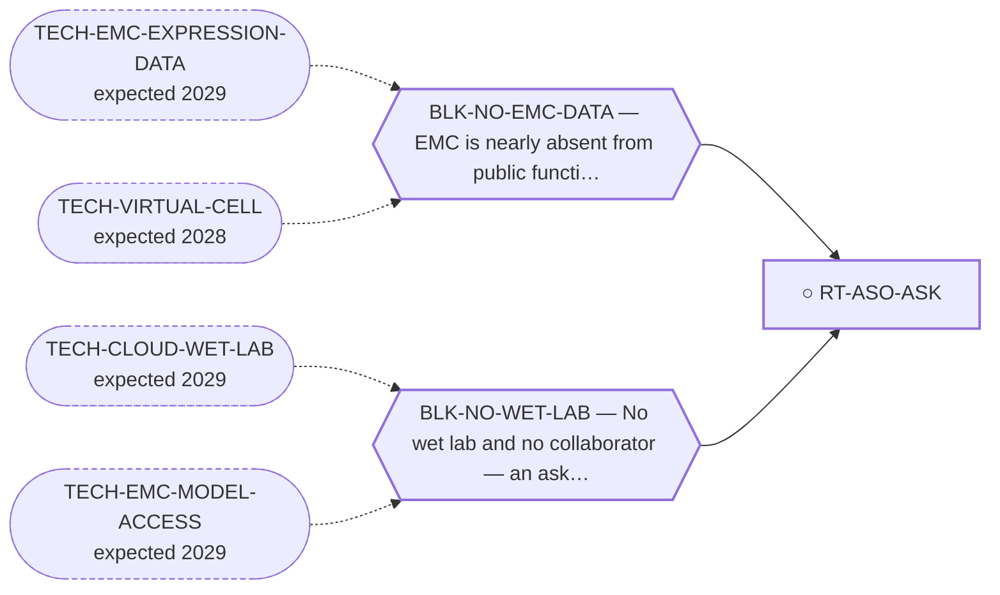

<!-- GENERATED FILE — DO NOT EDIT. Regenerate with:
     python3 systems/systems_check.py --write-views
     Source of truth: systems/graph/*.json -->

# RT-ASO-ASK — Junction knockdown + parental sparing in EMC lines (the ask behind the ASO)

**Family:** [ST-NUCLEIC-ACID](L1-st-nucleic-acid.md) · **state:** ○ blocked · scoped · confidence moderate · verified 2026-08-05

**Grade** (owned by [`research/manuscripts/emc-post-degrader-options.md`](../../research/manuscripts/emc-post-degrader-options.md)): Tier 2, rank 6 — ASK

## What has to land for this route to move

**Reading it.** A solid arrow is what holds this route down today. A dashed arrow is a capability that WOULD retire a blocker — dashed because it has not landed, and the date beside it is a forecast, not a schedule.

## Scientific rationale

This is the single experiment that would convert the oligonucleotide route from a design into a result. It is small, cheap for anyone who already has the cells, and its outcome is informative in both directions. It is registered as a route because an ask with no owner is not a plan.

## Remaining unknowns

- Whether anyone with an EMC or FET-fusion line is interested enough to run it.

## Required validation

| what | instrument | feasible today | blocked by |
|---|---|---|---|
| The experiment itself, run by someone with cells | ⛔ none built | **no** | BLK-NO-WET-LAB, BLK-NO-EMC-DATA |

## Blockers

| blocker | kind | what would retire it |
|---|---|---|
| **BLK-NO-WET-LAB** | `requires_external_collaboration` | `TECH-CLOUD-WET-LAB`, `TECH-EMC-MODEL-ACCESS` |
| **BLK-NO-EMC-DATA** | `insufficient_data` | `TECH-EMC-EXPRESSION-DATA`, `TECH-VIRTUAL-CELL` |

## Readiness — what this could become today

**`experimental_proposal`**

It is already a fully specified experimental proposal. What it lacks is a taker, and no amount of further specification produces one.

**Missing:**
- a collaborator with an EMC or FET-fusion line

## Strategic timing — the wait equation

**Recommendation: `pursue_now`**

The proposal is written and the cost to ask is zero. An ask that is never made has the same outcome as one that is refused, at the same price.

| horizon | effect |
|---|---|
| Six months | Only through whoever reads the preprint. |
| Two years | A solo-affordable cloud lab with the right assay scope would remove the need for a taker entirely — though not the need for the cell line. |
| Cost trend | falling |
| Automation outlook | Not automatable today; this is precisely what a cloud lab would change. |

**Revisit when:**
- **TECH-EMC-MODEL-ACCESS** — Access to a patient-derived EMC model through a collaborator, or through a solo-affordable cloud or robotic wet-lab service with E *(expected 2029, basis `speculative`)*
- **TECH-CLOUD-WET-LAB** — A remote robotic or cloud wet lab, rentable per experiment by an unaffiliated researcher, at a price and assay scope that covers E *(expected 2029, basis `extrapolated`)*

## Closure

`authorization` — Not refuted — waiting on a person with a bench.

## Best next action

Send the ask alongside the preprint. The proposal is ready; the missing input is a person.

*Cost:* $0

[← ST-NUCLEIC-ACID](L1-st-nucleic-acid.md) · [← L0](L0-ecosystem.md)
