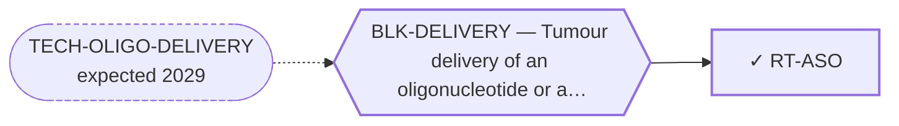

<!-- GENERATED FILE — DO NOT EDIT. Regenerate with:
     python3 systems/systems_check.py --write-views
     Source of truth: systems/graph/*.json -->

# RT-ASO — Fusion-junction ASO / siRNA (the deliverable)

**Family:** [ST-NUCLEIC-ACID](L1-st-nucleic-acid.md) · **state:** ✓ blocked · computed · confidence moderate · verified 2026-08-05

**Grade** (owned by [`research/manuscripts/emc-post-degrader-options.md`](../../research/manuscripts/emc-post-degrader-options.md)): Tier 1, rank 2 — DELIVERABLE

## What has to land for this route to move

**Reading it.** A solid arrow is what holds this route down today. A dashed arrow is a capability that WOULD retire a blocker — dashed because it has not landed, and the date beside it is a forecast, not a schedule.

✓ Already cleared by this route: `BLK-NOT-FUSION-SELECTIVE`, `BLK-PARALOGUE-DDG`, `BLK-TERNARY-GEOMETRY`.

## Scientific rationale

The breakpoint junction is a sequence that exists in no healthy cell. An oligonucleotide reads sequence rather than shape, so it discriminates perfectly where every protein-directed route has to fight a shared fold. This is the only genuinely fusion-selective route in the portfolio, and its in-silico arc is complete: design, off-target screen, breakpoint-favourability scan, and gap-mismatch-resolved candidates.

## Supporting evidence

| ref | supports | strength |
|---|---|---|
| `ART-JUNCTION-ASO-OFFTARGET` | a transcriptome-wide off-target screen returning predicted-clean gapmers | `direct` |

## Remaining unknowns

- How to deliver an oligonucleotide to a non-hepatic solid tumour — the one remaining gate, and it is engineering rather than biology.
- Whether predicted specificity survives a calibrated cleavage model: the current screen uses a deliberately conservative gap-mismatch heuristic, so it may be over- or under-calling.
- Whether the potency ranking holds — it rests on a local-fold accessibility proxy rather than a measured accessibility model.

## Required validation

| what | instrument | feasible today | blocked by |
|---|---|---|---|
| A delivery vehicle that reaches an EMC tumour | ⛔ none built | **no** | BLK-DELIVERY |
| Junction knockdown with parental sparing in an EMC line | ⛔ none built | **no** | BLK-NO-WET-LAB |

## Blockers

| blocker | kind | what would retire it |
|---|---|---|
| **BLK-DELIVERY** | `requires_future_technology` | `TECH-OLIGO-DELIVERY` |

## Blockers this route RETIRES

- **BLK-PARALOGUE-DDG** — The paralogue ΔΔG margin — selectivity that reduces to exp(−ΔΔG/RT)
- **BLK-TERNARY-GEOMETRY** — Ternary geometry — assembly, E3, exit vector, ubiquitin transfer
- **BLK-NOT-FUSION-SELECTIVE** — The route also engages the wild-type protein (NR4A3 LBD, or EWSR1's low-complexity half)

## Readiness — what this could become today

**`chemrxiv`**

The computational arc is complete and the delivery gate is stated honestly as a gate rather than hidden. A journal submission is reachable; what would strengthen it most is not more computation but a delivery candidate to name.

**Missing:**
- a named delivery candidate

**Experiment required:**
- junction knockdown plus parental sparing in an EMC or FET-fusion line

## Where this route ends — the paper

**[PUB-ASO](L3-publications.md)** — [A fusion-selective antisense oligonucleotide against the EWSR1::NR4A3 breakpoint junction: RNA-level fusion-exclusivity](../../research/manuscripts/fusion-junction-aso-paper.md)

`primary` · ◐ `drafted` · aimed at `chemrxiv`

**This route contributes:** The junction design, the transcriptome-wide specificity screen, and delivery stated as the outstanding gate rather than assumed away.

**The paper would claim:** The EWSR1::NR4A3 breakpoint junction is the one truly tumour-exclusive feature of this disease at the RNA level, an oligonucleotide can be designed to read it rather than a shape, and transcriptome-wide specificity screening finds no competing match — with delivery named as the outstanding gate rather than assumed away.

## Strategic timing — the wait equation

**Recommendation: `pursue_now`**

The computation is done and publishing is what recruits the collaborator this route needs. Waiting does not improve the design; it only delays the ask. Delivery is watched in parallel and does not gate the write-up.

| horizon | effect |
|---|---|
| Six months | Little on the design. Possibly a lot on whether a delivery candidate can be named. |
| Two years | Decisive — a working conjugate platform for solid tumours would move this from a design to a programme. |
| Cost trend | flat |
| Automation outlook | The design and screening halves are already automated; delivery is not a computational problem at all. |

## Claim ceiling — what this route may NOT be used to claim

*Inherited from [ST-NUCLEIC-ACID](L1-st-nucleic-acid.md), which is where these are asserted — a family limitation binds every route inside it.*

- Delivery of an oligonucleotide to a non-hepatic solid tumour has no validated solution, and this is not solvable in silico today.
- Predicted specificity rests in part on a conservative heuristic rather than a calibrated cleavage-activity model.
- The vector-delivered sub-routes carry a second, distinct delivery problem that must not be conflated with the oligonucleotide one.

## Best next action

Publish the complete in-silico arc with delivery named as the gate, and keep the delivery watch running.

*Cost:* $0

## What this route rests on — drill down

*L4 instruments and L5 objects, evidence and artifacts. Every row here is asserted by this route; the [evidence base](L5-evidence-base.md) shows the same edges from the other end.*

**L5 objects:** [OBJ-FUS-T1](L5-evidence-base.md#objects--the-biological-and-molecular-entities-the-program-reasons-about), [OBJ-FUS-T2](L5-evidence-base.md#objects--the-biological-and-molecular-entities-the-program-reasons-about), [OBJ-NR4A3-WT](L5-evidence-base.md#objects--the-biological-and-molecular-entities-the-program-reasons-about)

[← ST-NUCLEIC-ACID](L1-st-nucleic-acid.md) · [← L0](L0-ecosystem.md)
