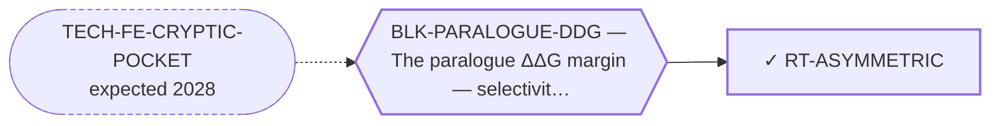

<!-- GENERATED FILE — DO NOT EDIT. Regenerate with:
     python3 systems/systems_check.py --write-views
     Source of truth: systems/graph/*.json -->

# RT-ASYMMETRIC — Asymmetric selectivity — NR4A1-sparing mandatory, NR4A2-sparing best-effort

**Family:** [ST-OCCUPANCY](L1-st-occupancy.md) · **state:** ✓ ready · computed · confidence high · verified 2026-08-05

**Grade** (owned by [`research/manuscripts/target-route-options.md`](../../research/manuscripts/target-route-options.md#route-1--asymmetric-selectivity-nr4a1-sparing-mandatory-nr4a2-sparing-best-effort--pk)): ★★ adopt now — free, and it changes the design brief

## What has to land for this route to move

**Reading it.** A solid arrow is what holds this route down today. A dashed arrow is a capability that WOULD retire a blocker — dashed because it has not landed, and the date beside it is a forecast, not a schedule.

## Scientific rationale

Sparing NR4A1 and sparing NR4A2 have been treated as one symmetric requirement, and they are not. NR4A1 has a named anti-target genotype making its sparing a hard constraint; NR4A2 sparing is unbounded in both directions. Recognising the asymmetry changes the design brief, because a molecule only has to win decisively against one of them.

## Remaining unknowns

- How much NR4A2 engagement is actually acceptable — the bound is unstated in both directions.

## Required validation

| what | instrument | feasible today | blocked by |
|---|---|---|---|
| The asymmetry carried through every downstream selectivity statement rather than stated once | ⛔ none built | yes | — |

## Blockers

| blocker | kind | what would retire it |
|---|---|---|
| **BLK-PARALOGUE-DDG** | `requires_better_simulation_accuracy` | `TECH-FE-CRYPTIC-POCKET` |

## Readiness — what this could become today

**`reproducible_workflow`**

It is a reframing rather than a result. Its value is that it changes what the other routes are trying to achieve, and that belongs inside them rather than in a paper of its own.

## Strategic timing — the wait equation

**Recommendation: `pursue_now`**

Free, already adopted, and it changes the design brief for every route in two families. There is no version of waiting that improves it.

| horizon | effect |
|---|---|
| Six months | None. |
| Two years | None. |
| Cost trend | flat |
| Automation outlook | It is a definitional decision, not computation. |

## Best next action

Ensure the asymmetry is carried in every selectivity statement across the model rather than asserted once — a symmetric restatement anywhere is a defect.

*Cost:* $0

[← ST-OCCUPANCY](L1-st-occupancy.md) · [← L0](L0-ecosystem.md)
