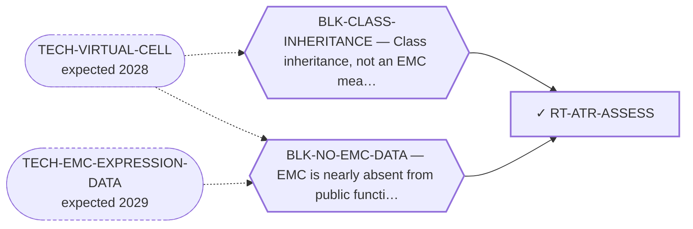

<!-- GENERATED FILE — DO NOT EDIT. Regenerate with:
     python3 systems/systems_check.py --write-views
     Source of truth: systems/graph/*.json -->

# RT-ATR-ASSESS — The in-silico ATR vulnerability assessment (the computed half)

**Family:** [ST-DEPENDENCY](L1-st-dependency.md) · **state:** ✓ ready · computed · confidence moderate · verified 2026-08-05

**Grade** (owned by [`research/manuscripts/emc-post-degrader-options.md`](../../research/manuscripts/emc-post-degrader-options.md)): Tier 1, rank 3 — DELIVERABLE

## What has to land for this route to move

**Reading it.** A solid arrow is what holds this route down today. A dashed arrow is a capability that WOULD retire a blocker — dashed because it has not landed, and the date beside it is a forecast, not a schedule.

✓ Already cleared by this route: `BLK-PARALOGUE-DDG`, `BLK-R4-BINDS`, `BLK-TERNARY-GEOMETRY`.

## Scientific rationale

FET-fusion sarcomas as a class show replication-stress phenotypes that make them sensitive to inhibitors of the associated checkpoint kinase. If EMC inherits that, an existing clinical-stage drug class becomes relevant without any new chemistry. The computational half — assembling the class argument and the supporting molecular features — is complete.

## Supporting evidence

| ref | supports | strength |
|---|---|---|
| `INS-IDR-CENSUS` | the low-complexity-region features the class argument rests on | `class_inherited` |
| `INS-DDR-AXIS-SCAN` | the replication-stress axis assembled for EMC from class-level evidence | `class_inherited` |

## Remaining unknowns

- Whether the class vulnerability transfers: no NR4A3 fusion has ever been tested for the phenotype.
- Whether the computed features predict drug sensitivity, which is a step nobody has validated for this class.

## Required validation

| what | instrument | feasible today | blocked by |
|---|---|---|---|
| A cell panel in EMC lines | ⛔ none built | **no** | BLK-NO-WET-LAB, BLK-CLASS-INHERITANCE |

## Blockers

| blocker | kind | what would retire it |
|---|---|---|
| **BLK-CLASS-INHERITANCE** | `insufficient_data` | `TECH-VIRTUAL-CELL` |
| **BLK-NO-EMC-DATA** | `insufficient_data` | `TECH-EMC-EXPRESSION-DATA`, `TECH-VIRTUAL-CELL` |

## Blockers this route RETIRES

- **BLK-PARALOGUE-DDG** — The paralogue ΔΔG margin — selectivity that reduces to exp(−ΔΔG/RT)
- **BLK-TERNARY-GEOMETRY** — Ternary geometry — assembly, E3, exit vector, ubiquitin transfer
- **BLK-R4-BINDS** — R4 — nothing is known to bind the cryptic pocket at all

## Not to be confused with

| route | the axis it turns on | blockers the distinction turns on | why |
|---|---|---|---|
| [RT-ATR-PANEL](L2-rt-atr-panel.md) | deliverable vs ask | `BLK-CLASS-INHERITANCE` | the assessment produces a computed result whether or not one cell is ever plated; the panel is the experiment and this programme does not execute it. The corrected ranking SPLIT them for exactly this reason |
| [RT-SYNLETH-DEP](L2-rt-synleth-dep.md) | where the dependency comes from | `BLK-NO-EMC-DATA` | both are called 'synthetic lethality' and they are not the same route: the ATR axis is inherited from a FET-family class argument, the BRD9/ncBAF axis was a DepMap transfer prior and came back negative |

## Readiness — what this could become today

**`preprint`**

It is computationally complete on its own axis, and its limit — that this is class inheritance rather than an EMC measurement — is stated inside the deliverable rather than hidden. That is publishable as an assessment; it is not publishable as a finding about EMC.

**Missing:**
- an EMC-specific measurement

**Experiment required:**
- a checkpoint-kinase inhibitor sensitivity panel in EMC lines

## Strategic timing — the wait equation

**Recommendation: `pursue_now`**

Complete, honest, and does not need the cell panel to be worth publishing. Its value is precisely that it states a testable class hypothesis clearly enough for someone with cells to act on — which is how a no-wet-lab program converts computation into experiments.

| horizon | effect |
|---|---|
| Six months | None on the computation. |
| Two years | An EMC dataset would convert the class argument into a measurement. |
| Cost trend | flat |
| Automation outlook | The assessment is automated; the panel is not. |

## Claim ceiling — what this route may NOT be used to claim

*Inherited from [ST-DEPENDENCY](L1-st-dependency.md), which is where these are asserted — a family limitation binds every route inside it.*

- The dependency transfer prior came back negative on the available data — a measured premise, revivable only by EMC-specific data.
- One route rests on class inheritance: no NR4A3 fusion has been tested for the phenotype it assumes.
- There is one EMC model in public dependency data, with no CRISPR data, so this family's in-silico half is bounded by a sample size of one.

## Best next action

Publish the assessment with the class-inheritance limit stated inside it, and pair it with the cell-panel ask.

*Cost:* $0

## What this route rests on — drill down

*L4 instruments and L5 objects, evidence and artifacts. Every row here is asserted by this route; the [evidence base](L5-evidence-base.md) shows the same edges from the other end.*

| L4 instrument | cited as | known-answer control |
|---|---|---|
| [INS-CONSTRUCT-DESIGNS](registers/instruments.md) — Transcript-level fusion construct designer (frame computed at the nucl | support | `passes` |
| [INS-DDR-AXIS-SCAN](registers/instruments.md) — ATRi/PARPi sensitivity re-cut by FET status (GDSC2) | support | `passes` |
| [INS-IDR-CENSUS](registers/instruments.md) — FET N-terminal IDR / RGG retention census | support | `passes` |
| [INS-DEPMAP-KO](registers/instruments.md) — DepMap CRISPR-knockout dependency scan of the ATR axis | **disclosed failing** | `fails` |

**L5 objects:** [OBJ-FUS-FUSNR4A3](L5-evidence-base.md#objects--the-biological-and-molecular-entities-the-program-reasons-about), [OBJ-FUS-T1](L5-evidence-base.md#objects--the-biological-and-molecular-entities-the-program-reasons-about), [OBJ-FUS-T2](L5-evidence-base.md#objects--the-biological-and-molecular-entities-the-program-reasons-about), [OBJ-FUS-T5](L5-evidence-base.md#objects--the-biological-and-molecular-entities-the-program-reasons-about), [OBJ-FUS-TAF15](L5-evidence-base.md#objects--the-biological-and-molecular-entities-the-program-reasons-about), [OBJ-FUS-TCF12](L5-evidence-base.md#objects--the-biological-and-molecular-entities-the-program-reasons-about), [OBJ-MODEL-E7E3](L5-evidence-base.md#objects--the-biological-and-molecular-entities-the-program-reasons-about)

**L5 evidence:** [EV-FET-ATR-2023](L5-evidence-base.md#evidence--the-literature-this-program-cites)

**L5 artifacts:** [ART-ATR-VULNERABILITY](L5-evidence-base.md#artifacts--the-files-a-claim-can-be-checked-against), [ART-CONSTRUCT-DESIGNS](L5-evidence-base.md#artifacts--the-files-a-claim-can-be-checked-against), [ART-DDR-AXIS-SCAN](L5-evidence-base.md#artifacts--the-files-a-claim-can-be-checked-against), [ART-IDR-CENSUS](L5-evidence-base.md#artifacts--the-files-a-claim-can-be-checked-against)

[← ST-DEPENDENCY](L1-st-dependency.md) · [← L0](L0-ecosystem.md)
