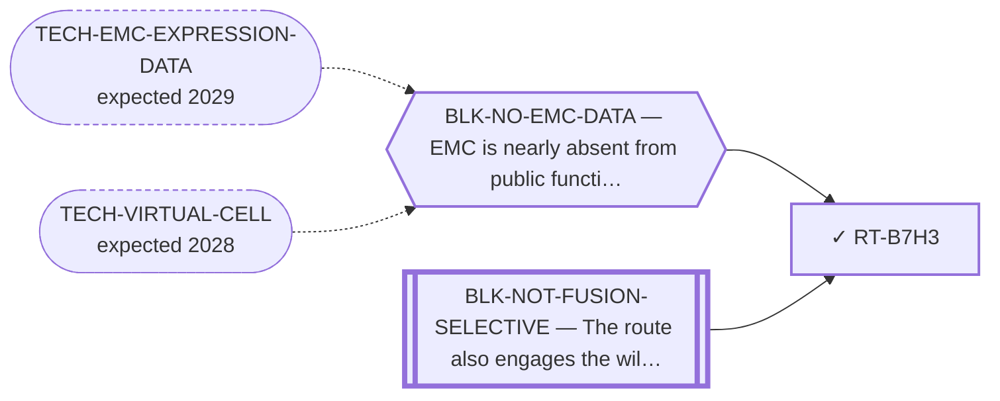

<!-- GENERATED FILE — DO NOT EDIT. Regenerate with:
     python3 systems/systems_check.py --write-views
     Source of truth: systems/graph/*.json -->

# RT-B7H3 — B7-H3 (CD276) / CD56 → ADC, bispecific or CAR-T

**Family:** [ST-IMMUNO](L1-st-immuno.md) · **state:** ✓ parked · computed · confidence moderate · verified 2026-08-05

**Grade** (owned by [`research/manuscripts/emc-surface-target-landscape.md`](../../research/manuscripts/emc-surface-target-landscape.md)): Tier 3 — already red-teamed in this repo: not selective (BH q = 1.0)

## What has to land for this route to move

**Reading it.** A solid arrow is what holds this route down today. A dashed arrow is a capability that WOULD retire a blocker — dashed because it has not landed, and the date beside it is a forecast, not a schedule.

⛔ **1 of these is permanent** (`BLK-NOT-FUSION-SELECTIVE`) — a fact about the biology, drawn double-walled, with no way out by definition. No technology arrives to fix it.

✓ Already cleared by this route: `BLK-PARALOGUE-DDG`, `BLK-TERNARY-GEOMETRY`.

## Scientific rationale

B7-H3 is a broadly expressed tumour antigen with clinical-stage agents already available, so a positive selectivity finding would have been immediately actionable.

## Supporting evidence

| ref | supports | strength |
|---|---|---|
| `ART-SURFACE-EXPRESSION` | the selectivity premise was measured on cell-line surrogates and failed | `surrogate` |

## Remaining unknowns

- Whether real EMC tissue would give a different answer than the cell-line surrogates that produced the negative.

## Required validation

| what | instrument | feasible today | blocked by |
|---|---|---|---|
| Selectivity measured on real EMC tissue rather than surrogates | ⛔ none built | **no** | BLK-NO-EMC-DATA |

## Blockers

| blocker | kind | what would retire it |
|---|---|---|
| **BLK-NOT-FUSION-SELECTIVE** | `fundamental_biological_limit` | *permanent* |
| **BLK-NO-EMC-DATA** | `insufficient_data` | `TECH-EMC-EXPRESSION-DATA`, `TECH-VIRTUAL-CELL` |

## Blockers this route RETIRES

- **BLK-PARALOGUE-DDG** — The paralogue ΔΔG margin — selectivity that reduces to exp(−ΔΔG/RT)
- **BLK-TERNARY-GEOMETRY** — Ternary geometry — assembly, E3, exit vector, ubiquitin transfer

## Readiness — what this could become today

**`internal_note`**

The negative was measured on surrogates, so it is as provisional as a positive would have been. Reporting it as settled would overstate it.

**Missing:**
- a tissue-level measurement

## Strategic timing — the wait equation

**Recommendation: `monitor`**

A measured negative on surrogate data. Only a tissue-level measurement moves it, in either direction.

| horizon | effect |
|---|---|
| Six months | None. |
| Two years | Only via an EMC dataset. |
| Cost trend | flat |
| Automation outlook | Re-grade is automatic on new data. |

**Revisit when:**
- **TECH-EMC-EXPRESSION-DATA** — A fetchable public EMC RNA-seq or proteomics deposit beyond the single existing model, enabling a target-regulon readout and per-a *(expected 2029, basis `speculative`)*

## Closure

`premise_false` — The selectivity premise was MEASURED and failed on cell-line surrogates; real EMC tissue is what could change the measurement.

## Best next action

Keep registered with the surrogate caveat attached to the negative.

*Cost:* $0

[← ST-IMMUNO](L1-st-immuno.md) · [← L0](L0-ecosystem.md)
