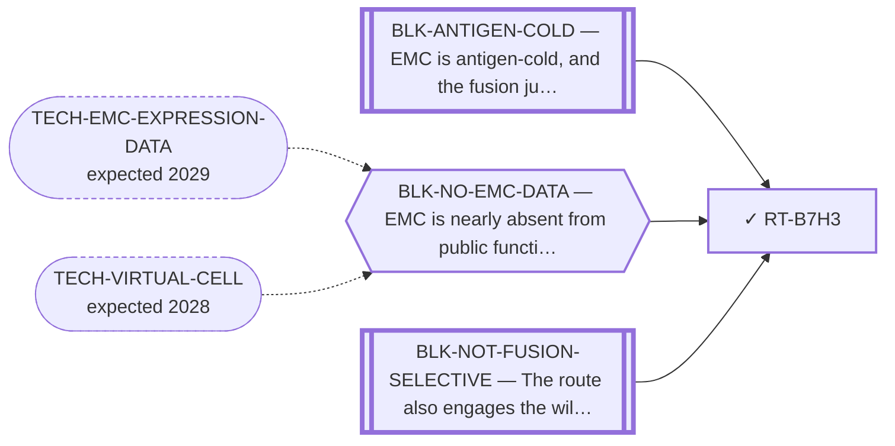

<!-- GENERATED FILE — DO NOT EDIT. Regenerate with:
     python3 systems/systems_check.py --write-views
     Source of truth: systems/graph/*.json -->

# RT-B7H3 — B7-H3 (CD276) / CD56 → ADC, bispecific or CAR-T

**Family:** [ST-IMMUNO](L1-st-immuno.md) · **state:** ✓ parked · computed · confidence moderate · verified 2026-08-06

**Grade** (owned by [`research/manuscripts/surface-targets/emc-surface-target-landscape.md`](../../research/manuscripts/surface-targets/emc-surface-target-landscape.md)): Tier 3 — already red-teamed in this repo. ⚠ THE TWO ANTIGENS FAIL DIFFERENTLY: B7-H3/CD276 is NOT selective (BH q = 1.0, enrichment 0.14); CD56/NCAM1 IS selective (q = 0.0, enrichment 1.74) and fails instead on the normal-tissue / immune window (NK cells), with a discontinued CD56 ADC precedent

## What has to land for this route to move

**Reading it.** A solid arrow is what holds this route down today. A dashed arrow is a capability that WOULD retire a blocker — dashed because it has not landed, and the date beside it is a forecast, not a schedule.

⛔ **2 of these are permanent** (`BLK-ANTIGEN-COLD`, `BLK-NOT-FUSION-SELECTIVE`) — a fact about the biology, drawn double-walled, with no way out by definition. No technology arrives to fix it.

✓ Already cleared by this route: `BLK-PARALOGUE-DDG`, `BLK-TERNARY-GEOMETRY`.

## Scientific rationale

B7-H3 is a broadly expressed tumour antigen with clinical-stage agents already available, so a positive selectivity finding would have been immediately actionable.

## Supporting evidence

| ref | supports | strength |
|---|---|---|
| `ART-SURFACE-EXPRESSION` | the selectivity premise was measured on cell-line surrogates and failed | `surrogate` |
| `ART-EMC-EXPRESSION-PANELS` | The EMC-tissue transcript reading behind required_validation[0]: gene_reads.CD276 and reads.read_8_SURFACE_ANTIGEN.the_route_named_addresses.CD276. It does not reach selectivity, which is a protein and tumour-versus-normal axis this artifact does not measure. | `direct` |

## Remaining unknowns

- Whether real EMC tissue would give a different answer than the cell-line surrogates that produced the negative.

## Required validation

| what | instrument | feasible today | blocked by |
|---|---|---|---|
| Selectivity measured on real EMC tissue rather than surrogates  ⭐ ADJUDICATED 2026-09-02 (AUT-PD-116, seat s31-emc-data-blocks). HALF TAKEN, AND THE HALF THAT IS NOT TAKEN IS THE WORD IN THE REQUIREMENT. The transcript read exists — `gene_reads.CD276.GSE24369_series_matrix.txt.gz.readable` true on GPL6244 only, with the contrast in `reads.read_8_SURFACE_ANTIGEN.the_route_named_addresses.CD276` — but SELECTIVITY is a protein and tumour-versus-normal axis, and `_what_this_cannot_conclude` states that this artifact's every contrast is EMC versus other SARCOMAS and that the tumour-versus-normal axis is not measured anywhere in the file. The residual is a measurement, not missing data. CD276 and NCAM1 have no assigned probe in the fourth cohort. ⚠ THE RULE THIS APPLIES, THE FOURTH COHORT'S DESIGN AND LIMITS, AND THE PER-GENE COVERAGE ALL HAVE ONE HOME AND ARE NOT RESTATED HERE: research/modalities/emc-fourth-cohort-route-readout.json — its "⭐ the_rule_this_adjudication_applies" field, its cohort block, and per_route.RT-B7H3. | ⛔ none built | **no** | BLK-NO-WET-LAB |

## Blockers

| blocker | kind | what would retire it |
|---|---|---|
| **BLK-ANTIGEN-COLD** | `fundamental_biological_limit` | *permanent* |
| **BLK-NO-EMC-DATA** | `insufficient_data` | `TECH-EMC-EXPRESSION-DATA`, `TECH-VIRTUAL-CELL` |
| **BLK-NOT-FUSION-SELECTIVE** | `fundamental_biological_limit` | *permanent* |

## Blockers this route RETIRES

- **BLK-PARALOGUE-DDG** — The paralogue ΔΔG margin — selectivity that reduces to exp(−ΔΔG/RT)
- **BLK-TERNARY-GEOMETRY** — Ternary geometry — assembly, E3, exit vector, ubiquitin transfer

## Not to be confused with

| route | the axis it turns on | blockers the distinction turns on | why |
|---|---|---|---|
| [RT-CART-SURFACE](L2-rt-cart-surface.md) | antigen vs modality | `BLK-NOT-FUSION-SELECTIVE` | B7-H3 is an ANTIGEN whose selectivity was measured and failed; CAR-T is a MODALITY that would use whichever antigen survives. Collapsing them hides that the modality is blocked by the antigen search, not by the cell product |
| [RT-SSTR2](L2-rt-sstr2.md) | which antigen and how it was graded | `BLK-NOT-FUSION-SELECTIVE` | B7-H3's selectivity was MEASURED and failed (BH q = 1.0); SSTR2 is UNMEASURED in EMC. A measured negative and an unmeasured hope are not the same status |

## Readiness — what this could become today

**`internal_note`**

The negative was measured on surrogates, so it is as provisional as a positive would have been. Reporting it as settled would overstate it.

**Missing:**
- a tissue-level measurement

## Where this route ends — the paper

**[PUB-SURFACE-TARGETS](L3-publications.md)** — [Fixed-panel tissue RNA prioritization in extraskeletal myxoid chondrosarcoma](../../research/manuscripts/surface-targets/emc-tissue-rna-prioritization.md)

`primary` · ◐ `drafted` · aimed at `preprint`

**This route contributes:** The prioritised surface-antigen ranking and the surrogate basis that bounds its negatives.

**The paper would claim:** A fixed panel of 11 therapeutic-address genes, with CHRNA6 as a separate established RNA-marker control, can be assessed using within-cohort tissue RNA ranks and prespecified sarcoma comparators. In the overlap-reduced Hofvander cohort of nine primary EMC specimens, CSPG4 alone meets the frozen tissue-validation allocation rule; its LGFMS contrast agrees with the original GSE24369 array contrast, but year-deletion sensitivity and DFSP context limit generalization. This supports a qualified rationale for EMC tissue protein and compartment validation, not validated surface expression, normal sparing, treatment selection or efficacy. All other fixed-panel results and discordant protein/normal-context evidence are retained.

## Strategic timing — the wait equation

**Recommendation: `monitor`**

A measured negative on surrogate data. Only a tissue-level measurement moves it, in either direction.

| horizon | effect |
|---|---|
| Six months | None. |
| Two years | Only via an EMC dataset. |
| Cost trend | flat |
| Automation outlook | Re-grade is automatic on new data. |

**Revisit when:**
- **TECH-EMC-EXPRESSION-DATA** — A fetchable public EMC RNA-seq or proteomics deposit beyond the single existing model, enabling a target-regulon readout and per-a *(expected 2029, basis `speculative`)*

## Claim ceiling — what this route may NOT be used to claim

*Inherited from [ST-IMMUNO](L1-st-immuno.md), which is where these are asserted — a family limitation binds every route inside it.*

- EMC is antigen-cold and the fusion junction is a weak peptide-HLA — a property of this tumour and this junction, not of any modality here.
- Surface-antigen selectivity was measured on cell-line surrogates rather than on EMC tissue, so the negatives are as provisional as the positives would have been.
- One route's predicted binders span junction seams that a corrected exon index says do not exist; that result is void and the question is open.

## Closure

`premise_false` — The selectivity premise was MEASURED and failed FOR B7-H3 (BH q = 1.0). ⚠ It did NOT fail for CD56 — NCAM1 returns q = 0.0 and is selectivity-significant; what fails there is the normal-tissue window (VITAL_OR_IMMUNE_LIABILITY, NK cells). Collapsing the two into one 'not selective' verdict was wrong for half this route.

## Best next action

Keep registered with the surrogate caveat attached to the negative.

*Cost:* $0

[← ST-IMMUNO](L1-st-immuno.md) · [← L0](L0-ecosystem.md)
