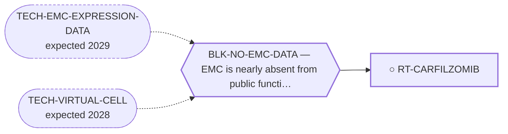

<!-- GENERATED FILE — DO NOT EDIT. Regenerate with:
     python3 systems/systems_check.py --write-views
     Source of truth: systems/graph/*.json -->

# RT-CARFILZOMIB — Carfilzomib ± anthracycline (± venetoclax)

**Family:** [ST-REPURPOSING](L1-st-repurposing.md) · **state:** ○ ready · concept · confidence moderate · verified 2026-08-05

**Grade** (owned by [`research/manuscripts/repurposing-hypotheses.md`](../../research/manuscripts/repurposing-hypotheses.md)): NEAR-TERM LEAD — best ex-vivo EMC evidence

## What has to land for this route to move

**Reading it.** A solid arrow is what holds this route down today. A dashed arrow is a capability that WOULD retire a blocker — dashed because it has not landed, and the date beside it is a forecast, not a schedule.

✓ Already cleared by this route: `BLK-PARALOGUE-DDG`, `BLK-TERNARY-GEOMETRY`.

## Scientific rationale

This carries the best ex-vivo EMC drug-sensitivity evidence in the repository — an actual measurement on actual EMC material, which is rarer than anything else in this family. An approved agent with an ex-vivo signal is a strong near-term lead by the standards available for this disease.

## Supporting evidence

| ref | supports | strength |
|---|---|---|
| `EV-EMC-EXVIVO` | ex-vivo drug sensitivity measured on EMC material | `direct` |

## Remaining unknowns

- Whether ex-vivo sensitivity transfers to clinical benefit, which it frequently does not.
- The provenance of the underlying evidence needs firming — it is the repository's only ex-vivo EMC result and its citation has been flagged as incomplete.

## Required validation

| what | instrument | feasible today | blocked by |
|---|---|---|---|
| Confirmation of the ex-vivo result and a firm primary citation | ⛔ none built | yes | — |
| A clinical series | ⛔ none built | **no** | BLK-NO-EMC-DATA |

## Blockers

| blocker | kind | what would retire it |
|---|---|---|
| **BLK-NO-EMC-DATA** | `insufficient_data` | `TECH-EMC-EXPRESSION-DATA`, `TECH-VIRTUAL-CELL` |

## Blockers this route RETIRES

- **BLK-PARALOGUE-DDG** — The paralogue ΔΔG margin — selectivity that reduces to exp(−ΔΔG/RT)
- **BLK-TERNARY-GEOMETRY** — Ternary geometry — assembly, E3, exit vector, ubiquitin transfer

## Readiness — what this could become today

**`internal_note`**

Its single supporting result currently lacks a resolvable primary identifier, and an uncitable result cannot carry a published claim however good it looks.

**Missing:**
- a resolvable primary citation for the ex-vivo evidence

## Where this route ends — the paper

**[PUB-REPURPOSING](L3-publications.md)** — [Mechanism-based drug-repurposing hypotheses for extraskeletal myxoid chondrosarcoma](../../research/manuscripts/repurposing-hypotheses.md)

`primary` · ◐ `drafted` · aimed at `preprint`

**This route contributes:** The proteasome-inhibitor hypothesis and the ex-vivo EMC evidence behind it — the only ex-vivo EMC result in the portfolio, and currently the paper's weakest citation.

**The paper would claim:** Existing agents not yet reported in EMC can be mapped to EMC's molecular and microenvironmental axes by three independent methods, each candidate graded by an explicit evidence tier — a hypothesis-generating menu that asserts no efficacy for any agent it names.

## Strategic timing — the wait equation

**Recommendation: `pursue_now`**

The blocking item is a citation lookup, not a capability — and it gates the only ex-vivo EMC evidence the repository holds. Leaving the program's best measured EMC result uncitable is a defect worth fixing before anything else in this family.

| horizon | effect |
|---|---|
| Six months | None. |
| Two years | None on the citation; a clinical series would change the route. |
| Cost trend | flat |
| Automation outlook | The literature lookup is automatable and is already wired. |

## Claim ceiling — what this route may NOT be used to claim

*Inherited from [ST-REPURPOSING](L1-st-repurposing.md), which is where these are asserted — a family limitation binds every route inside it.*

- EMC is nearly absent from public functional-genomics data, so mechanism fit is argued from class membership rather than measured in this disease.
- Several routes here rest on a direction of effect that has never been read in EMC tissue; an expression readout would settle them cheaply and does not exist.
- A repurposing hypothesis is a hypothesis. Nothing here asserts efficacy in EMC.

## Best next action

Resolve the primary citation for the ex-vivo EMC drug-sensitivity evidence. It is the only ex-vivo EMC result here and it currently carries no resolvable identifier.

*Cost:* $0

## What this route rests on — drill down

*L4 instruments and L5 objects, evidence and artifacts. Every row here is asserted by this route; the [evidence base](L5-evidence-base.md) shows the same edges from the other end.*

**L5 evidence:** [EV-BANGERTER-2023](L5-evidence-base.md#evidence--the-literature-this-program-cites)

[← ST-REPURPOSING](L1-st-repurposing.md) · [← L0](L0-ecosystem.md)
