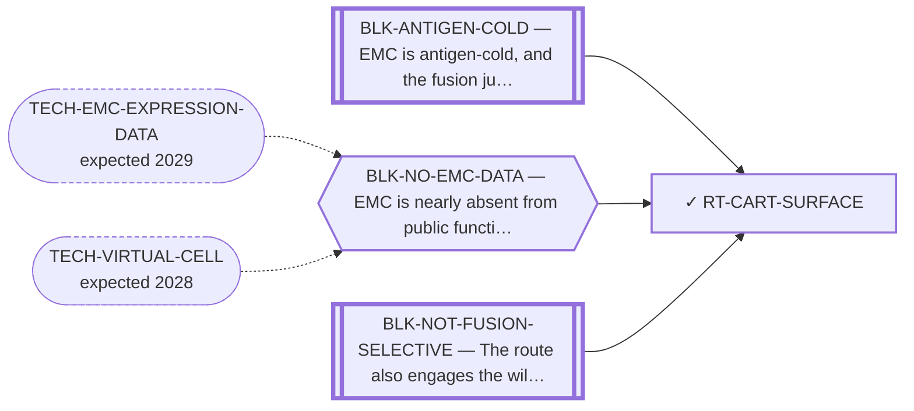

<!-- GENERATED FILE — DO NOT EDIT. Regenerate with:
     python3 systems/systems_check.py --write-views
     Source of truth: systems/graph/*.json -->

# RT-CART-SURFACE — CAR-T for EMC (surface-directed)

**Family:** [ST-IMMUNO](L1-st-immuno.md) · **state:** ✓ blocked · computed · confidence low · verified 2026-08-05

**Grade** (owned by [`research/manuscripts/surface-targets/car-t-strategies-emc.md`](../../research/manuscripts/surface-targets/car-t-strategies-emc.md)): Hard but not closed — among surface modalities, the conjugate and radioligand forms carry the smaller build and regulatory burden; nothing here bears on efficacy in EMC

## What has to land for this route to move

**Reading it.** A solid arrow is what holds this route down today. A dashed arrow is a capability that WOULD retire a blocker — dashed because it has not landed, and the date beside it is a forecast, not a schedule.

⛔ **2 of these are permanent** (`BLK-ANTIGEN-COLD`, `BLK-NOT-FUSION-SELECTIVE`) — a fact about the biology, drawn double-walled, with no way out by definition. No technology arrives to fix it.

✓ Already cleared by this route: `BLK-PARALOGUE-DDG`, `BLK-TERNARY-GEOMETRY`.

## Scientific rationale

A surface target avoids the intracellular-antigen problem entirely and CAR-T is a mature modality. The whole route reduces to whether EMC presents a surface antigen that healthy tissue does not.

## Supporting evidence

| ref | supports | strength |
|---|---|---|
| `ART-EMC-EXPRESSION-PANELS` | The antigen search this route's required_validation[0] asked for: reads.read_8_SURFACE_ANTIGEN.cross_platform_board, 100 genes, of which five are concordantly up on both platforms and none clears the route's stated requirement of a SELECTIVE SURFACE antigen. | `direct` |

## Remaining unknowns

- Whether any sufficiently selective surface antigen exists on EMC.
- Whether the myxoid stroma admits T cells at all.

## Required validation

| what | instrument | feasible today | blocked by |
|---|---|---|---|
| A selective surface antigen confirmed on EMC tissue  ⭐ ADJUDICATED 2026-09-02 (AUT-PD-116, seat s31-emc-data-blocks). THE SEARCH THIS ENTRY WAITED ON HAS RUN, AND IT RETURNED NO QUALIFYING ANTIGEN. `reads.read_8_SURFACE_ANTIGEN.cross_platform_board.by_state.CONCORDANT_UP_ON_BOTH` holds five of the board's 100 genes (ALCAM, BGN, CD44, GPC1, VCAN); only ALCAM carries a RESTRICTED normal-tissue prior in `research/modalities/emc-surface-normal-window.json`, and the route's own owning manuscript demotes ALCAM on the exposure axis. ⛔ SO THE REQUIREMENT — a SELECTIVE SURFACE antigen — IS NOT SATISFIED, `readiness.missing` stays true and is not edited, and nothing here promotes this route. The fourth cohort adds BGN, CD44 and VCAN in twelve more tumours and no ALCAM or GPC1 probe. ⚠ THE RULE THIS APPLIES, THE FOURTH COHORT'S DESIGN AND LIMITS, AND THE PER-GENE COVERAGE ALL HAVE ONE HOME AND ARE NOT RESTATED HERE: research/modalities/emc-fourth-cohort-route-readout.json — its "⭐ the_rule_this_adjudication_applies" field, its cohort block, and per_route.RT-CART-SURFACE. | ⛔ none built | **no** | BLK-ANTIGEN-COLD, BLK-NO-WET-LAB |

## Blockers

| blocker | kind | what would retire it |
|---|---|---|
| **BLK-ANTIGEN-COLD** | `fundamental_biological_limit` | *permanent* |
| **BLK-NO-EMC-DATA** | `insufficient_data` | `TECH-EMC-EXPRESSION-DATA`, `TECH-VIRTUAL-CELL` |
| **BLK-NOT-FUSION-SELECTIVE** | `fundamental_biological_limit` | *permanent* |

## Blockers this route RETIRES

- **BLK-PARALOGUE-DDG** — The paralogue ΔΔG margin — selectivity that reduces to exp(−ΔΔG/RT)
- **BLK-TERNARY-GEOMETRY** — Ternary geometry — assembly, E3, exit vector, ubiquitin transfer

## Not to be confused with

| route | the axis it turns on | blockers the distinction turns on | why |
|---|---|---|---|
| [RT-PANNR4A-EXVIVO](L2-rt-pannr4a-exvivo.md) | where the NR4A molecule acts | `BLK-ANTIGEN-COLD` | ⚠ TWO DIFFERENT CAR-T ROUTES. This one directs a CAR against an EMC surface antigen. No treatment claim is made — no antigen here has been shown to be EMC-restricted, and nothing asserts efficacy. The pan-NR4A pole is a MANUFACTURING ADDITIVE applied ex vivo to the T cells, where the systemic-selectivity liability does not arise at all |
| [RT-B7H3](L2-rt-b7h3.md) | antigen vs modality | `BLK-ANTIGEN-COLD`, `BLK-NO-EMC-DATA` | CAR-T is the modality; B7-H3 is one antigen it could use. The modality is blocked by the antigen search and by the cold myxoid stroma, not by the cell product |

## Readiness — what this could become today

**`internal_note`**

Blocked by the antigen search and the cold stroma rather than by the cell product. Among surface modalities, conjugates and radioligands carry a smaller build and regulatory burden — a statement about development effort, not about efficacy.

**Missing:**
- a selective surface antigen

## Where this route ends — the paper

**[PUB-SURFACE-TARGETS](L3-publications.md)** — [Fixed-panel tissue RNA prioritization in extraskeletal myxoid chondrosarcoma](../../research/manuscripts/surface-targets/emc-tissue-rna-prioritization.md)

`contributing` · ◐ `drafted` · aimed at `preprint`

**This route contributes:** The cell-product reading of the same ranking, and the finding that the constraint is the antigen and the stroma rather than the CAR.

**The paper would claim:** A fixed panel of 11 therapeutic-address genes, with CHRNA6 as a separate established RNA-marker control, can be assessed using within-cohort tissue RNA ranks and prespecified sarcoma comparators. In the overlap-reduced Hofvander cohort of nine primary EMC specimens, CSPG4 alone meets the frozen tissue-validation allocation rule; its LGFMS contrast agrees with the original GSE24369 array contrast, but year-deletion sensitivity and DFSP context limit generalization. This supports a qualified rationale for EMC tissue protein and compartment validation, not validated surface expression, normal sparing, treatment selection or efficacy. All other fixed-panel results and discordant protein/normal-context evidence are retained.

## Strategic timing — the wait equation

**Recommendation: `monitor`**

Two independent blockers, both about the tumour rather than the modality, and other surface modalities are ahead of it on the same antigen question.

| horizon | effect |
|---|---|
| Six months | None. |
| Two years | Only via an EMC dataset that surfaces a candidate antigen. |
| Cost trend | flat |
| Automation outlook | The antigen search is automatable and has been run; the data is what is missing. |

**Revisit when:**
- **TECH-EMC-EXPRESSION-DATA** — A fetchable public EMC RNA-seq or proteomics deposit beyond the single existing model, enabling a target-regulon readout and per-a *(expected 2029, basis `speculative`)*

## Claim ceiling — what this route may NOT be used to claim

*Inherited from [ST-IMMUNO](L1-st-immuno.md), which is where these are asserted — a family limitation binds every route inside it.*

- EMC is antigen-cold and the fusion junction is a weak peptide-HLA — a property of this tumour and this junction, not of any modality here.
- Surface-antigen selectivity was measured on cell-line surrogates rather than on EMC tissue, so the negatives are as provisional as the positives would have been.
- One route's predicted binders span junction seams that a corrected exon index says do not exist; that result is void and the question is open.

## Closure

`confound_in_the_system` — Blocked by the antigen search and the cold myxoid stroma, not by the cell product. ⚠ BLK-NOT-FUSION-SELECTIVE reads HERE as on-target/off-tumour — the antigen is shared with normal tissue — not as a paralogue margin; a CAR engages neither NR4A3 nor EWSR1.

## Best next action

Keep registered. The antigen search re-runs automatically when EMC expression data lands. ⛔ CORRECTED 2026-09-02 (AUT-PD-116): the data landed and the search RAN — reads.read_8_SURFACE_ANTIGEN.cross_platform_board returned five of 100 genes concordantly up on both platforms, of which only ALCAM carries a RESTRICTED normal-tissue prior and the owning manuscript demotes ALCAM on the exposure axis. ⚠ Superseded, retained: "The antigen search re-runs automatically when EMC expression data lands." A completed search recorded as a standing promise makes a finished negative read as pending upside. ⛔ readiness.missing stays true: no qualifying antigen was found.

*Cost:* $0

[← ST-IMMUNO](L1-st-immuno.md) · [← L0](L0-ecosystem.md)
