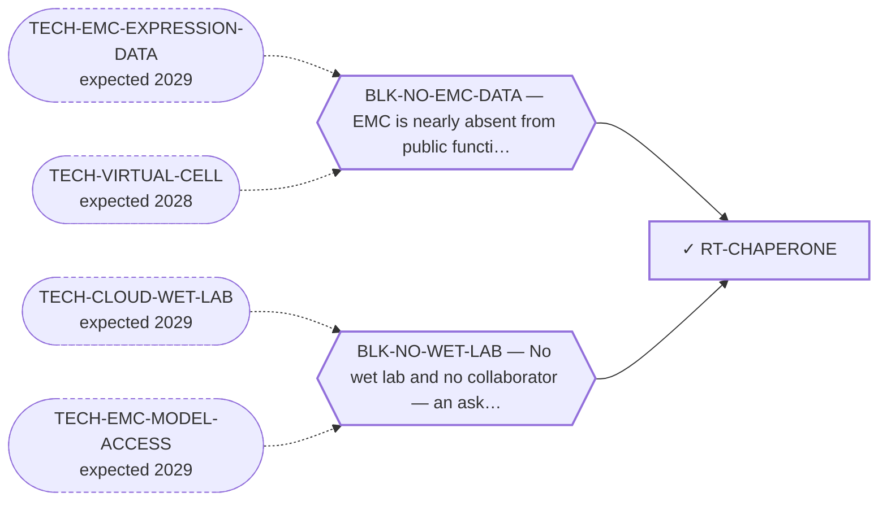

<!-- GENERATED FILE — DO NOT EDIT. Regenerate with:
     python3 systems/systems_check.py --write-views
     Source of truth: systems/graph/*.json -->

# RT-CHAPERONE — Chaperone dependency of the chimera (HSP90 and co-chaperones)

**Family:** [ST-DEPENDENCY](L1-st-dependency.md) · **state:** ✓ blocked · computed · confidence low · verified 2026-08-09

**Grade** (owned by [`research/modalities/census-route-expression-grading.json`](../../research/modalities/census-route-expression-grading.json)): ◐ PARTLY SUPPORTED (2026-08-09). The HSP90 machine and its co-chaperones read HIGHER in EMC on BOTH platforms. ⛔ But the HSP70 arm and the heat-shock response go the OTHER way on both — which is the reading that matters, because a standing proteostatic load should raise the stress response too, and it does not. ⭐ AND THE DEPENDENCY AXIS ADDS AN ASYMMETRY THE ABUNDANCE READING DOES NOT SHOW. Across the 91 screened sarcoma lines the two HSP90 paralogues are dependencies in only 5.5% and 18.7% ⛔ DENOMINATOR CORRECTED 2026-08-27: this grade said 176 sarcoma lines. 176 is the number of sarcoma MODELS in DepMap 24Q4; only 91 of them carry CRISPR gene-effect data, and every fraction here is computed over those 91. The repository caught this identical error in the MTAP/PRMT5 manuscript on 2026-08-09/10 -- the day after this grade was written -- and the correction never reached the graph. of lines, while the kinase-specific co-chaperone CDC37 is a dependency in 97.8% — and none of the three shows any sarcoma selectivity. ⚠ THE PARALOGUE RESULT MUST NOT BE READ AS 'HSP90 IS DISPENSABLE': two paralogues that back each other up will each score as non-essential in a single-gene knockout screen, which is a limitation of the instrument and not a property of the chaperone. What the near-essential co-chaperone does say is that the machine as a whole is load-bearing in this tissue class, and that a route hoping to exploit it needs an argument for why the tumour needs it MORE than the normal cell — which nothing here supplies.

## What has to land for this route to move

**Reading it.** A solid arrow is what holds this route down today. A dashed arrow is a capability that WOULD retire a blocker — dashed because it has not landed, and the date beside it is a forecast, not a schedule.

## Scientific rationale

A structural argument nobody here had made. Chimeric proteins are disproportionately chaperone-dependent for folding and stability, which offers a way to lower fusion protein levels that needs no pocket ligand, no assembled ternary complex and no paralogue discrimination — the three blockers holding this portfolio's largest family down.

## Supporting evidence

| ref | supports | strength |
|---|---|---|
| `ART-CENSUS-ROUTE-GRADING` | the HSP90 machine and co-chaperones read higher in EMC on both platforms while the HSP70 arm and heat-shock response read lower — a split the general-stress reading does not predict | `direct` |
| `ART-DEPMAP-SARCOMA-DEP` | the HSP90 paralogues are individually non-essential across sarcoma lines while the kinase-specific co-chaperone is near-essential, with no sarcoma selectivity for any of the three | `class_inherited` |

## Remaining unknowns

- Whether the chimera is a chaperone CLIENT, which is the route's actual premise and a co-immunoprecipitation question that no expression read can reach. ⛔ The literature was assessed on 2026-08-27 and NO FET-family fusion protein is a documented client: no binding assay exists for any FUS, EWSR1 or TAF15 fusion, and NR4A3 fusions have no chaperone literature at all. What does exist is dependence without binding — EWS::FLI1 protein falls on HSP90 inhibition and on knockdown of the co-chaperone SGT1. The assay is not the obstacle: AML1-ETO was shown to bind the chaperonin TRiC directly. See research/literature/fet-fusion-chaperone-clientship-2026-08-27.json.
- Why the HSP90 and HSP70 arms move in opposite directions here, which is unexplained and is the reason this is not graded as support.
- Whether any therapeutic index exists for this class — its clinical record is dominated by toxicity, and nothing here assumes otherwise.
- Whether the two HSP90 paralogues are mutually redundant, which would make their individually low dependency scores an artefact of single-gene knockout rather than a statement about the chaperone — a dual-knockout question no public panel answers.

## Required validation

| what | instrument | feasible today | blocked by |
|---|---|---|---|
| A literature assessment of chaperone clientship across FET-family fusion proteins | ⛔ none built | yes | — |
| A structural assessment of whether the junction region is predicted to be unstable or disordered, using the structural work already committed here | ⛔ none built | yes | — |
| Whether the chimera is an HSP90 CLIENT — a co-immunoprecipitation or degradation-on-inhibition readout in an EMC model, which is the route's premise and which no expression read can reach | ⛔ none built | **no** | BLK-NO-WET-LAB |

## Blockers

| blocker | kind | what would retire it |
|---|---|---|
| **BLK-NO-EMC-DATA** | `insufficient_data` | `TECH-EMC-EXPRESSION-DATA`, `TECH-VIRTUAL-CELL` |
| **BLK-NO-WET-LAB** | `requires_external_collaboration` | `TECH-CLOUD-WET-LAB`, `TECH-EMC-MODEL-ACCESS` |

## Readiness — what this could become today

**`internal_note`**

An arm-split reading is a reason to ask the client question, not an answer to it.

**Missing:**
- a client-binding measurement, which is not an expression question

## Where this route ends — the paper

**[PUB-TXN-DEPENDENCY](L3-publications.md)** — [Transcriptional and proteostatic dependency of a fusion transcription factor — what a no-wet-lab program can and cannot establish](../../research/manuscripts/dependency/emc-transcriptional-proteostatic-dependency.md)

`primary` · ◐ `drafted` · aimed at `preprint`

**This route contributes:** The half of the paper that argues from what the driver IS STRUCTURALLY: a chimera of two domains that never evolved together is a folding problem before it is a signalling one.

**The paper would claim:** A fusion oncoprotein whose entire mechanism is transactivation, and whose structure is a chimera of two domains that never evolved together, predicts dependencies on the transcriptional machinery and on the chaperone system — and for both, ABUNDANCE AND DEPENDENCY DISAGREE IN OPPOSITE DIRECTIONS. The transcriptional half is the most concordant elevation in the census and closes completely on dependency, being pan-essential with no selectivity. The chaperone half is an internally contradictory elevation that survives weakly for a reason abundance alone could not show. Reading only the first axis would have given a confident and wrong answer in both cases, which is the transferable result.

## Strategic timing — the wait equation

**Recommendation: `monitor`**

The decisive observation is whether the fusion is an HSP90 client, and that needs a model this programme cannot reach. The expression read has given what it can.

| horizon | effect |
|---|---|
| Cost trend | flat |

**Revisit when:**
- **TECH-EMC-MODEL-ACCESS** — Access to a patient-derived EMC model through a collaborator, or through a solo-affordable cloud or robotic wet-lab service with E *(expected 2029, basis `speculative`)*

## Claim ceiling — what this route may NOT be used to claim

*Inherited from [ST-DEPENDENCY](L1-st-dependency.md), which is where these are asserted — a family limitation binds every route inside it.*

- The dependency transfer prior came back negative on the available data — a measured premise, revivable only by EMC-specific data.
- One route rests on class inheritance: no NR4A3 fusion has been tested for the phenotype it assumes.
- There is one EMC model in public dependency data, with no CRISPR data, so this family's in-silico half is bounded by a sample size of one.

## Best next action

Fetch IntAct/BioGRID dataset IM-22301, the deposited interaction set of the published human chaperone-interaction network (PMID 25036637), and record whether FUS, EWSR1 or TAF15 appear in its query panel at all — a $0 fetch, and the last cheap observation left on this route now that the FET-fusion clientship literature has been assessed and come back empty.

*Cost:* $0

[← ST-DEPENDENCY](L1-st-dependency.md) · [← L0](L0-ecosystem.md)
