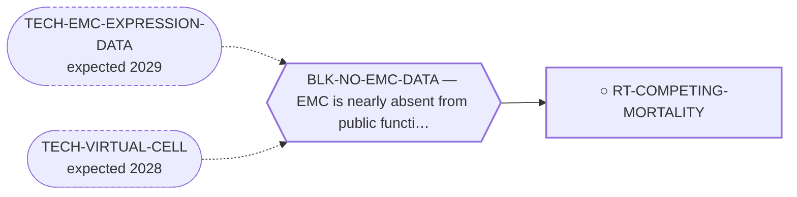

<!-- GENERATED FILE — DO NOT EDIT. Regenerate with:
     python3 systems/systems_check.py --write-views
     Source of truth: systems/graph/*.json -->

# RT-COMPETING-MORTALITY — Competing (non-EMC) mortality in a decade-scale cohort

**Family:** [ST-MORTALITY-MECHANISM](L1-st-mortality-mechanism.md) · **state:** ○ ready · computed · confidence low · verified 2026-08-09

**Grade** (owned by [`research/manuscripts/emc-mortality-mechanisms.md`](../../research/manuscripts/emc-mortality-mechanisms.md)): ⭑ Registered 2026-08-09 from trimcrae's mechanism-of-death question; the family this route sits in did not exist before that day.

## What has to land for this route to move

**Reading it.** A solid arrow is what holds this route down today. A dashed arrow is a capability that WOULD retire a blocker — dashed because it has not landed, and the date beside it is a forecast, not a schedule.

## Scientific rationale

The curated cohorts report ten-year all-cause survival of 65-70% against a ten-year disease-specific survival near 85%. Within the one series that measures both on the same patients, 39.4% of deaths at ten years were not EMC deaths. A cohort diagnosed in its fifties and sixties and surviving five to seven years even after metastasis accrues an ordinary person's cardiovascular and second-cancer risk for a very long time, and no route on this board is aimed at any of it.

## Remaining unknowns

- Whether the observed all-cause minus disease-specific gap is the size this cohort's age and sex explain, or is instead an artifact of pairing figures from studies that were never comparable.
- What the competing deaths actually are, which no EMC series reports -- the disease-specific classification tells you only that they were not EMC.
- Whether an EMC cohort's non-cancer mortality resembles the general population's at all, given it is selected for being fit enough to reach and survive a sarcoma diagnosis.

## Required validation

| what | instrument | feasible today | blocked by |
|---|---|---|---|
| A background-mortality comparison against a published life table, which decides whether the gap is ordinary or is a study-comparability artifact | ⛔ none built | yes | — |
| A cause-of-death breakdown for the non-EMC deaths, which requires registry death-certificate linkage nobody here can perform | ⛔ none built | **no** | BLK-NO-EMC-DATA |

## Blockers

| blocker | kind | what would retire it |
|---|---|---|
| **BLK-NO-EMC-DATA** | `insufficient_data` | `TECH-EMC-EXPRESSION-DATA`, `TECH-VIRTUAL-CELL` |

## Readiness — what this could become today

**`internal_note`**

The competing share is computed and reproducible, but until the background check runs it cannot be distinguished from a study-comparability artifact, and an internal note is the strongest honest output.

**Missing:**
- the background-mortality comparison, which is fetched but not yet folded in

## Where this route ends — the paper

**[PUB-MORTALITY-MECHANISM](L3-publications.md)** — [What kills patients with extraskeletal myxoid chondrosarcoma, and the survival available to tumour-directed therapy: a cause-of-death and relative-survival analysis of the published record](../../research/manuscripts/emc-mortality-mechanisms-paper.md)

`contributing` · ◐ `drafted` · aimed at `preprint`

**This route contributes:** The arithmetic that bounds every other route in the portfolio: what a perfect antitumour therapy could add, and what it could not touch.

**The paper would claim:** In extraskeletal myxoid chondrosarcoma the published record does not state a mechanism for most recorded deaths; where it does, competing causes and second malignancies are the largest identifiable category and respiratory failure is not dominant. Between a fifth and a third of deaths after diagnosis are not attributed to the tumour -- a figure relative survival and registry cause attribution agree on despite sharing no input -- so the survival available to all antitumour therapy taken together is bounded at 6.7 percentage points in localised disease against 31.0 in metastatic disease.

## Strategic timing — the wait equation

**Recommendation: `pursue_now`**

The decomposition already runs and the check that validates it costs nothing, so there is no version of this that is worth deferring.

| horizon | effect |
|---|---|
| Cost trend | flat |

## Claim ceiling — what this route may NOT be used to claim

*Inherited from [ST-MORTALITY-MECHANISM](L1-st-mortality-mechanism.md), which is where these are asserted — a family limitation binds every route inside it.*

- The competing-mortality figure is arithmetic on published summary percentages from heterogeneous studies, not a competing-risks model, and most pairings cross populations.
- Every supportive-care effect size available to this family was measured in some other cancer; no EMC-specific supportive-care outcome data exists at all.
- Nothing in this family asserts efficacy, safety, a therapeutic window or clinical readiness, and a mechanism being common is not evidence that treating it changes survival.

## Best next action

Close the background-mortality check with the fetched life table and state whether the decomposition survives it.

*Cost:* $0

[← ST-MORTALITY-MECHANISM](L1-st-mortality-mechanism.md) · [← L0](L0-ecosystem.md)
