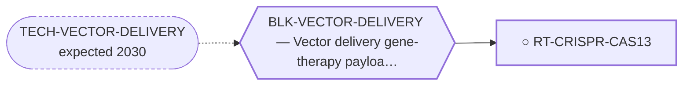

<!-- GENERATED FILE — DO NOT EDIT. Regenerate with:
     python3 systems/systems_check.py --write-views
     Source of truth: systems/graph/*.json -->

# RT-CRISPR-CAS13 — CRISPR/Cas9 intron-targeted fusion disruption; Cas13 fusion-RNA knockdown

**Family:** [ST-NUCLEIC-ACID](L1-st-nucleic-acid.md) · **state:** ○ parked · concept · confidence low · verified 2026-08-05

**Grade** (owned by [`research/manuscripts/emc-post-degrader-options.md`](../../research/manuscripts/emc-post-degrader-options.md)): Tier 3 — delivery, and Cas13 collateral activity

## What has to land for this route to move

**Reading it.** A solid arrow is what holds this route down today. A dashed arrow is a capability that WOULD retire a blocker — dashed because it has not landed, and the date beside it is a forecast, not a schedule.

✓ Already cleared by this route: `BLK-PARALOGUE-DDG`, `BLK-TERNARY-GEOMETRY`.

## Scientific rationale

Sequence-programmable nucleases share the oligonucleotide route's sequence-level discrimination — reading sequence rather than shape and add the possibility of permanent gene disruption. The RNA-targeting form avoids editing the genome at all.

## Remaining unknowns

- How to deliver a vector to a solid tumour at therapeutic coverage.
- Whether collateral activity of the RNA-targeting nuclease is tolerable.

## Required validation

| what | instrument | feasible today | blocked by |
|---|---|---|---|
| Vector delivery at therapeutic coverage | ⛔ none built | **no** | BLK-VECTOR-DELIVERY |

## Blockers

| blocker | kind | what would retire it |
|---|---|---|
| **BLK-VECTOR-DELIVERY** | `requires_future_technology` | `TECH-VECTOR-DELIVERY` |

## Blockers this route RETIRES

- **BLK-PARALOGUE-DDG** — The paralogue ΔΔG margin — selectivity that reduces to exp(−ΔΔG/RT)
- **BLK-TERNARY-GEOMETRY** — Ternary geometry — assembly, E3, exit vector, ubiquitin transfer

## Not to be confused with

| route | the axis it turns on | blockers the distinction turns on | why |
|---|---|---|---|
| [RT-ASO](L2-rt-aso.md) | delivery class | `BLK-VECTOR-DELIVERY` | an oligonucleotide's delivery problem and a vector's delivery problem are different engineering problems with different precedents — BLK-DELIVERY vs BLK-VECTOR-DELIVERY |

## Readiness — what this could become today

**`internal_note`**

Gated on a delivery problem the field has not solved, so there is no computation whose result would change the route's standing.

**Missing:**
- a solid-tumour vector

## Where this route ends — the paper

**[PUB-PARKED-MODALITIES](L3-publications.md)** — *Five modalities parked on a capability that does not exist yet: what would have to land, and how it is being watched for* (unwritten)

`contributing` · ○ `unwritten` · aimed at `preprint`

**This route contributes:** The nuclease arms, whose gate is the vector rather than the nuclease — which is why watching the enzyme literature would be watching the wrong thing.

**The paper would claim:** For each parked modality there is a single named capability — a glue design method with a prospective track record, a co-folder benchmarked on assembly, a solid-tumour vector — whose arrival would make the route computable, and stating that capability with its scan trigger converts an indefinite park into a monitored condition.

**It is not written because:** Every route it would cover is parked on a technology nobody has, so the paper has no result to report and would be a horizon scan. It is worth writing only once at least one of the watched capabilities lands; until then the scan triggers carry the work.

## Strategic timing — the wait equation

**Recommendation: `monitor`**

Strictly behind the oligonucleotide route on the same discrimination argument, with a harder delivery problem. There is no scenario where this is worth building while that route is still delivery-blocked.

| horizon | effect |
|---|---|
| Six months | None. |
| Two years | Only via vector delivery, which is the slower of the two delivery problems. |
| Cost trend | flat |
| Automation outlook | Not automatable — the gap is delivery. |

**Revisit when:**
- **TECH-VECTOR-DELIVERY** — A gene-therapy vector that reaches a solid tumour at therapeutic coverage *(expected 2030, basis `speculative`)*

## Claim ceiling — what this route may NOT be used to claim

*Inherited from [ST-NUCLEIC-ACID](L1-st-nucleic-acid.md), which is where these are asserted — a family limitation binds every route inside it.*

- Delivery of an oligonucleotide to a non-hepatic solid tumour has no validated solution, and this is not solvable in silico today.
- Predicted specificity rests in part on a conservative heuristic rather than a calibrated cleavage-activity model.
- The vector-delivered sub-routes carry a second, distinct delivery problem that must not be conflated with the oligonucleotide one.

## Closure

`instrument_limit` — Vector delivery, plus Cas13 collateral activity.

## Best next action

Keep registered. Watch vector delivery, not the nuclease.

*Cost:* $0

## What this route rests on — drill down

*L4 instruments and L5 objects, evidence and artifacts. Every row here is asserted by this route; the [evidence base](L5-evidence-base.md) shows the same edges from the other end.*

**L5 objects:** [OBJ-FUS-T1](L5-evidence-base.md#objects--the-biological-and-molecular-entities-the-program-reasons-about)

[← ST-NUCLEIC-ACID](L1-st-nucleic-acid.md) · [← L0](L0-ecosystem.md)
