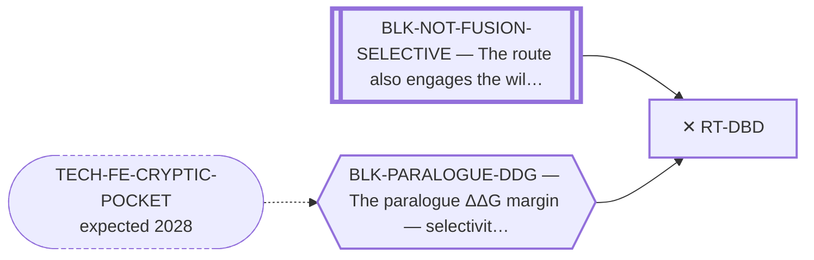

<!-- GENERATED FILE — DO NOT EDIT. Regenerate with:
     python3 systems/systems_check.py --write-views
     Source of truth: systems/graph/*.json -->

# RT-DBD — Target the DBD / DNA binding

**Family:** [ST-FUSION-DIRECT](L1-st-fusion-direct.md) · **state:** ✕ closed · computed · confidence high · verified 2026-08-05

**Grade** (owned by [`research/manuscripts/target-route-options.md`](../../research/manuscripts/target-route-options.md#route-12--target-the-dbd--dna-binding)): ✕ down, on arithmetic — `zinc_finger_window` paralogue identity 92.8% / 98.6% against the LBD's 59.4% / 67.3%

## What has to land for this route to move

**Reading it.** A solid arrow is what holds this route down today. A dashed arrow is a capability that WOULD retire a blocker — dashed because it has not landed, and the date beside it is a forecast, not a schedule.

⛔ **1 of these is permanent** (`BLK-NOT-FUSION-SELECTIVE`) — a fact about the biology, drawn double-walled, with no way out by definition. No technology arrives to fix it.

## Scientific rationale

The zinc-finger DNA-binding domain is far more conserved between the paralogues than the ligand-binding domain the program already targets. Moving there makes the discrimination problem strictly harder, and that follows arithmetically from a measured sequence identity.

## Remaining unknowns

- Nothing is open. The closure is arithmetic over a measured paralogue sequence identity, and that identity does not change — so no capability reopens it.

## Blockers

| blocker | kind | what would retire it |
|---|---|---|
| **BLK-NOT-FUSION-SELECTIVE** | `fundamental_biological_limit` | *permanent* |
| **BLK-PARALOGUE-DDG** | `requires_better_simulation_accuracy` | `TECH-FE-CRYPTIC-POCKET` |

## Not to be confused with

| route | the axis it turns on | blockers the distinction turns on | why |
|---|---|---|---|
| [RT-EWSR1-PROTEIN](L2-rt-ewsr1-protein.md) | which protein the collateral damage lands on | `BLK-NOT-FUSION-SELECTIVE` | the EWSR1 routes relocate onto wild-type EWSR1, an essential housekeeping protein, and close definitionally with nothing computed; this one stays on NR4A3 and closes on a COMPUTED paralogue-identity ordering |
| [RT-FET-LC-LIGAND](L2-rt-fet-lc-ligand.md) | which protein the collateral damage lands on | `BLK-NOT-FUSION-SELECTIVE` | the shared FET low-complexity half is wild-type EWSR1 sequence by definition; the DBD is NR4A3's own, and what closes this route is that the zinc finger is MORE paralogue-identical than the LBD, not that it is shared with EWSR1 |

## Readiness — what this could become today

**`internal_note`**

Closed by arithmetic over a fixed measured fact.

## Where this route ends — the paper

**[PUB-CLOSED-ROUTES](L3-publications.md)** — [Seven routes closed on argument rather than on experiment — the negative record of an EWSR1::NR4A3 route search](../../research/manuscripts/closed-routes-negative-record.md)

`contributing` · ◐ `drafted` · aimed at `preprint`

**This route contributes:** The arithmetic-over-a-fixed-fact closure — the clearest case in the register of a route closed by measurement rather than by opinion.

**The paper would claim:** A route can be closed rigorously without an experiment when the closure is definitional or is arithmetic over a fixed measured fact, and separating those permanent closures from the merely instrument-limited ones is what keeps a portfolio from re-litigating settled questions — with wild-type NR4A3 pharmacology failing to transfer to the chimera as the worked example.

## Strategic timing — the wait equation

**Recommendation: `closed`**

Permanently closed. The closure is arithmetic over a sequence identity that does not change.

## Claim ceiling — what this route may NOT be used to claim

*Inherited from [ST-FUSION-DIRECT](L1-st-fusion-direct.md), which is where these are asserted — a family limitation binds every route inside it.*

- The closures here are definitional or arithmetic over a fixed fact. They may carry no revival trigger and must never appear on a watch list.
- That a route is closed says nothing about whether the disease can be treated — only that this surface is not the way.

## Closure

`arithmetic_over_fixed_fact` — The zinc-finger DBD is far more conserved between the paralogues than the LBD the program already targets. An arithmetic consequence of a fixed sequence fact — never revivable.

## Best next action

Nothing. Cite the closure.

*Cost:* $0

## What this route rests on — drill down

*L4 instruments and L5 objects, evidence and artifacts. Every row here is asserted by this route; the [evidence base](L5-evidence-base.md) shows the same edges from the other end.*

**L5 objects:** [OBJ-NR4A3-DBD](L5-evidence-base.md#objects--the-biological-and-molecular-entities-the-program-reasons-about)

**L5 artifacts:** [ART-TARGET-ROUTE-CENSUS](L5-evidence-base.md#artifacts--the-files-a-claim-can-be-checked-against)

[← ST-FUSION-DIRECT](L1-st-fusion-direct.md) · [← L0](L0-ecosystem.md)
