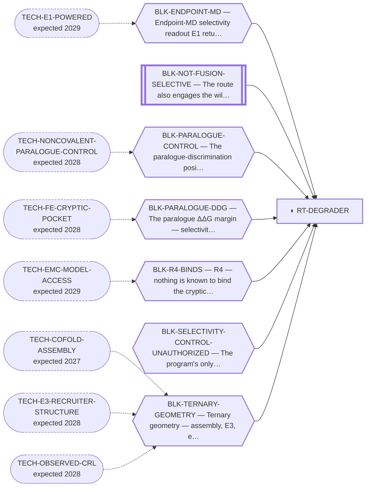

<!-- GENERATED FILE — DO NOT EDIT. Regenerate with:
     python3 systems/systems_check.py --write-views
     Source of truth: systems/graph/*.json -->

# RT-DEGRADER — NR4A3-LBD PROTAC degrader

**Family:** [ST-PROXIMITY](L1-st-proximity.md) · **state:** ◐ blocked · computed · confidence low · verified 2026-08-05

**Grade** (owned by [`research/manuscripts/nr4a3-program-map.md`](../../research/manuscripts/nr4a3-program-map.md#-where-we-are--the-scoreboard-in-plain-language)): LEADING driver-directed route; the program's north star — and the route whose four blocking failures reorganise every other row

## What has to land for this route to move

**Reading it.** A solid arrow is what holds this route down today. A dashed arrow is a capability that WOULD retire a blocker — dashed because it has not landed, and the date beside it is a forecast, not a schedule.

⛔ **1 of these is permanent** (`BLK-NOT-FUSION-SELECTIVE`) — a fact about the biology, drawn double-walled, with no way out by definition. No technology arrives to fix it.

⚠ **1 blocker here has no technology named at all** (`BLK-SELECTIVITY-CONTROL-UNAUTHORIZED`) — not *waiting*, **unaddressed**. A blocker with no named way out is the most expensive kind, because nothing is being watched for it.

## Scientific rationale

NR4A3 is a transcription factor with no orthosteric ligand, so occupancy-based inhibition has nothing to bind. Degradation only needs the protein to be ENGAGED, not inhibited, and a cryptic pocket that opens under dynamics gives something to engage. Selectivity over the two paralogues is the whole problem: they share the ligand-binding domain fold, so discrimination has to come from a small free-energy difference, from a residue only NR4A3 has, or from the ternary complex's shape.

## Supporting evidence

| ref | supports | strength |
|---|---|---|
| `V13` | a cryptic pocket opens in biased dynamics, though the two-state mechanism gate failed as registered | `direct` |
| `V14` | an independent sequence-only ensemble method detects the same site, unbiased | `direct` |
| `V15` | an independent cryptic-site predictor agrees, on four of five permutation nulls | `direct` |

## Remaining unknowns

- Whether anything binds the cryptic pocket at all — no molecule of any kind is known to.
- Whether the paralogue selectivity margin is real: the engine used to compute it misses a known absolute answer by more than the entire margin.
- Whether a correctly assembled NR4A3 ternary is even geometrically possible — none has been built by anyone.
- Whether the opening penalty differs between paralogues, which could reverse the margin and has never been computed.

## Required validation

| what | instrument | feasible today | blocked by |
|---|---|---|---|
| An engine that recovers a known SELECTIVITY answer before any selectivity number is believed | V4 | yes | BLK-SELECTIVITY-CONTROL-UNAUTHORIZED |
| A correctly assembled ternary for THIS system, not a rebuilt known one | V2 | yes | BLK-TERNARY-GEOMETRY |
| Experimental evidence that something binds the opened site | ⛔ none built | **no** | BLK-R4-BINDS |

## Blockers

| blocker | kind | what would retire it |
|---|---|---|
| **BLK-ENDPOINT-MD** | `no_known_assay` | `TECH-E1-POWERED` |
| **BLK-NOT-FUSION-SELECTIVE** | `fundamental_biological_limit` | *permanent* |
| **BLK-PARALOGUE-CONTROL** | `no_known_assay` | `TECH-NONCOVALENT-PARALOGUE-CONTROL` |
| **BLK-PARALOGUE-DDG** | `requires_better_simulation_accuracy` | `TECH-FE-CRYPTIC-POCKET` |
| **BLK-R4-BINDS** | `requires_wet_lab` | `TECH-EMC-MODEL-ACCESS` |
| **BLK-SELECTIVITY-CONTROL-UNAUTHORIZED** | `requires_authorization` | Ask for the decision. This blocker is cheaper to retire than any other in the register and it gates the one control that would tell the program whether its central quantitative claim is measurable at all. |
| **BLK-TERNARY-GEOMETRY** | `requires_better_structure_prediction` | `TECH-COFOLD-ASSEMBLY`, `TECH-E3-RECRUITER-STRUCTURE`, `TECH-OBSERVED-CRL` |

## Readiness — what this could become today

**`preprint`**

The computational arc is complete enough to describe honestly, but every selectivity statement is an unvalidated prediction and the paper says so. A journal submission is reachable once the binary selectivity control has run — that is the gating item, and it costs a decision rather than a capability.

**Missing:**
- a passing selectivity known-answer control
- an anti-target panel that recovers its own cognate ligands

**Evidence required:**
- a free-energy engine validated in this regime

**Experiment required:**
- a binding assay against the opened site

## Strategic timing — the wait equation

**Recommendation: `pursue_now`**

The cheapest decisive item is a decision, not a capability, and the paper is publishable now as an honest negative-leaning record. Waiting improves the physics but does not improve the writing, and the writing is what recruits the collaborator every wet-lab-gated row needs.

| horizon | effect |
|---|---|
| Six months | Little on the physics. Materially more on whether a co-folder benchmarked on assembly has appeared. |
| Two years | Substantial — a free-energy method validated on cryptic pockets would move this from unvalidated prediction to a measured claim. |
| Cost trend | falling |
| Automation outlook | Lane orchestration is already automated; the scientific judgement about what a failed control means is not. |

## Closure

`instrument_limit` — ⭐ NOT closed — but every one of its four blocking failures is an INSTRUMENT LIMIT rather than a fact about the target, which is the options memo's organising finding restated as a field. Filing it beside a definitional impossibility would lose exactly that.

## Best next action

Ask for the decision on the binary selectivity control. It is the highest-leverage unrun item in the portfolio and it costs a conversation.

*Cost:* $0 to ask; the run itself points at the pricing home

[← ST-PROXIMITY](L1-st-proximity.md) · [← L0](L0-ecosystem.md)
