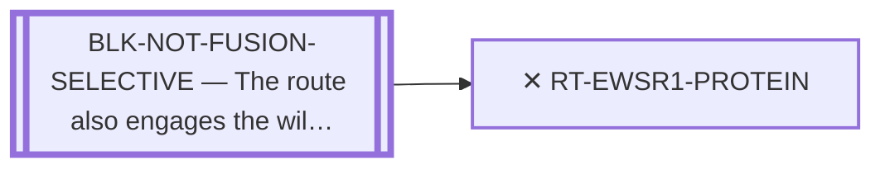

<!-- GENERATED FILE — DO NOT EDIT. Regenerate with:
     python3 systems/systems_check.py --write-views
     Source of truth: systems/graph/*.json -->

# RT-EWSR1-PROTEIN — Target the EWSR1 half at the protein level

**Family:** [ST-FUSION-DIRECT](L1-st-fusion-direct.md) · **state:** ✕ closed · scoped · confidence high · verified 2026-08-05

**Grade** (owned by [`research/manuscripts/target-route-options.md`](../../research/manuscripts/target-route-options.md#route-11--target-the-ewsr1-half-at-the-protein-level)): ✕ down — relocates onto an essential gene

## What has to land for this route to move

**Reading it.** A solid arrow is what holds this route down today. A dashed arrow is a capability that WOULD retire a blocker — dashed because it has not landed, and the date beside it is a forecast, not a schedule.

⛔ **1 of these is permanent** (`BLK-NOT-FUSION-SELECTIVE`) — a fact about the biology, drawn double-walled, with no way out by definition. No technology arrives to fix it.

✓ Already cleared by this route: `BLK-PARALOGUE-DDG`.

## Scientific rationale

Registered so the idea, which recurs, has a permanent answer rather than being re-argued. The EWSR1 half of the fusion IS wild-type EWSR1 sequence, so a ligand for it engages an essential housekeeping protein by construction. This is a fact about what the objects are, not a limit of any method.

## Remaining unknowns

- Nothing is open. The EWSR1 half of the fusion IS wild-type EWSR1 sequence, so this closure is a fact about what the objects are — no method advance, dataset or capability reopens it.

## Blockers

| blocker | kind | what would retire it |
|---|---|---|
| **BLK-NOT-FUSION-SELECTIVE** | `fundamental_biological_limit` | *permanent* |

## Blockers this route RETIRES

- **BLK-PARALOGUE-DDG** — The paralogue ΔΔG margin — selectivity that reduces to exp(−ΔΔG/RT)

## Readiness — what this could become today

**`internal_note`**

It is a closed route. Its only output is the reasoning that closes it, which belongs in the closed-route register.

## Strategic timing — the wait equation

**Recommendation: `closed`**

Permanently closed on a fact about the sequence. No future capability reopens it, and it must appear on no watch list.

## Closure

`definitional` — The EWSR1 half of the fusion IS wild-type EWSR1 sequence, so a ligand for it engages an essential housekeeping protein BY CONSTRUCTION. No method changes what the sequence is.

## Best next action

Nothing. Cite the closure when the idea resurfaces.

*Cost:* $0

[← ST-FUSION-DIRECT](L1-st-fusion-direct.md) · [← L0](L0-ecosystem.md)
