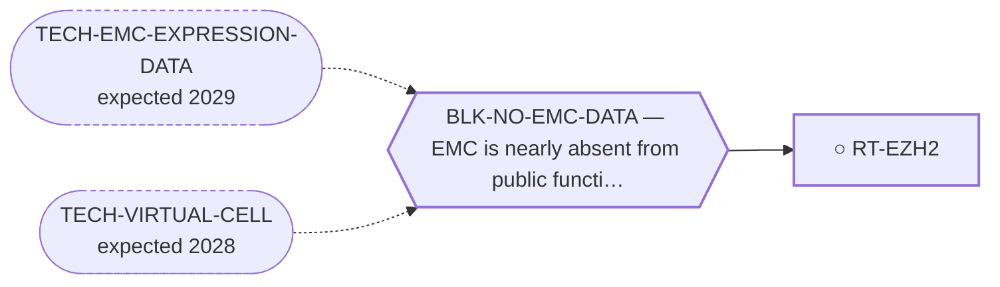

<!-- GENERATED FILE — DO NOT EDIT. Regenerate with:
     python3 systems/systems_check.py --write-views
     Source of truth: systems/graph/*.json -->

# RT-EZH2 — EZH2 / PRC2 inhibition

**Family:** [ST-DEPENDENCY](L1-st-dependency.md) · **state:** ○ blocked · concept · confidence low · verified 2026-08-09

**Grade** (owned by [`research/manuscripts/cancer-modality-census.md`](../../research/manuscripts/cancer-modality-census.md#32--biomarker-selected-classes-readable-from-data-already-on-disk)): ⭑ Registered 2026-08-09 from the modality census; it must be read beside the neighbouring route's existing negative rather than apart from it.

## What has to land for this route to move

**Reading it.** A solid arrow is what holds this route down today. A dashed arrow is a capability that WOULD retire a blocker — dashed because it has not landed, and the date beside it is a forecast, not a schedule.

## Scientific rationale

An agent is approved in a sarcoma selected by a chromatin-remodeller defect, and this portfolio already contains a chromatin-remodelling hypothesis through a non-canonical BAF subunit — but the two had never been connected and no prior sweep named this class. The existing BAF route's own dependency prior came back negative, which any assessment has to lead with.

## Remaining unknowns

- Whether any PRC2 or chromatin-remodeller dependency exists in this disease, which is unreported.
- Whether the neighbouring route's negative dependency prior also covers this axis, or is specific to the subunit it was computed on.

## Required validation

| what | instrument | feasible today | blocked by |
|---|---|---|---|
| The expression or committed-artifact lookup that selects this class | ⛔ none built | yes | — |
| A measurement in a fusion-positive EMC model | ⛔ none built | **no** | BLK-NO-WET-LAB |

## Blockers

| blocker | kind | what would retire it |
|---|---|---|
| **BLK-NO-EMC-DATA** | `insufficient_data` | `TECH-EMC-EXPRESSION-DATA`, `TECH-VIRTUAL-CELL` |

## Readiness — what this could become today

**`internal_note`**

Nothing has been run. This route was registered on 2026-08-09 from the modality census and is at concept maturity, so the only honest output today is the question and its cheapest next observation.

**Missing:**
- a read of the PRC2 and BAF subunit sets in the expression data and the committed dependency artifact

## Where this route ends — the paper

**[PUB-BIOMARKER-DEP](L3-publications.md)** — *Biomarker-selected therapeutic classes in an ultra-rare sarcoma: what the available expression data excludes* (unwritten)

`contributing` · ○ `unwritten` · aimed at `preprint`

**This route contributes:** One of six biomarker-selected classes whose selecting feature is readable in expression data already public for this disease, and whose most useful output is exclusion.

**The paper would claim:** Six therapeutic classes are selected by a molecular state rather than by a growth rate, every selecting feature is readable in expression data already public for this disease, and the useful output is which classes the data rules out rather than which it nominates.

**It is not written because:** Every class it covers is one expression lookup away from a verdict, and none of those lookups has been run — the paper is defined by results that do not exist yet.

## Strategic timing — the wait equation

**Recommendation: `pursue_now`**

The next step costs nothing and needs nobody's cooperation, so there is no reason to defer it; what it returns decides whether this route is worth more than a row.

| horizon | effect |
|---|---|
| Cost trend | flat |

## Claim ceiling — what this route may NOT be used to claim

*Inherited from [ST-DEPENDENCY](L1-st-dependency.md), which is where these are asserted — a family limitation binds every route inside it.*

- The dependency transfer prior came back negative on the available data — a measured premise, revivable only by EMC-specific data.
- One route rests on class inheritance: no NR4A3 fusion has been tested for the phenotype it assumes.
- There is one EMC model in public dependency data, with no CRISPR data, so this family's in-silico half is bounded by a sample size of one.

## Best next action

Read the PRC2 and BAF subunit sets across the expression cohorts and check the committed sarcoma dependency artifact for the same genes.

*Cost:* $0

[← ST-DEPENDENCY](L1-st-dependency.md) · [← L0](L0-ecosystem.md)
