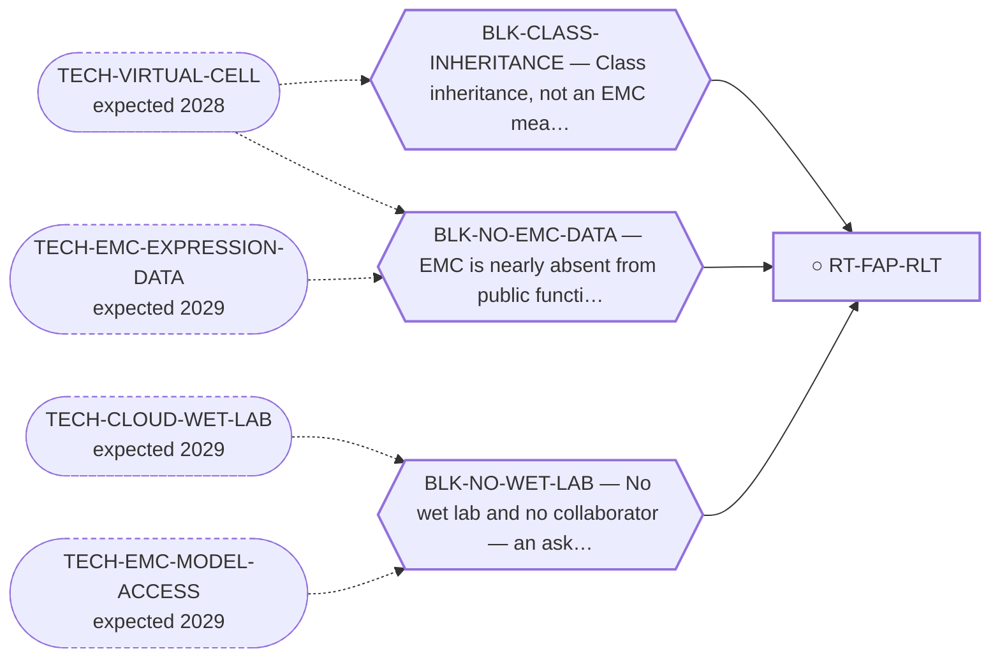

<!-- GENERATED FILE — DO NOT EDIT. Regenerate with:
     python3 systems/systems_check.py --write-views
     Source of truth: systems/graph/*.json -->

# RT-FAP-RLT — FAP-targeted radioligand therapy (FAPI-RLT)

**Family:** [ST-RADIOLIGAND](L1-st-radioligand.md) · **state:** ○ blocked · concept · confidence unknown · verified 2026-08-05

**Grade** (owned by [`research/manuscripts/modality-census/emerging-modalities-scan-emc.md`](../../research/manuscripts/modality-census/emerging-modalities-scan-emc.md#2-fap-targeted-radioligand-therapy-fapi-rlt--emerging-plausibly-applies)): Emerging, plausible

## What has to land for this route to move

**Reading it.** A solid arrow is what holds this route down today. A dashed arrow is a capability that WOULD retire a blocker — dashed because it has not landed, and the date beside it is a forecast, not a schedule.

✓ Already cleared by this route: `BLK-NOT-FUSION-SELECTIVE`, `BLK-PARALOGUE-DDG`, `BLK-TERNARY-GEOMETRY`.

## Scientific rationale

EMC is a stroma-rich myxoid tumour, and a stromal target RELOCATES the question — from what the tumour cells express, to whether stromal delivery reaches them, which is remaining_unknown 2 and is unanswered in a disease where the cellular antigen search has repeatedly come back empty.

## Supporting evidence

| ref | supports | strength |
|---|---|---|
| `ART-EMC-EXPRESSION-PANELS` | The EMC-tissue transcript half of required_validation[0]: gene_reads.FAP is readable on both platforms and the board places FAP in FLAT_ON_BOTH against comparator sarcomas. It reaches no protein, IHC or imaging value. | `direct` |

## Remaining unknowns

- Whether the stromal target is present in EMC's particular myxoid matrix — this has never been measured. ⚠ The surfaceome screen (ART-SURFACE-EXPRESSION) does return FAP selectivity_q = 0.1555 / myxoid 0.0 — but it is DepMap tumour-cell MONOCULTURE with no CAF compartment, so it cannot see the stroma this route targets and does not answer the question.
- Whether a stromal-targeted radioligand delivers enough dose to the tumour cells.

## Required validation

| what | instrument | feasible today | blocked by |
|---|---|---|---|
| An expression or imaging readout on EMC tissue  ⭐ ADJUDICATED 2026-09-02 (AUT-PD-116, seat s31-emc-data-blocks). HALF TAKEN, AND ON BOTH PLATFORMS. `gene_reads.FAP` is readable in both series, the contrast is in `reads.read_8_SURFACE_ANTIGEN.the_route_named_addresses.FAP`, and the board places FAP in `cross_platform_board.by_state.FLAT_ON_BOTH` — flat against comparator sarcomas, not elevated, which is the direction that matters for a radioligand address. ⛔ THE IMAGING HALF IS UNTAKEN and no FAP protein, IHC or imaging value in EMC has been reported; CYC-0074's 2026-08-29 ruling that even a successful extraction leaves the protein gap open STANDS. FAP has no assigned probe in the fourth cohort. ⚠ THE RULE THIS APPLIES, THE FOURTH COHORT'S DESIGN AND LIMITS, AND THE PER-GENE COVERAGE ALL HAVE ONE HOME AND ARE NOT RESTATED HERE: research/modalities/emc-fourth-cohort-route-readout.json — its "⭐ the_rule_this_adjudication_applies" field, its cohort block, and per_route.RT-FAP-RLT. | ⛔ none built | **no** | BLK-NO-WET-LAB |
| Bystander/crossfire dose from FAP-positive stroma to tumour cells, and a tumour-to-normal uptake ratio  ⭐ ADJUDICATED 2026-09-02 (AUT-PD-116, seat s31-emc-data-blocks). NOT ANSWERED AND NOT ANSWERABLE FROM EXPRESSION. A bystander/crossfire dose and a tumour-to-normal uptake ratio are dosimetry quantities; no transcript read of any cohort reaches them, and the residual is a bench and an imaging study. ⚠ THE RULE THIS APPLIES, THE FOURTH COHORT'S DESIGN AND LIMITS, AND THE PER-GENE COVERAGE ALL HAVE ONE HOME AND ARE NOT RESTATED HERE: research/modalities/emc-fourth-cohort-route-readout.json — its "⭐ the_rule_this_adjudication_applies" field, its cohort block, and per_route.RT-FAP-RLT. | ⛔ none built | **no** | BLK-NO-WET-LAB |

## Blockers

| blocker | kind | what would retire it |
|---|---|---|
| **BLK-CLASS-INHERITANCE** | `insufficient_data` | `TECH-VIRTUAL-CELL` |
| **BLK-NO-EMC-DATA** | `insufficient_data` | `TECH-EMC-EXPRESSION-DATA`, `TECH-VIRTUAL-CELL` |
| **BLK-NO-WET-LAB** | `requires_external_collaboration` | `TECH-CLOUD-WET-LAB`, `TECH-EMC-MODEL-ACCESS` |

## Blockers this route RETIRES

- **BLK-NOT-FUSION-SELECTIVE** — The route also engages the wild-type protein (NR4A3 LBD, or EWSR1's low-complexity half)
- **BLK-PARALOGUE-DDG** — The paralogue ΔΔG margin — selectivity that reduces to exp(−ΔΔG/RT)
- **BLK-TERNARY-GEOMETRY** — Ternary geometry — assembly, E3, exit vector, ubiquitin transfer

## Not to be confused with

| route | the axis it turns on | blockers the distinction turns on | why |
|---|---|---|---|
| [RT-SSTR2](L2-rt-sstr2.md) | which radioligand target | `BLK-NO-EMC-DATA` | both are theranostics and they target different things — FAP is the myxoid STROMA, SSTR2 is EMC's own neuroendocrine differentiation |

## Readiness — what this could become today

**`internal_note`**

Entirely unmeasured in EMC. The rationale is a plausible inference from the tumour's histology and nothing more.

**Missing:**
- any measurement in EMC

## Where this route ends — the paper

**[PUB-SURFACE-TARGETS](L3-publications.md)** — [Fixed-panel tissue RNA prioritization in extraskeletal myxoid chondrosarcoma](../../research/manuscripts/surface-targets/emc-tissue-rna-prioritization.md)

`contributing` · ◐ `drafted` · aimed at `preprint`

**This route contributes:** The stromal arm, which is the only row on the list that does not require the fusion biology to be solved and is also the least measured.

**The paper would claim:** A fixed panel of 11 therapeutic-address genes, with CHRNA6 as a separate established RNA-marker control, can be assessed using within-cohort tissue RNA ranks and prespecified sarcoma comparators. In the overlap-reduced Hofvander cohort of nine primary EMC specimens, CSPG4 alone meets the frozen tissue-validation allocation rule; its LGFMS contrast agrees with the original GSE24369 array contrast, but year-deletion sensitivity and DFSP context limit generalization. This supports a qualified rationale for EMC tissue protein and compartment validation, not validated surface expression, normal sparing, treatment selection or efficacy. All other fixed-panel results and discordant protein/normal-context evidence are retained.

## Strategic timing — the wait equation

**Recommendation: `monitor`**

Emerging and unmeasured. It is worth a row because the stromal angle is genuinely different from every other antigen route here, but there is nothing to do until a measurement exists.

| horizon | effect |
|---|---|
| Six months | None. |
| Two years | An EMC dataset, or a sarcoma radioligand series, would move it. |
| Cost trend | falling |
| Automation outlook | Re-grade is automatic on new data. |

**Revisit when:**
- **TECH-EMC-EXPRESSION-DATA** — A fetchable public EMC RNA-seq or proteomics deposit beyond the single existing model, enabling a target-regulon readout and per-a *(expected 2029, basis `speculative`)*

## Claim ceiling — what this route may NOT be used to claim

*Inherited from [ST-RADIOLIGAND](L1-st-radioligand.md), which is where these are asserted — a family limitation binds every route inside it.*

- Target expression in EMC is unmeasured; the case is currently inherited from neuroendocrine and stromal biology rather than observed in this disease.
- A radioligand target is not a driver, so nothing here would be evidence about the fusion.

## Best next action

Keep registered for automatic re-grade when EMC expression data lands. ⛔ CORRECTED 2026-09-02 (AUT-PD-116): the expression data landed and the FAP read is taken on both platforms (gene_reads.FAP; FLAT_ON_BOTH against comparator sarcomas). ⚠ Superseded, retained: "Keep registered for automatic re-grade when EMC expression data lands." What remains is the PROTEIN and imaging gap, which CYC-0074 ruled on 2026-08-29 stays open even after a successful extraction.

*Cost:* $0

[← ST-RADIOLIGAND](L1-st-radioligand.md) · [← L0](L0-ecosystem.md)
