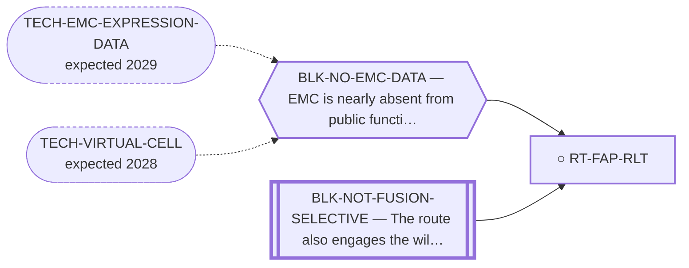

<!-- GENERATED FILE — DO NOT EDIT. Regenerate with:
     python3 systems/systems_check.py --write-views
     Source of truth: systems/graph/*.json -->

# RT-FAP-RLT — FAP-targeted radioligand therapy (FAPI-RLT)

**Family:** [ST-RADIOLIGAND](L1-st-radioligand.md) · **state:** ○ blocked · concept · confidence unknown · verified 2026-08-05

**Grade** (owned by [`research/manuscripts/emerging-modalities-scan-emc.md`](../../research/manuscripts/emerging-modalities-scan-emc.md#2-fap-targeted-radioligand-therapy-fapi-rlt--emerging-plausibly-applies)): Emerging, plausible

## What has to land for this route to move

**Reading it.** A solid arrow is what holds this route down today. A dashed arrow is a capability that WOULD retire a blocker — dashed because it has not landed, and the date beside it is a forecast, not a schedule.

⛔ **1 of these is permanent** (`BLK-NOT-FUSION-SELECTIVE`) — a fact about the biology, drawn double-walled, with no way out by definition. No technology arrives to fix it.

✓ Already cleared by this route: `BLK-PARALOGUE-DDG`, `BLK-TERNARY-GEOMETRY`.

## Scientific rationale

EMC is a stroma-rich myxoid tumour, and a stromal target sidesteps the whole question of what the tumour cells themselves express. That is an unusual advantage in a disease where the cellular antigen search has repeatedly come back empty.

## Remaining unknowns

- Whether the stromal target is present in EMC's particular myxoid matrix — this has never been measured.
- Whether a stromal-targeted radioligand delivers enough dose to the tumour cells.

## Required validation

| what | instrument | feasible today | blocked by |
|---|---|---|---|
| An expression or imaging readout on EMC tissue | ⛔ none built | **no** | BLK-NO-EMC-DATA |

## Blockers

| blocker | kind | what would retire it |
|---|---|---|
| **BLK-NO-EMC-DATA** | `insufficient_data` | `TECH-EMC-EXPRESSION-DATA`, `TECH-VIRTUAL-CELL` |
| **BLK-NOT-FUSION-SELECTIVE** | `fundamental_biological_limit` | *permanent* |

## Blockers this route RETIRES

- **BLK-PARALOGUE-DDG** — The paralogue ΔΔG margin — selectivity that reduces to exp(−ΔΔG/RT)
- **BLK-TERNARY-GEOMETRY** — Ternary geometry — assembly, E3, exit vector, ubiquitin transfer

## Readiness — what this could become today

**`internal_note`**

Entirely unmeasured in EMC. The rationale is a plausible inference from the tumour's histology and nothing more.

**Missing:**
- any measurement in EMC

## Strategic timing — the wait equation

**Recommendation: `monitor`**

Emerging and unmeasured. It is worth a row because the stromal angle is genuinely different from every other antigen route here, but there is nothing to do until a measurement exists.

| horizon | effect |
|---|---|
| Six months | None. |
| Two years | An EMC dataset, or a sarcoma radioligand series, would move it. |
| Cost trend | falling |
| Automation outlook | Re-grade is automatic on new data. |

**Revisit when:**
- **TECH-EMC-EXPRESSION-DATA** — A fetchable public EMC RNA-seq or proteomics deposit beyond the single existing model, enabling a target-regulon readout and per-a *(expected 2029, basis `speculative`)*

## Best next action

Keep registered for automatic re-grade when EMC expression data lands.

*Cost:* $0

[← ST-RADIOLIGAND](L1-st-radioligand.md) · [← L0](L0-ecosystem.md)
