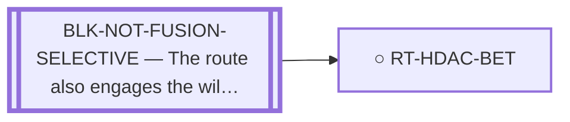

<!-- GENERATED FILE — DO NOT EDIT. Regenerate with:
     python3 systems/systems_check.py --write-views
     Source of truth: systems/graph/*.json -->

# RT-HDAC-BET — HDAC / BET to lower fusion expression

**Family:** [ST-REPURPOSING](L1-st-repurposing.md) · **state:** ○ closed · concept · confidence high · verified 2026-08-05

**Grade** (owned by [`research/manuscripts/emc-post-degrader-options.md`](../../research/manuscripts/emc-post-degrader-options.md)): Tier 3 — not fusion-selective; a class effect, not an EMC result

## What has to land for this route to move

**Reading it.** A solid arrow is what holds this route down today. A dashed arrow is a capability that WOULD retire a blocker — dashed because it has not landed, and the date beside it is a forecast, not a schedule.

⛔ **1 of these is permanent** (`BLK-NOT-FUSION-SELECTIVE`) — a fact about the biology, drawn double-walled, with no way out by definition. No technology arrives to fix it.

✓ Already cleared by this route: `BLK-PARALOGUE-DDG`, `BLK-TERNARY-GEOMETRY`.

## Scientific rationale

Registered with its refutation attached, because the idea recurs. Lowering expression of a fusion via a broad epigenetic mechanism is not fusion-selective by construction: the mechanism does not distinguish the chimera from anything else the drug class affects.

## Remaining unknowns

- Nothing is open on selectivity. A class effect on expression is definitionally not fusion-selective, so no capability makes it so.

## Blockers

| blocker | kind | what would retire it |
|---|---|---|
| **BLK-NOT-FUSION-SELECTIVE** | `fundamental_biological_limit` | *permanent* |

## Blockers this route RETIRES

- **BLK-PARALOGUE-DDG** — The paralogue ΔΔG margin — selectivity that reduces to exp(−ΔΔG/RT)
- **BLK-TERNARY-GEOMETRY** — Ternary geometry — assembly, E3, exit vector, ubiquitin transfer

## Readiness — what this could become today

**`internal_note`**

Closed on a definitional argument; the output is the reasoning.

## Strategic timing — the wait equation

**Recommendation: `closed`**

Permanently closed as a FUSION-SELECTIVE route. It remains an ordinary non-selective cytotoxic option, which is a different claim and belongs to clinical practice rather than to this program.

## Closure

`definitional` — A class effect on fusion EXPRESSION is not fusion-selective by construction — the mechanism does not distinguish the chimera from anything else the class regulates.

## Best next action

Nothing. Cite the closure when the idea resurfaces.

*Cost:* $0

[← ST-REPURPOSING](L1-st-repurposing.md) · [← L0](L0-ecosystem.md)
