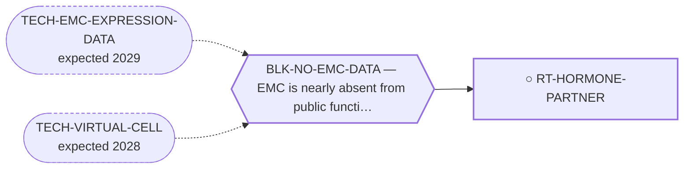

<!-- GENERATED FILE — DO NOT EDIT. Regenerate with:
     python3 systems/systems_check.py --write-views
     Source of truth: systems/graph/*.json -->

# RT-HORMONE-PARTNER — Hormonal therapy for hormone-responsive 5′ fusion partners

**Family:** [ST-REPURPOSING](L1-st-repurposing.md) · **state:** ○ blocked · concept · confidence low · verified 2026-08-09

**Grade** (owned by [`research/manuscripts/cancer-modality-census.md`](../../research/manuscripts/cancer-modality-census.md#37--nuclear-receptors-outside-nr4a3)): ⭑ Registered 2026-08-09 from the modality census, porting a 2026-08-07 lane; the census also recorded that no hormonal route existed on the board at all.

## What has to land for this route to move

**Reading it.** A solid arrow is what holds this route down today. A dashed arrow is a capability that WOULD retire a blocker — dashed because it has not landed, and the date beside it is a forecast, not a schedule.

## Scientific rationale

A 5′ partner can bring its own promoter and its own regulation, and the repository already holds a reported instance of exactly that with durable benefit on an approved agent. No hormonal route exists among the forty-three, which makes this a registered lane with nowhere to live.

## Remaining unknowns

- What fraction of patients carry a hormone-responsive partner, which is a minority of an already ultra-rare disease and has never been summed.
- Whether the reported benefit is attributable to the mechanism or is a single favourable natural history.

## Required validation

| what | instrument | feasible today | blocked by |
|---|---|---|---|
| A pooled estimate of the hormone-responsive partner fraction from the series already curated here | ⛔ none built | yes | — |
| Confirmation that the partner's promoter drives the fusion in a hormone-dependent way | ⛔ none built | **no** | BLK-NO-WET-LAB |

## Blockers

| blocker | kind | what would retire it |
|---|---|---|
| **BLK-NO-EMC-DATA** | `insufficient_data` | `TECH-EMC-EXPRESSION-DATA`, `TECH-VIRTUAL-CELL` |

## Readiness — what this could become today

**`internal_note`**

Nothing has been run. This route was registered on 2026-08-09 from the modality census and is at concept maturity, so the only honest output today is the question and its cheapest next observation.

**Missing:**
- the pooled partner-fraction arithmetic, which is $0 and uses a method this repository owns

## Where this route ends — the paper

**[PUB-NR-OUTSIDE-NR4A3](L3-publications.md)** — *Nuclear-receptor pharmacology outside NR4A3 in a NR4A3-driven sarcoma* (unwritten)

`primary` · ○ `unwritten` · aimed at `preprint`

**This route contributes:** The half of the paper where the druggable input is imported by the 5′ partner rather than supplied by the driver's own receptor.

**The paper would claim:** Two nuclear-receptor routes exist in this disease that do not act on its own receptor — one where a 5′ fusion partner imports a druggable transcriptional input, and one targeting dormancy through a receptor that has the published tool compound this program's own receptor never had.

**It is not written because:** Both routes it would cover were surfaced as lanes on 2026-08-07 and neither has had its expression lookup run.

## Strategic timing — the wait equation

**Recommendation: `pursue_now`**

The next step costs nothing and needs nobody's cooperation, so there is no reason to defer it; what it returns decides whether this route is worth more than a row.

| horizon | effect |
|---|---|
| Cost trend | flat |

## Claim ceiling — what this route may NOT be used to claim

*Inherited from [ST-REPURPOSING](L1-st-repurposing.md), which is where these are asserted — a family limitation binds every route inside it.*

- EMC is nearly absent from public functional-genomics data, so mechanism fit is argued from class membership rather than measured in this disease.
- Several routes here rest on a direction of effect that has never been read in EMC tissue; an expression readout would settle them cheaply and does not exist.
- A repurposing hypothesis is a hypothesis. Nothing here asserts efficacy in EMC.

## Best next action

Pool the published partner-frequency series already curated here to size the hormone-responsive subset, and state how many patients a partner-directed option could reach.

*Cost:* $0

[← ST-REPURPOSING](L1-st-repurposing.md) · [← L0](L0-ecosystem.md)
