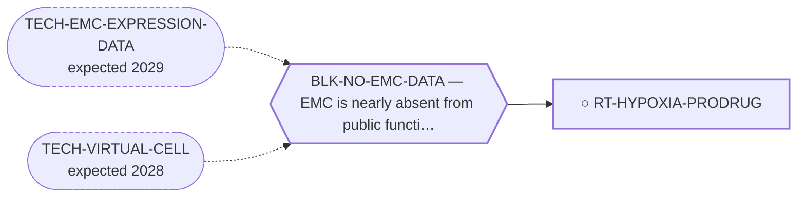

<!-- GENERATED FILE — DO NOT EDIT. Regenerate with:
     python3 systems/systems_check.py --write-views
     Source of truth: systems/graph/*.json -->

# RT-HYPOXIA-PRODRUG — Hypoxia-activated prodrugs

**Family:** [ST-MICROENV](L1-st-microenv.md) · **state:** ○ blocked · concept · confidence low · verified 2026-08-09

**Grade** (owned by [`research/manuscripts/cancer-modality-census.md`](../../research/manuscripts/cancer-modality-census.md#34--the-matrix-as-an-address)): ⭑ Registered 2026-08-09 from the modality census; the niche-fit argument was already accepted here for a different modality and never applied to this one.

## What has to land for this route to move

**Reading it.** A solid arrow is what holds this route down today. A dashed arrow is a capability that WOULD retire a blocker — dashed because it has not landed, and the date beside it is a forecast, not a schedule.

## Scientific rationale

This repository has already accepted that a hypovascular matrix-dominated tumour is a good niche fit for hypoxia-directed treatment — it said so when grading engineered bacteria, where the fit was real and the decisive objection was that no in-silico instrument could be brought to bear. That objection does not hold here, because a hypoxia signature is readable in expression data already on disk. The class has a negative randomised soft-tissue-sarcoma record that any assessment must lead with.

## Remaining unknowns

- Whether the hypoxic fraction is large enough to matter, which is unmeasured in this disease.
- Whether the class's randomised failure was a mechanism failure or a patient-selection failure, which decides whether a biomarker-selected retry is coherent at all.

## Required validation

| what | instrument | feasible today | blocked by |
|---|---|---|---|
| The expression lookup that grades this route's premise | ⛔ none built | yes | — |
| A measurement of the matrix compartment in EMC tissue | ⛔ none built | **no** | BLK-NO-WET-LAB, BLK-NO-EMC-DATA |

## Blockers

| blocker | kind | what would retire it |
|---|---|---|
| **BLK-NO-EMC-DATA** | `insufficient_data` | `TECH-EMC-EXPRESSION-DATA`, `TECH-VIRTUAL-CELL` |

## Readiness — what this could become today

**`internal_note`**

Nothing has been run. This route was registered on 2026-08-09 from the modality census and is at concept maturity, so the only honest output today is the question and its cheapest next observation.

**Missing:**
- a hypoxia-signature score across the expression data already on disk

## Where this route ends — the paper

**[PUB-MATRIX-ADDRESS](L3-publications.md)** — *The myxoid matrix as an address rather than an obstacle* (unwritten)

`contributing` · ○ `unwritten` · aimed at `preprint`

**This route contributes:** One of the handles the matrix offers — an epitope, a biosynthetic pathway or a hypoxic niche — none of which requires the fusion protein to be druggable.

**The paper would claim:** The matrix that defines this tumour histologically has been treated in the therapeutic literature almost entirely as a barrier to drug delivery, and it admits at least three distinct handles — an epitope, a biosynthetic pathway and a hypoxic niche — none of which requires the fusion protein to be druggable.

**It is not written because:** The expression read that would ground it is committed but ungraded, and the paper's whole argument depends on what that read says.

## Strategic timing — the wait equation

**Recommendation: `pursue_now`**

The next step costs nothing and needs nobody's cooperation, so there is no reason to defer it; what it returns decides whether this route is worth more than a row.

| horizon | effect |
|---|---|
| Cost trend | flat |

## Claim ceiling — what this route may NOT be used to claim

*Inherited from [ST-MICROENV](L1-st-microenv.md), which is where these are asserted — a family limitation binds every route inside it.*

- The screen this repository uses to nominate surface addresses ranks tumour-cell monoculture transcripts, so it has no stromal compartment in it and cannot see glycans — its silence about a matrix target is an absent reading rather than a reading of absence.
- Nothing in this family discriminates the tumour from normal tissue by the fusion, so every route here depends entirely on the matrix itself being tumour-restricted enough, and no route here has shown that.
- The matrix has never been measured in this disease as a therapeutic compartment — only described histologically — so every route in this family rests on inference from phenotype rather than on a measurement.
- Nothing in this family asserts efficacy, safety, a therapeutic window or clinical readiness.

## Best next action

Score a hypoxia signature across the readable EMC expression series and the fourth cohort, then read the sarcoma randomised record for whether the failure was mechanism or selection.

*Cost:* $0

[← ST-MICROENV](L1-st-microenv.md) · [← L0](L0-ecosystem.md)
