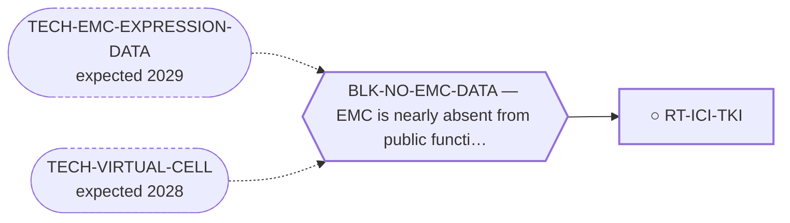

<!-- GENERATED FILE — DO NOT EDIT. Regenerate with:
     python3 systems/systems_check.py --write-views
     Source of truth: systems/graph/*.json -->

# RT-ICI-TKI — Checkpoint inhibitor + anti-angiogenic TKI combination

**Family:** [ST-IMMUNO](L1-st-immuno.md) · **state:** ○ ready · concept · confidence moderate · verified 2026-08-05

**Grade** (owned by [`research/manuscripts/immunotherapy-options-emc.md`](../../research/manuscripts/immunotherapy-options-emc.md#2-checkpoint-inhibitor--anti-angiogenic-tki-combination--real-emc-signal-new-lead)): TOP NEAR-TERM LEAD (best EMC evidence)

## What has to land for this route to move

**Reading it.** A solid arrow is what holds this route down today. A dashed arrow is a capability that WOULD retire a blocker — dashed because it has not landed, and the date beside it is a forecast, not a schedule.

✓ Already cleared by this route: `BLK-NOT-FUSION-SELECTIVE`, `BLK-PARALOGUE-DDG`, `BLK-TERNARY-GEOMETRY`.

## Scientific rationale

This carries the best actual EMC clinical signal on the board, and both components are approved drugs. For an ultra-rare disease with no targeted agent, an approved combination with a reported signal is the shortest path to a patient that exists.

## Supporting evidence

| ref | supports | strength |
|---|---|---|
| `EV-EMC-CLINICAL` | the best reported EMC clinical signal among the routes examined | `direct` |

## Remaining unknowns

- Whether the reported signal survives in a larger series — the evidence base for any EMC treatment is very small.
- Which patients it applies to; EMC is heterogeneous and the series are tiny.

## Required validation

| what | instrument | feasible today | blocked by |
|---|---|---|---|
| A larger EMC series or a registry analysis | ⛔ none built | **no** | BLK-NO-EMC-DATA |

## Blockers

| blocker | kind | what would retire it |
|---|---|---|
| **BLK-NO-EMC-DATA** | `insufficient_data` | `TECH-EMC-EXPRESSION-DATA`, `TECH-VIRTUAL-CELL` |

## Blockers this route RETIRES

- **BLK-PARALOGUE-DDG** — The paralogue ΔΔG margin — selectivity that reduces to exp(−ΔΔG/RT)
- **BLK-TERNARY-GEOMETRY** — Ternary geometry — assembly, E3, exit vector, ubiquitin transfer
- **BLK-NOT-FUSION-SELECTIVE** — The route also engages the wild-type protein (NR4A3 LBD, or EWSR1's low-complexity half)

## Readiness — what this could become today

**`internal_note`**

This is clinical evidence synthesis, not computation, and this program's contribution to it is limited. It belongs in the landscape context of a paper rather than as a result of its own.

**Missing:**
- a larger clinical series

## Strategic timing — the wait equation

**Recommendation: `monitor`**

Nothing computational advances it and no in-silico work would strengthen the signal. Its role in the portfolio is as context: it is the standard against which any new route has to argue it is worth pursuing.

| horizon | effect |
|---|---|
| Six months | Only via new clinical reports. |
| Two years | Same. |
| Cost trend | flat |
| Automation outlook | Literature monitoring is already automated. |

**Revisit when:**
- **TECH-EMC-EXPRESSION-DATA** — A fetchable public EMC RNA-seq or proteomics deposit beyond the single existing model, enabling a target-regulon readout and per-a *(expected 2029, basis `speculative`)*

## Best next action

Keep as landscape context, cited and never overstated. It is the comparator, not a contribution.

*Cost:* $0

[← ST-IMMUNO](L1-st-immuno.md) · [← L0](L0-ecosystem.md)
