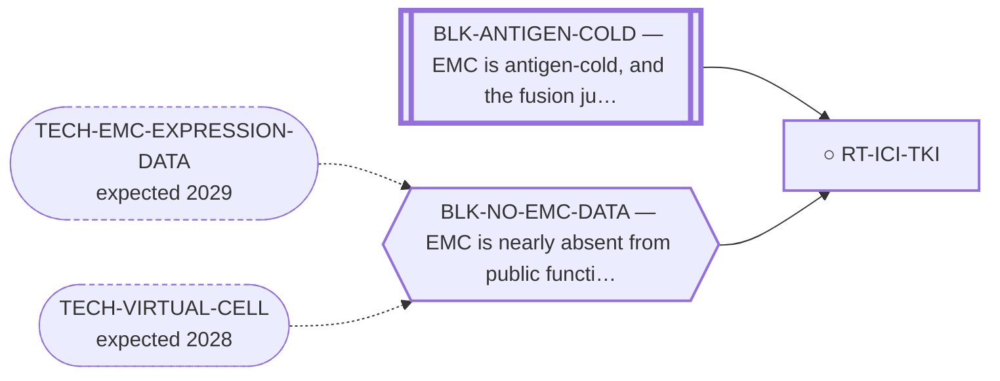

<!-- GENERATED FILE — DO NOT EDIT. Regenerate with:
     python3 systems/systems_check.py --write-views
     Source of truth: systems/graph/*.json -->

# RT-ICI-TKI — Checkpoint inhibitor + anti-angiogenic TKI combination

**Family:** [ST-IMMUNO](L1-st-immuno.md) · **state:** ○ delegated · concept · confidence moderate · verified 2026-08-25

**Grade** (owned by [`research/manuscripts/neoantigen/immunotherapy-options-emc.md`](../../research/manuscripts/neoantigen/immunotherapy-options-emc.md#2-checkpoint-inhibitor--anti-angiogenic-tki-combination--real-emc-signal-new-lead)): Landscape comparator — the only approved-drug combination with any reported EMC response ⭐ 2026-08-25 — THE PARENT TRIAL'S EMC PATIENTS ARE NOW READABLE ONE BY ONE. IMMUNOSARC's phase II figure is a swimmer plot rather than a Kaplan-Meier curve, so each bar is one patient: the four extraskeletal myxoid chondrosarcoma patients (Table 1 confirms four) had progression-free survival of 11.6, 15.5, 16.3 and 19.3 months, three of them still progression-free at last assessment, against a whole-cohort median of 5.6 months. Read by `km_digitize.read_swimmer_plot`; three checks the paper itself supplies all pass, and every censoring flag was confirmed by eye. One home: `research/modalities/km-swimmer-readings.json`. ⛔ CLAIM CEILING, AND IT IS TIGHT: four patients, identified by BAR COLOUR, in a subgroup the trial neither pre-specified nor analysed, with no comparator arm and no adjustment. This is what those four patients' bars show. It is not a response rate, not a comparison against other histologies, and not evidence that the combination works. ⚠ AND THEY MAY NOT BE FOUR NEW PATIENTS: the registry flags immunosarc2emc2025 as possibly an expansion of this same trial, so these four could be inside that cohort's 24. Adjudicate before either count is used as a denominator.

## What has to land for this route to move

**Reading it.** A solid arrow is what holds this route down today. A dashed arrow is a capability that WOULD retire a blocker — dashed because it has not landed, and the date beside it is a forecast, not a schedule.

⛔ **1 of these is permanent** (`BLK-ANTIGEN-COLD`) — a fact about the biology, drawn double-walled, with no way out by definition. No technology arrives to fix it.

✓ Already cleared by this route: `BLK-NOT-FUSION-SELECTIVE`, `BLK-PARALOGUE-DDG`, `BLK-TERNARY-GEOMETRY`.

## Scientific rationale

Both components are approved for OTHER indications, and one EMC partial responder is reported within a mixed-sarcoma phase-II. This route is the landscape COMPARATOR, not a contribution of this program. ⚠ No efficacy, safety, eligibility or clinical-readiness claim is made for EMC — this repo's own validated clinical registry records checkpoint inhibitors as NOT systematically active in EMC, with only isolated responses.

## Supporting evidence

| ref | supports | strength |
|---|---|---|
| `ART-EMC-CLINICAL-REGISTRY` | one reported EMC partial responder within a mixed-sarcoma phase-II; the combination's activity data come from OTHER sarcomas, and the multi-patient EMC evidence in the registry belongs to the TKI half alone | `transferred` |

## Remaining unknowns

- Whether the reported signal survives in a larger series — the evidence base for any EMC treatment is very small.
- Which patients it applies to; EMC is heterogeneous and the series are tiny.

## Required validation

| what | instrument | feasible today | blocked by |
|---|---|---|---|
| A larger EMC series or a registry analysis | ⛔ none built | **no** | BLK-NO-EMC-DATA |

## Blockers

| blocker | kind | what would retire it |
|---|---|---|
| **BLK-ANTIGEN-COLD** | `fundamental_biological_limit` | *permanent* |
| **BLK-NO-EMC-DATA** | `insufficient_data` | `TECH-EMC-EXPRESSION-DATA`, `TECH-VIRTUAL-CELL` |

## Blockers this route RETIRES

- **BLK-PARALOGUE-DDG** — The paralogue ΔΔG margin — selectivity that reduces to exp(−ΔΔG/RT)
- **BLK-TERNARY-GEOMETRY** — Ternary geometry — assembly, E3, exit vector, ubiquitin transfer
- **BLK-NOT-FUSION-SELECTIVE** — The route also engages the wild-type protein (NR4A3 LBD, or EWSR1's low-complexity half)

## Readiness — what this could become today

**`internal_note`**

This is clinical evidence synthesis, not computation, and this program's contribution to it is limited. It belongs in the landscape context of a paper rather than as a result of its own. ⚠ 'ready' previously read as ready-as-a-treatment on a nivolumab+sunitinib route; it is ready only as a paragraph of a paper.

**Missing:**
- a larger clinical series — unchanged. Four patient-level PFS values now exist for this route (km-swimmer-readings.json) and four patients is not a series.

## Where this route ends — the paper

**[PUB-EMC-PROGRAM](L3-publications.md)** — [Attacking an "undruggable" fusion oncoprotein by computation alone: a driver-directed treatment program for EWSR1::NR4A3](../../research/manuscripts/program/emc-treatment-roadmap.md)

`context` · ◐ `drafted` · aimed at `journal_submission`

**This route contributes:** The comparator arm: the most consistently active class in EMC, cited to size the gap rather than analysed. Promoting it to a contribution would overstate what was done.

**The paper would claim:** The gap in EMC care is categorical rather than a matter of degree — nothing in clinical use addresses the driver — and a computation-only program can enumerate the driver-directed routes, state a falsifiable kill criterion for each, and place the borrowed standard-of-care agents as context rather than as its own contribution.

## Strategic timing — the wait equation

**Recommendation: `monitor`**

Nothing computational advances it and no in-silico work would strengthen the signal. Its role in the portfolio is as context: it is the standard against which any new route has to argue it is worth pursuing.

| horizon | effect |
|---|---|
| Six months | Only via new clinical reports. |
| Two years | Same. |
| Cost trend | flat |
| Automation outlook | Literature monitoring is already automated. |

**Revisit when:**
- **TECH-EMC-EXPRESSION-DATA** — A fetchable public EMC RNA-seq or proteomics deposit beyond the single existing model, enabling a target-regulon readout and per-a *(expected 2029, basis `speculative`)*

## Claim ceiling — what this route may NOT be used to claim

*Inherited from [ST-IMMUNO](L1-st-immuno.md), which is where these are asserted — a family limitation binds every route inside it.*

- EMC is antigen-cold and the fusion junction is a weak peptide-HLA — a property of this tumour and this junction, not of any modality here.
- Surface-antigen selectivity was measured on cell-line surrogates rather than on EMC tissue, so the negatives are as provisional as the positives would have been.
- One route's predicted binders span junction seams that a corrected exon index says do not exist; that result is void and the question is open.

## Best next action

Keep as landscape context, cited and never overstated. It is the comparator, not a contribution.

*Cost:* $0

[← ST-IMMUNO](L1-st-immuno.md) · [← L0](L0-ecosystem.md)
