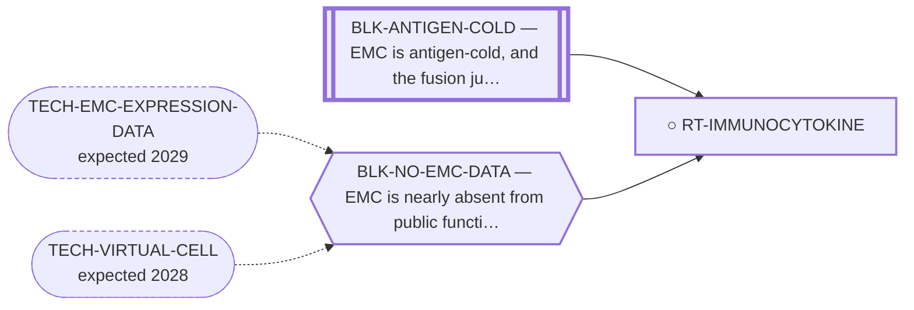

<!-- GENERATED FILE — DO NOT EDIT. Regenerate with:
     python3 systems/systems_check.py --write-views
     Source of truth: systems/graph/*.json -->

# RT-IMMUNOCYTOKINE — Matrix-targeted immunocytokines

**Family:** [ST-MICROENV](L1-st-microenv.md) · **state:** ○ blocked · concept · confidence low · verified 2026-08-09

**Grade** (owned by [`research/manuscripts/cancer-modality-census.md`](../../research/manuscripts/cancer-modality-census.md#34--the-matrix-as-an-address)): ⭑ Registered 2026-08-09 from the modality census as a class no prior sweep had named; it inherits the cold-microenvironment blocker on its payload while routing around the antigen problem on its address.

## What has to land for this route to move

**Reading it.** A solid arrow is what holds this route down today. A dashed arrow is a capability that WOULD retire a blocker — dashed because it has not landed, and the date beside it is a forecast, not a schedule.

⛔ **1 of these is permanent** (`BLK-ANTIGEN-COLD`) — a fact about the biology, drawn double-walled, with no way out by definition. No technology arrives to fix it.

## Scientific rationale

The one antibody format whose address is not a tumour-cell antigen: it targets an extracellular matrix epitope, and the matrix is this disease's defining compartment. That routes around the instrument limitation already flagged here — the surfaceome screen ranks tumour-cell monoculture transcripts and cannot see stroma. The class also has soft-tissue-sarcoma clinical experience specifically. The payload is a cytokine, so a cold infiltrate remains a real objection to the immune arm even if the address holds.

## Remaining unknowns

- Whether the targeted matrix epitope is expressed in this disease's stroma, which the existing screen could not have detected either way.
- Whether a cytokine payload can do anything in a microenvironment this repository has recorded as cold, sparse and myeloid-predominant.

## Required validation

| what | instrument | feasible today | blocked by |
|---|---|---|---|
| The expression lookup that grades this route's premise | ⛔ none built | yes | — |
| A measurement of the matrix compartment in EMC tissue | ⛔ none built | **no** | BLK-NO-WET-LAB, BLK-NO-EMC-DATA |

## Blockers

| blocker | kind | what would retire it |
|---|---|---|
| **BLK-ANTIGEN-COLD** | `fundamental_biological_limit` | *permanent* |
| **BLK-NO-EMC-DATA** | `insufficient_data` | `TECH-EMC-EXPRESSION-DATA`, `TECH-VIRTUAL-CELL` |

## Readiness — what this could become today

**`internal_note`**

Nothing has been run. This route was registered on 2026-08-09 from the modality census and is at concept maturity, so the only honest output today is the question and its cheapest next observation.

**Missing:**
- a read of the matrix splice-variant transcripts in the expression data already on disk

## Where this route ends — the paper

**[PUB-MATRIX-ADDRESS](L3-publications.md)** — *The myxoid matrix as an address rather than an obstacle* (unwritten)

`contributing` · ○ `unwritten` · aimed at `preprint`

**This route contributes:** One of the handles the matrix offers — an epitope, a biosynthetic pathway or a hypoxic niche — none of which requires the fusion protein to be druggable.

**The paper would claim:** The matrix that defines this tumour histologically has been treated in the therapeutic literature almost entirely as a barrier to drug delivery, and it admits at least three distinct handles — an epitope, a biosynthetic pathway and a hypoxic niche — none of which requires the fusion protein to be druggable.

**It is not written because:** The expression read that would ground it is committed but ungraded, and the paper's whole argument depends on what that read says.

## Strategic timing — the wait equation

**Recommendation: `pursue_now`**

The next step costs nothing and needs nobody's cooperation, so there is no reason to defer it; what it returns decides whether this route is worth more than a row.

| horizon | effect |
|---|---|
| Cost trend | flat |

## Claim ceiling — what this route may NOT be used to claim

*Inherited from [ST-MICROENV](L1-st-microenv.md), which is where these are asserted — a family limitation binds every route inside it.*

- The screen this repository uses to nominate surface addresses ranks tumour-cell monoculture transcripts, so it has no stromal compartment in it and cannot see glycans — its silence about a matrix target is an absent reading rather than a reading of absence.
- Nothing in this family discriminates the tumour from normal tissue by the fusion, so every route here depends entirely on the matrix itself being tumour-restricted enough, and no route here has shown that.
- The matrix has never been measured in this disease as a therapeutic compartment — only described histologically — so every route in this family rests on inference from phenotype rather than on a measurement.
- Nothing in this family asserts efficacy, safety, a therapeutic window or clinical readiness.

## Best next action

Read the fibronectin and tenascin splice-variant transcripts across the EMC expression cohorts — matrix genes are visible in bulk tumour data in a way a cell-surface antigen is not.

*Cost:* $0

[← ST-MICROENV](L1-st-microenv.md) · [← L0](L0-ecosystem.md)
