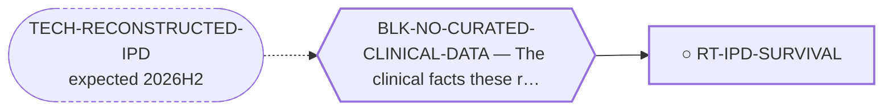

<!-- GENERATED FILE — DO NOT EDIT. Regenerate with:
     python3 systems/systems_check.py --write-views
     Source of truth: systems/graph/*.json -->

# RT-IPD-SURVIVAL — Patient-level survival reconstructed from published Kaplan-Meier curves

**Family:** [ST-CARE-DELIVERY](L1-st-care-delivery.md) · **state:** ○ ready · computed · confidence moderate · verified 2026-08-09

**Grade** (owned by [`systems/graph/routes.json`](../graph/routes.json)): ⭐ THE INSTRUMENT IS BUILT AND ITS KNOWN-ANSWER CONTROL PASSES; ONLY THE CURVES ARE MISSING. research/modalities/emc_ipd_survival.py implements Guyot et al. 2012 and recovers a held-out synthetic cohort EXACTLY — 26 patients, 11 events, 15 censored, identical to truth, survival agreeing within 0.004 except at the tail — and the control is shown to be capable of failing (a three-fold-wrong risk table collapses the recovered cohort to 7). ⛔ THE CONTROL BOUNDS ALGORITHMIC ERROR AND CANNOT FAIL ON A MIS-READ PIXEL: it is fed exact coordinates, whereas a real curve is read off a figure by eye. Digitization error is bounded separately, per curve, by max_abs_km_deviation against the quality floor.  ⛔ FEASIBILITY DOWNGRADED THE SAME DAY IT WAS REGISTERED, BY A COUNT THAT SHOULD HAVE BEEN TAKEN FIRST (2026-08-09). Of 340 EMC full texts in the 554-record open-access corpus, only **19 print a Kaplan-Meier curve at all**, and only 2 also mention numbers-at-risk in text — both of those being conference-abstract collections rather than series. The binding constraint is therefore 19, not the size of the literature, and after §2.3 excludes overlapping populations the poolable set is plausibly single digits covering a few hundred patients. ⚠ THE 2 IS A WEAK PROXY AND MUST NOT BE QUOTED AS THE ANSWER: a numbers-at-risk row is usually rendered INSIDE the figure image, which no text search can see, so it undercounts in exactly the direction that matters. The 19 is NOT a proxy — 'Kaplan-Meier' is named in text whenever a curve is shown — which is why the honest constraint is 19 and the true reconstructable count lies somewhere at or below it. Closed-access series are outside the corpus entirely. ⭐ Superseded, retained: this route was registered on the premise that 'dozens of EMC series print a Kaplan-Meier curve'. Dozens do not. The instrument and its control are unaffected — what falls is the size of the dataset it can build, and with it everything downstream.

## What has to land for this route to move

**Reading it.** A solid arrow is what holds this route down today. A dashed arrow is a capability that WOULD retire a blocker — dashed because it has not landed, and the date beside it is a forecast, not a schedule.

## Scientific rationale

This repository's evidence contract states its own limit in s2.5 — 'no censoring/Kaplan-Meier; no risk-adjustment or multivariable control' — and s2.4 refuses to merge time-anchored survival. That is a correct account of the method s2.2 mandates, not a limit of the published record: dozens of EMC series print a Kaplan-Meier curve, and Guyot's algorithm inverts one back into the data that generated it. ⭐ The consequence is concrete rather than general: RT-SCHEDULING is closed `definitional` precisely because no pooled progression-free-survival figure may be built under the contract, and reconstruction is the mechanism that makes such a pool legal.

## Supporting evidence

| ref | supports | strength |
|---|---|---|
| `ART-IPD-SURVIVAL` | the reconstruction recovers a held-out cohort exactly, and the control is demonstrably capable of failing | `direct` |

## Remaining unknowns

- How many published EMC series print a numbers-at-risk table at all — without one the per-interval censored count is unidentifiable and the curve is refused, and small single-institution series frequently print none.
- How large digitization error is on real figures, which the synthetic control is structurally unable to measure and which max_abs_km_deviation bounds only after a curve has been read.
- Which series overlap in population, since POLICY-evidence.md s2.3 excludes the smaller of any overlapping pair and the SEER analyses certainly overlap each other.

## Required validation

| what | instrument | feasible today | blocked by |
|---|---|---|---|
| Digitize the curves and numbers-at-risk tables of the open-access EMC series and run them through the built instrument | ⛔ none built | yes | — |
| Validation against a series whose true patient-level data is published, which would bound digitization error rather than algorithmic error | ⛔ none built | **no** | BLK-NO-CURATED-CLINICAL-DATA |

## Blockers

| blocker | kind | what would retire it |
|---|---|---|
| **BLK-NO-CURATED-CLINICAL-DATA** | `insufficient_data` | `TECH-RECONSTRUCTED-IPD` |

## Readiness — what this could become today

**`internal_note`**

The instrument is validated and the artifact is generated, but it computes over an empty table. A methods paper with no dataset is not the paper this route is for.

**Missing:**
- the curves themselves — no published EMC figure has been digitized into CURVES yet

## Where this route ends — the paper

**[PUB-IPD-SURVIVAL](L3-publications.md)** — *A reconstructed patient-level survival dataset for extraskeletal myxoid chondrosarcoma* (unwritten)

`contributing` · ○ `unwritten` · aimed at `preprint`

**This route contributes:** The dataset every other clinical route in this portfolio stops at the absence of.

**The paper would claim:** Patient-level survival data for extraskeletal myxoid chondrosarcoma, reconstructed from every published Kaplan-Meier curve that prints a numbers-at-risk table — the first pooled time-to-event dataset in this disease, and the input its unanswerable clinical questions were waiting on.

**It is not written because:** The instrument is built and its known-answer control passes; no published figure has been digitized into it yet. ⛔ The generator's CURVES table is EMPTY by construction and a test enforces that, because inventing a coordinate would fabricate a clinical datum.

## Strategic timing — the wait equation

**Recommendation: `pursue_now`**

Every input is either committed or free to curate, and the work is $0.

| horizon | effect |
|---|---|
| Cost trend | flat |

## Claim ceiling — what this route may NOT be used to claim

*Inherited from [ST-CARE-DELIVERY](L1-st-care-delivery.md), which is where these are asserted — a family limitation binds every route inside it.*

- Nothing in this family produces a new agent, so its ceiling is bounded by what the existing arsenal can do — and its floor is that the arsenal is already being used, so the gain is variance-reduction rather than a new option.
- Every route here ends in an observational or modelled argument. No randomised trial will ever settle a surgical-margin or surveillance-interval question in a disease this rare, so the limits of the design must travel with every claim.
- Reconstructed and registry data are re-expressions of published records, never new patients — they inherit every selection and publication bias of the series they came from and can correct none of it.
- Treatment associations in observational sarcoma data are dominated by confounding by indication, which runs in the direction that makes therapy look harmful; a route here that reports an unadjusted hazard has produced an artefact, not a result.
- Nothing in this family asserts efficacy, safety, a therapeutic window or clinical readiness.

## Best next action

Digitize the Kaplan-Meier curve and numbers-at-risk table of the largest open-access EMC series and admit or refuse it against the quality floor.

*Cost:* $0

## What this route rests on — drill down

*L4 instruments and L5 objects, evidence and artifacts. Every row here is asserted by this route; the [evidence base](L5-evidence-base.md) shows the same edges from the other end.*

**L5 artifacts:** [ART-IPD-SURVIVAL](L5-evidence-base.md#artifacts--the-files-a-claim-can-be-checked-against)

[← ST-CARE-DELIVERY](L1-st-care-delivery.md) · [← L0](L0-ecosystem.md)
