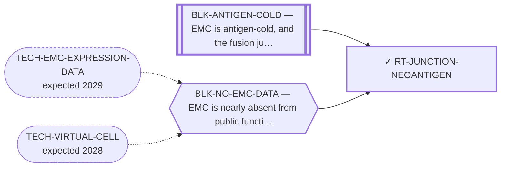

<!-- GENERATED FILE — DO NOT EDIT. Regenerate with:
     python3 systems/systems_check.py --write-views
     Source of truth: systems/graph/*.json -->

# RT-JUNCTION-NEOANTIGEN — Fusion-junction neoantigen (the antigen, shared by three delivery routes)

**Family:** [ST-IMMUNO](L1-st-immuno.md) · **state:** ✓ ready · computed · confidence low · verified 2026-08-28

**Grade** (owned by [`research/manuscripts/program/target-route-options.md`](../../research/manuscripts/program/target-route-options.md#route-7--junction-neoantigen-vaccine--tcr-t--soluble-tcr)): ○ drafted — the correction is PAID (2026-08-07) and the route is graded on COVERAGE. ⭐ RE-GRADED 2026-08-28 AGAINST THE COMMITTED ARTIFACTS AND THE GRADE DOES NOT MOVE UP. ⚠ Superseded, retained: "○ drafted — and now carrying a correction owed", which contradicted this record's own `correction_owed` and the grade owner's table row in the same breath. ⛔ ALL THREE ITEMS THIS ROUTE LISTED AS WITHHELD WERE FALSE against the committed tree, checked artifact by artifact rather than inherited: patient-cd4-demo.json and patient-neoepitopes-taf15-demo.json each carry `source.coordinate_system` TRANSCRIPT with `source.grade` EMITTABLE at the corrected seam; patient_neoepitopes.py builds every junction through `junction_aso.transcript_model` / `mrna_junction_generic` and grades it with `junction_aso.grade_junction`; and re-running vaccine_construct.py and coverage_scan.py offline reproduces vaccine-construct.json and coverage-curve.json BYTE-FOR-BYTE. ⭐ THE DISCRIMINATING OBSERVATION for the third item, which no earlier reading had taken: coverage_scan.py emits coverage-curve.json and epitope-allele-matrix.json and has never emitted a file named coverage-scan.json, and the matrix's peptide count is exactly the 8–11-mer set of the CORRECTED breakpoint artifact — so its class-I scan was run on the repaired input, not the retracted one. ⛔ WHAT THE RE-GRADE FINDS IS NOT BETTER NEWS. Coverage is the ceiling and it is low at every level: the public e7::e3 junction, the pooled class-I panel, the class-II arm — ONE strong binder on ONE allele of the full DR/DP/DQ panel screened, with every declared allele scored and `alleles_without_a_model` empty — and the both-arms figure, which is the PRODUCT of the two arms and is therefore the smallest number on the route. Every figure is owned by ART-HLA-COVERAGE, by research/modalities/coverage-curve.json and by emc-vaccine-development-path.md §B4, and none is re-typed here. ⚠ AND THE REVIVAL TRIGGER'S FIRST DISJUNCT IS ALREADY MET ON ITS LETTER — the 34-allele scan finds the lead peptide strong on a second common allele — while its second is decisively NOT met, and the coverage that first disjunct bought is too small to reopen anything. That is recorded as a defect in the trigger STRING, and the string is deliberately NOT rewritten by the cycle it fired in.

## What has to land for this route to move

**Reading it.** A solid arrow is what holds this route down today. A dashed arrow is a capability that WOULD retire a blocker — dashed because it has not landed, and the date beside it is a forecast, not a schedule.

⛔ **1 of these is permanent** (`BLK-ANTIGEN-COLD`) — a fact about the biology, drawn double-walled, with no way out by definition. No technology arrives to fix it.

✓ Already cleared by this route: `BLK-NOT-FUSION-SELECTIVE`, `BLK-PARALOGUE-DDG`, `BLK-TERNARY-GEOMETRY`.

## Scientific rationale

The junction is tumour-exclusive at the sequence level, and the committed analysis finds NO pan-EMC epitope: the most-shared candidate is a weak binder, and every strong binder it emits is specific to a single breakpoint. ⚠ Superseded, retained (corrected 2026-08-28): "Whether ONE peptide is shared across breakpoints is UNSETTLED — the committed analysis found no pan-EMC epitope (the most-shared candidate appears in 2 of 7 junctions and is a weak binder) — and it was computed on seams the corrected exon index does not produce, so even that reading is void pending regeneration." The regeneration happened on 2026-08-07 and the counts that replaced those are owned by research/modalities/fusion-breakpoint-neoantigens.json and by the abstract of research/manuscripts/neoantigen/fusion-junction-neoantigen-paper.md, so they are not re-typed here. What is unsettled is no longer the seam. It is COVERAGE — a public junction that reaches a small minority of patients — and, above that, presentation, which has never been measured on EMC tissue.

## Remaining unknowns

- ⚠ Superseded, retained (corrected 2026-08-28 against the committed artifact): "The breakpoint-RESOLVED predictions remain VOID: they span seams the corrected exon index does not produce, and that artifact is not regenerated." research/modalities/fusion-breakpoint-neoantigens.json IS regenerated on the transcript model — its own `_coordinate_system` field says so — and every junction it emits grades EMITTABLE. The seam, the per-junction peptide counts and the lead binder are owned by that artifact and by the abstract of research/manuscripts/neoantigen/fusion-junction-neoantigen-paper.md and are not re-typed here. ⛔ Predicted binding is a SCREEN, not presentation and not immunogenicity.
- Whether a junction peptide is presented at all, and at what level — EMC is antigen-cold.
- Whether the peptide-HLA is strong enough to be a target rather than merely present.

## Required validation

| what | instrument | feasible today | blocked by |
|---|---|---|---|
| ⛔ TAKEN 2026-08-07 and re-verified 2026-08-28 — regeneration of the predictions against the corrected exon index. Every downstream artifact is on the transcript model too, and vaccine-construct.json and coverage-curve.json reproduce byte-for-byte when their generators are re-run offline. Nothing free remains in this row. | ⛔ none built | yes | — |
| Measured presentation on EMC tissue | ⛔ none built | **no** | BLK-ANTIGEN-COLD, BLK-NO-EMC-DATA |

## Blockers

| blocker | kind | what would retire it |
|---|---|---|
| **BLK-ANTIGEN-COLD** | `fundamental_biological_limit` | *permanent* |
| **BLK-NO-EMC-DATA** | `insufficient_data` | `TECH-EMC-EXPRESSION-DATA`, `TECH-VIRTUAL-CELL` |

## Blockers this route RETIRES

- **BLK-PARALOGUE-DDG** — The paralogue ΔΔG margin — selectivity that reduces to exp(−ΔΔG/RT)
- **BLK-TERNARY-GEOMETRY** — Ternary geometry — assembly, E3, exit vector, ubiquitin transfer
- **BLK-NOT-FUSION-SELECTIVE** — The route also engages the wild-type protein (NR4A3 LBD, or EWSR1's low-complexity half)

## Not to be confused with

| route | the axis it turns on | blockers the distinction turns on | why |
|---|---|---|---|
| [RT-VACCINE](L2-rt-vaccine.md) | delivery of the same antigen | `BLK-ANTIGEN-COLD` | the antigen is one object; the vaccine, the TCR-T and the soluble TCR are three different products with different failure modes, and the board has graded them as one row |
| [RT-TCR-IMMTAC](L2-rt-tcr-immtac.md) | delivery of the same antigen | `BLK-ANTIGEN-COLD` | same antigen, engineered-cell or soluble-bispecific product rather than an immunisation |

## Readiness — what this could become today

**`internal_note`**

The breakpoint-resolved artifact is regenerated and its banner is cleared — and so is everything this record listed as downstream of it. ⚠ Superseded, retained: "What remains is DOWNSTREAM: patient-cd4-demo.json, the TAF15 panel (patient_neoepitopes.py), vaccine_construct.py and coverage_scan.py were all built on the retracted seam and are NOT repaired by regenerating their input." ⛔ THAT SENTENCE WAS FALSE AGAINST THE COMMITTED TREE and had been since the regenerations landed; it is corrected 2026-08-28 with the evidence in `next.best_next_action` and in the grade. The one surviving `fusion_breakpoints.gene_model` call in patient_neoepitopes.py is the NOVELTY FILTER's parent wild-type protein lookup, which is that instrument's correct use and is not the junction builder. What is missing now is a WIDER class-I panel, which is free, and above it measured presentation, which is not.

**Missing:**
- HLA-C in the class-I coverage panel — coverage_scan.py's `PANEL` is common HLA-A and HLA-B alleles only, with no HLA-C at all, and emc-vaccine-development-path.md's Table 2 caption names HLA-C as the first extension that could raise the figures at the fixed 0.5-percentile cut. Free, and it needs MHCflurry, so it belongs to the modalities-run.yml step that already runs coverage_scan.py. ⚠ Whether the predictor scores HLA-C alleles at all is UNKNOWN from this tree and is the first thing that run would establish; coverage_scan.py records no `alleles_without_a_model` equivalent, so an allele it could not score would leave the panel silently rather than as a reading.
- measured presentation of a junction peptide on EMC tissue — BLK-ANTIGEN-COLD and BLK-NO-EMC-DATA, and not free

## Where this route ends — the paper

**[PUB-NEOANTIGEN](L3-publications.md)** — [Targeting the EWSR1::NR4A3 fusion-junction neoantigen in extraskeletal myxoid chondrosarcoma: a fusion-exclusive immunot](../../research/manuscripts/neoantigen/fusion-junction-neoantigen-paper.md)

`primary` · ◐ `drafted` · aimed at `preprint`

**This route contributes:** The junction peptide and its predicted-binding SCREEN, regenerated 2026-08-07 on the transcript model. The publishable finding is now partly NEGATIVE: no pan-EMC epitope, three of five junctions with no strong binder, and a public junction reaching under a tenth of patients.

**The paper would claim:** The fusion junction produces a peptide sequence that is absent from wild-type EWSR1 and wild-type NR4A3 — ⚠ the only novelty test in this repo compares against those two PARENT proteins (`fusion_breakpoints.py:231`) and NO proteome-wide search has ever been run, so 'absent from the normal proteome' is not a claim this work can make, and whether any allele presents it is a prediction that must be regenerated against a corrected exon index before it can be reported at all.

## Strategic timing — the wait equation

**Recommendation: `pursue_now`**

⚠ Superseded, retained: "The blocking defect is an input error this program made and can fix for nothing. Waiting on any external capability while a free self-inflicted defect stands unrepaired is the wrong order." The input error was fixed on 2026-08-07; what kept this row reading `blocked` until 2026-08-28 was a stale record of it, not the defect. The recommendation stays `pursue_now` for a different reason: one free step remains — widening the class-I panel to HLA-C — and it is the route's own revival condition, so parking the row would be a false park.

| horizon | effect |
|---|---|
| Six months | None — the one free step, widening the class-I panel to HLA-C, is available now. ⚠ Superseded, retained: "None — the fix is available now.", written when the step was the seam regeneration, which was paid on 2026-08-07. |
| Two years | Presentation prediction is improving, and a measured presentation result is the only thing that would move this route materially. ⚠ Superseded, retained: "Presentation prediction is improving, but the void result must be repaired first regardless." Nothing on this route is void: every artifact is regenerated on the transcript model. |
| Cost trend | flat |
| Automation outlook | Fully automatable — the remaining free step is a panel widening plus a re-run of an existing CI job. The measurement above it is not computational at all. |

## Claim ceiling — what this route may NOT be used to claim

*Inherited from [ST-IMMUNO](L1-st-immuno.md), which is where these are asserted — a family limitation binds every route inside it.*

- EMC is antigen-cold and the fusion junction is a weak peptide-HLA — a property of this tumour and this junction, not of any modality here.
- Surface-antigen selectivity was measured on cell-line surrogates rather than on EMC tissue, so the negatives are as provisional as the positives would have been.
- One route's predicted binders span junction seams that a corrected exon index says do not exist; that result is void and the question is open.

## Closure

`instrument_limit` — ⚠ THE CORRECTION LANDED AND THE ROUTE GOT WEAKER, NOT STRONGER. The result is no longer void — but the corrected e7::e3 public junction is presented on HLA-B*15:01 ALONE, so class-I coverage falls 29.7% → 8.51% and the pooled panel 58.0% → 27.4%. What now closes this route is a COVERAGE/immunogenicity argument, not a defective input.

## Best next action

⭐ THE RE-GRADE THIS FIELD ASKED FOR IS DONE (2026-08-28), AND THE ROUTE IS BLOCKED ON NOTHING THIS PROGRAM OWES. ⚠ Superseded, retained: "Regenerate patient-cd4-demo.json and the TAF15 panel at the corrected junction, then re-grade the route on COVERAGE rather than on a defective input." ⛔ BOTH REGENERATIONS WERE ALREADY COMMITTED WHEN THAT SENTENCE WAS SITTING IN THE QUEUE AT `status: blocked` AND `cost: $0`, and so was the third item — so the row looked healthy while telling every reader that finished work was owed and that the class-II arm was withheld. THE RE-GRADE'S OUTCOME is in `grade`: coverage is the ceiling, it is low, and it moved AGAINST the route rather than for it. NEXT, AND IT IS FREE: add HLA-C to coverage_scan.py's class-I panel, re-run it in modalities-run.yml, and re-grade the coverage again. ⛔ DELIBERATELY NOT DONE IN THE CYCLE THAT FOUND THIS: changing the panel moves figures registered in research/manuscripts/pinned-figures.json and quoted in a manuscript under hardening, and CLAUDE.md rule 1.3 requires every home of a changed pinned figure updated in the same commit — which needs the CI run's numbers first.

*Cost:* $0

## What this route rests on — drill down

*L4 instruments and L5 objects, evidence and artifacts. Every row here is asserted by this route; the [evidence base](L5-evidence-base.md) shows the same edges from the other end.*

| L4 instrument | cited as | known-answer control |
|---|---|---|
| [INS-HLA-COVERAGE](registers/instruments.md) — HLA population-coverage calculator | **disclosed failing** | `none` |

**L5 objects:** [OBJ-FUS-T1](L5-evidence-base.md#objects--the-biological-and-molecular-entities-the-program-reasons-about), [OBJ-FUS-T2](L5-evidence-base.md#objects--the-biological-and-molecular-entities-the-program-reasons-about), [OBJ-MODEL-E7E3](L5-evidence-base.md#objects--the-biological-and-molecular-entities-the-program-reasons-about)

**L5 artifacts:** [ART-HLA-COVERAGE](L5-evidence-base.md#artifacts--the-files-a-claim-can-be-checked-against)

[← ST-IMMUNO](L1-st-immuno.md) · [← L0](L0-ecosystem.md)
