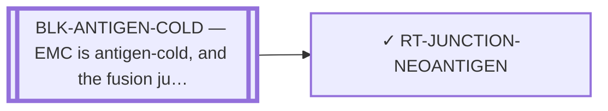

<!-- GENERATED FILE — DO NOT EDIT. Regenerate with:
     python3 systems/systems_check.py --write-views
     Source of truth: systems/graph/*.json -->

# RT-JUNCTION-NEOANTIGEN — Fusion-junction neoantigen (the antigen, shared by three delivery routes)

**Family:** [ST-IMMUNO](L1-st-immuno.md) · **state:** ✓ blocked · computed · confidence low · verified 2026-08-05

**Grade** (owned by [`research/manuscripts/target-route-options.md`](../../research/manuscripts/target-route-options.md#route-7--junction-neoantigen-vaccine--tcr-t--soluble-tcr)): ○ drafted — and now carrying a correction owed

## What has to land for this route to move

**Reading it.** A solid arrow is what holds this route down today. A dashed arrow is a capability that WOULD retire a blocker — dashed because it has not landed, and the date beside it is a forecast, not a schedule.

⛔ **1 of these is permanent** (`BLK-ANTIGEN-COLD`) — a fact about the biology, drawn double-walled, with no way out by definition. No technology arrives to fix it.

✓ Already cleared by this route: `BLK-NOT-FUSION-SELECTIVE`, `BLK-PARALOGUE-DDG`, `BLK-TERNARY-GEOMETRY`.

## Scientific rationale

The junction is tumour-exclusive at the sequence level, so a peptide spanning it is a true neoantigen shared by every patient with this fusion. That would make one reagent serve the whole disease, which is the only economically plausible shape for an ultra-rare cancer.

## Remaining unknowns

- The predicted binders are VOID: they span seams that a corrected exon index says no reported junction produces. The result is unusable; the question is open.
- Whether a junction peptide is presented at all, and at what level — EMC is antigen-cold.
- Whether the peptide-HLA is strong enough to be a target rather than merely present.

## Required validation

| what | instrument | feasible today | blocked by |
|---|---|---|---|
| Regeneration of the predictions against the corrected exon index | ⛔ none built | yes | — |
| Measured presentation on EMC tissue | ⛔ none built | **no** | BLK-ANTIGEN-COLD, BLK-NO-EMC-DATA |

## Blockers

| blocker | kind | what would retire it |
|---|---|---|
| **BLK-ANTIGEN-COLD** | `fundamental_biological_limit` | *permanent* |

## Blockers this route RETIRES

- **BLK-PARALOGUE-DDG** — The paralogue ΔΔG margin — selectivity that reduces to exp(−ΔΔG/RT)
- **BLK-TERNARY-GEOMETRY** — Ternary geometry — assembly, E3, exit vector, ubiquitin transfer
- **BLK-NOT-FUSION-SELECTIVE** — The route also engages the wild-type protein (NR4A3 LBD, or EWSR1's low-complexity half)

## Readiness — what this could become today

**`internal_note`**

The current predictions cannot be published because they span junctions that do not exist. That is a defect of the input index, not of the method — which is why the fix is free and is the route's next action.

**Missing:**
- regenerated predictions against the corrected exon index

## Where this route ends — the paper

**[PUB-NEOANTIGEN](L3-publications.md)** — [Targeting the EWSR1::NR4A3 fusion-junction neoantigen in extraskeletal myxoid chondrosarcoma: a fusion-exclusive immunot](../../research/manuscripts/fusion-junction-neoantigen-paper.md)

`primary` · ◐ `drafted` · aimed at `preprint`

**This route contributes:** The junction peptide and its presentation predictions, which must be regenerated against the corrected exon index before any of them can be reported.

**The paper would claim:** The fusion junction produces a peptide sequence that is absent from the normal proteome, and whether any allele presents it is a prediction that must be regenerated against a corrected exon index before it can be reported at all.

## Strategic timing — the wait equation

**Recommendation: `pursue_now`**

The blocking defect is an input error this program made and can fix for nothing. Waiting on any external capability while a free self-inflicted defect stands unrepaired is the wrong order.

| horizon | effect |
|---|---|
| Six months | None — the fix is available now. |
| Two years | Presentation prediction is improving, but the void result must be repaired first regardless. |
| Cost trend | flat |
| Automation outlook | Fully automatable; it is a regeneration. |

## Claim ceiling — what this route may NOT be used to claim

*Inherited from [ST-IMMUNO](L1-st-immuno.md), which is where these are asserted — a family limitation binds every route inside it.*

- EMC is antigen-cold and the fusion junction is a weak peptide-HLA — a property of this tumour and this junction, not of any modality here.
- Surface-antigen selectivity was measured on cell-line surrogates rather than on EMC tissue, so the negatives are as provisional as the positives would have been.
- One route's predicted binders span junction seams that a corrected exon index says do not exist; that result is void and the question is open.

## Closure

`unregenerable_artifact` — ⚠ THE TWO HALVES, KEPT APART: the 26 predicted binders are unusable because they span seams that do not exist — that RESULT is void. The QUESTION is open and one free regeneration answers it.

## Best next action

Regenerate the junction-neoantigen predictions against the corrected exon index, then re-grade. Every predicted binder currently spans a seam no reported junction produces.

*Cost:* $0

## What this route rests on — drill down

*L4 instruments and L5 objects, evidence and artifacts. Every row here is asserted by this route; the [evidence base](L5-evidence-base.md) shows the same edges from the other end.*

| L4 instrument | cited as | known-answer control |
|---|---|---|
| [INS-HLA-COVERAGE](registers/instruments.md) — HLA population-coverage calculator | **disclosed failing** | `none` |

**L5 objects:** [OBJ-FUS-T1](L5-evidence-base.md#objects--the-biological-and-molecular-entities-the-program-reasons-about), [OBJ-FUS-T2](L5-evidence-base.md#objects--the-biological-and-molecular-entities-the-program-reasons-about), [OBJ-MODEL-E7E3](L5-evidence-base.md#objects--the-biological-and-molecular-entities-the-program-reasons-about)

**L5 artifacts:** [ART-HLA-COVERAGE](L5-evidence-base.md#artifacts--the-files-a-claim-can-be-checked-against)

[← ST-IMMUNO](L1-st-immuno.md) · [← L0](L0-ecosystem.md)
