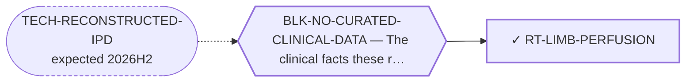

<!-- GENERATED FILE — DO NOT EDIT. Regenerate with:
     python3 systems/systems_check.py --write-views
     Source of truth: systems/graph/*.json -->

# RT-LIMB-PERFUSION — Isolated limb perfusion for extremity disease

**Family:** [ST-LOCOREGIONAL](L1-st-locoregional.md) · **state:** ✓ blocked · computed · confidence low · verified 2026-08-25

**Grade** (owned by [`research/modalities/emc-locoregional-eligibility.json`](../../research/modalities/emc-locoregional-eligibility.json)): ⚠ NOT GRADEABLE ON ELIGIBILITY — THE ONE NUMBER THIS ROUTE NEEDS IS NOT A CURATED FIELD (2026-08-09). Isolated limb perfusion is offerable only for an extremity primary, so the eligible fraction IS the extremity fraction. ⛔ No cohort in the registry carries a site field: the registry's site information is a prose ordering with no counts behind it, and a prose ordering cannot become a denominator. That is an absent reading, NOT a reading of absence — nothing here says the extremity fraction is low, and the premise remains untested. ⭐ What the arithmetic DID supply is the size of the problem this route addresses: local recurrence runs at a substantial minority across four non-overlapping series, with a wide between-study range the pooled figure hides.  ⭐ 2026-08-25 — THE ELIGIBLE FRACTION IS NOW COMPUTED, AND ITS UNCERTAINTY IS A DEFINITION RATHER THAN A SAMPLE SIZE. Isolated limb perfusion is offerable only for an extremity primary, so the eligible fraction IS the extremity fraction, and that quantity was recorded as NOT COMPUTABLE because no registry cohort carries a site field. It was never a literature problem: the site tables are printed in the primary reports, and transcribing the two open-access ones (`emc-site-curation.json`, 230 patients across an Italian two-institution series and a Japanese national registry study) gives **70.4% (64.2-76.0) on a strict limb-only reading and 85.7% (80.5-89.6) once the junctional girdle sites are admitted** — shoulder, groin, axilla and buttock, 35 of 171 patients in one series, every one a primary a perfusion service would argue about rather than refuse. ⛔ THE GAP BETWEEN THE TWO READINGS IS WIDER THAN THE CONFIDENCE INTERVAL ON EITHER, so anyone quoting a single extremity fraction for this disease is quoting a category boundary they did not state. ⚠ Nothing here says perfusion works; it sizes who it could be OFFERED to.  ⭐ 2026-08-27 — A THIRD SERIES WAS READ AND THE EXTREMITY FRACTION IS RECOMPUTED OVER 271 PATIENTS. bishop2019 (n=41, MD Anderson, localised EMC) prints a site breakdown that exhausts its cohort — lower extremity 22, upper extremity 10, trunk 8, neck 1 — and it was reached at $0 through its PMC full-text record. The pooled extremity fraction is now **71.6% (65.9-76.6) strict and 84.5% (79.7-88.3) inclusive over 271 patients in three series**. ⚠ *Superseded, retained: "70.4% (64.2-76.0) … and 85.7% (80.5-89.6)" over 230 patients in two series* — correct for the two-series pool it was computed on. Adding the third series moved the strict reading UP and the inclusive reading DOWN, which narrows the gap between the two definitions without closing it: the binding uncertainty is still a category boundary, not a sample size. ⛔ AND THE FILE'S OWN CLAIM THAT THE OTHER NINE SERIES WERE UNREACHABLE WAS WRONG AND IS WITHDRAWN — it read `openAccess: false`, a LICENCE field, as an ACCESS statement. Two of the nine have a PMC full-text record; seven return no PMCID from NCBI and stay unreachable, measured rather than assumed.  ⛔ 2026-08-27 — THE PERFUSION LITERATURE CONTAINS NO CASE OF THIS DISEASE, AND THAT IS NOW SEARCHED RATHER THAN UNKNOWN. Two independent PubMed queries return ZERO records — limb perfusion or infusion crossed with the disease term, and the disease term crossed with 'perfusion' alone — against a 468-record disease literature and a 444-record limb-perfusion-in-sarcoma literature, with an instrument control run in the same session (ART-EMC-PERFUSION-MYXOID-SEARCH). ⭐ The adjacent reading leans the route's way and is a DIFFERENT DISEASE: the one perfusion series that analyses a myxoid subgroup separately reports myxoid liposarcoma as its best-responding subgroup, and limb perfusion has been used with reported activity in clear cell sarcoma, a rare translocation-driven extremity sarcoma. ⛔ Neither transfers: a shared stromal descriptor is not a shared lineage or driver, and both statements are narrative rather than counted. ⚠ AND THE NULL HAS A BOUNDARY — a field search cannot see a per-patient histology table, so 'nobody has published a perfusion report ABOUT this disease' is established while 'no such patient has ever been perfused' is not, and is not claimed.

## What has to land for this route to move

**Reading it.** A solid arrow is what holds this route down today. A dashed arrow is a capability that WOULD retire a blocker — dashed because it has not landed, and the date beside it is a forecast, not a schedule.

## Scientific rationale

A regional technique with an approved agent and an established role in unresectable extremity soft-tissue sarcoma — and this disease's most common primary site is deep soft tissue of the thigh and lower limb, so the anatomical precondition is met more often here than in most sarcomas. It was invisible to every prior search, all of which looked only at molecular modalities.

## Supporting evidence

| ref | supports | strength |
|---|---|---|
| `ART-LOCOREGIONAL-ELIGIBILITY` | local recurrence across four non-overlapping series is a substantial minority with wide between-study heterogeneity, while primary anatomical site is not a curated field on any cohort | `direct` |

## Remaining unknowns

- What fraction of primaries are extremity — the route's entire eligibility question, absent from the registry by omission rather than by extraction failure.
- Whether the wide recurrence heterogeneity reflects margin status, era or referral pattern, which the pooled figure cannot separate.
- ⭐ SEARCHED AND ANSWERED 2026-08-27, superseding “Whether the perfusion literature contains any myxoid histology at all, which has not been searched.”: it contains no case of this disease, and the myxoid histology it does contain is myxoid liposarcoma, a different disease (ART-EMC-PERFUSION-MYXOID-SEARCH). ⚠ What stays UNKNOWN is narrower and is now stated as itself — whether any perfused patient in a series' unreachable per-patient histology table was an EMC, which no field search can settle.

## Required validation

| what | instrument | feasible today | blocked by |
|---|---|---|---|
| The eligibility arithmetic from the curated cohorts | ⛔ none built | yes | — |
| A clinical series in this histology, which only a collaborating centre could assemble | ⛔ none built | **no** | BLK-NO-WET-LAB |

## Blockers

| blocker | kind | what would retire it |
|---|---|---|
| **BLK-NO-CURATED-CLINICAL-DATA** | `insufficient_data` | `TECH-RECONSTRUCTED-IPD` |

## Readiness — what this could become today

**`internal_note`**

A route whose eligibility criterion is uncurated cannot be graded on eligibility, only on the size of the problem it would address.

**Missing:**
- primary-site curation from the pooled series' primary reports, which is $0 for the open-access ones
- a search of the perfusion literature for myxoid histologies specifically

## Where this route ends — the paper

**[PUB-LOCOREGIONAL](L3-publications.md)** — *Anatomical selectivity in an indolent, extremity-primary, lung-metastasising sarcoma* (unwritten)

`contributing` · ◔ `outlined` · aimed at `preprint`

**This route contributes:** One of the anatomical-selectivity strategies a disease that is extremity-primary, lung-metastasis-dominant and indolent is unusually well matched to.

**The paper would claim:** A disease that is extremity-primary, lung-metastasis-dominant and slow enough for local control to matter is unusually well matched to locoregional and radiation-based treatment, and a portfolio containing no physical intervention at all had never assessed any of it.

**It is not written because:** ⚠ ITS BLOCKER WAS HALF RIGHT, AND THE HALF IT GOT WRONG IS THE INTERESTING ONE. The arithmetic ran on 2026-08-09 under the repository's binding pooling contract, and it splits cleanly: the SIZE OF THE PROBLEM is computable and now computed — roughly a third of localised patients develop distant disease and a substantial minority recur locally, each pooled over three or four non-overlapping series with its heterogeneity range shown. ⛔ But the ELIGIBILITY criteria are not extractable, because they were never curated: no cohort carries a primary anatomical site field, metastatic site appears once in free text rather than as data, and no cohort records lesion burden or time-to-metastasis. So the paper has its denominator and not its numerator. ⭐ That is still writable and is arguably a better paper: the argument, the sized problem, and an explicit statement of which single curation step would convert it into an eligible fraction — which is $0 for the open-access series. ⛔ Superseded, retained: "the eligibility arithmetic has not been extracted from the curated cohorts yet", which reads as though extraction were the missing step. For two of the three quantities no extraction could have produced them.

## Strategic timing — the wait equation

**Recommendation: `pursue_now`**

The remaining steps are $0 curation and literature search, both self-doable.

| horizon | effect |
|---|---|
| Cost trend | flat |

## Claim ceiling — what this route may NOT be used to claim

*Inherited from [ST-LOCOREGIONAL](L1-st-locoregional.md), which is where these are asserted — a family limitation binds every route inside it.*

- Anatomical selectivity works only for anatomically confined disease, so every route here is limited to a subset of patients whose size has not been established in this disease.
- The portfolio contains no physical intervention of any kind, so it holds no instrument, no prior result and no reviewer competence in this family — the in-silico half of every route here is literature synthesis rather than computation.
- A modality dosed per unit volume but delivered per cell is penalised in a matrix-dominated tumour with few cells per unit volume, and that correction has already closed one route in this area.
- Nothing in this family asserts efficacy, safety, a therapeutic window or clinical readiness.

## Best next action

Decide which junctional sites a perfusion service would actually accept, and state the eligible fraction under that definition rather than under both. ⚠ Superseded, retained: "Curate primary anatomical site from the open-access pooled series, then search the perfusion literature for myxoid histologies." — DONE 2026-08-27: three series curated (ART-SITE-CURATION) and the perfusion literature searched to a null (ART-EMC-PERFUSION-MYXOID-SEARCH). ⚠ The remaining step is a clinical judgement, recorded in this route's `best_next_action.why`; it is deliberately NOT written as `next.blocked_on`, which would reschedule the autonomy loop as a side effect of a curation step.

*Cost:* $0

## What this route rests on — drill down

*L4 instruments and L5 objects, evidence and artifacts. Every row here is asserted by this route; the [evidence base](L5-evidence-base.md) shows the same edges from the other end.*

**L5 artifacts:** [ART-EMC-PERFUSION-MYXOID-SEARCH](L5-evidence-base.md#artifacts--the-files-a-claim-can-be-checked-against), [ART-SITE-CURATION](L5-evidence-base.md#artifacts--the-files-a-claim-can-be-checked-against)

[← ST-LOCOREGIONAL](L1-st-locoregional.md) · [← L0](L0-ecosystem.md)
