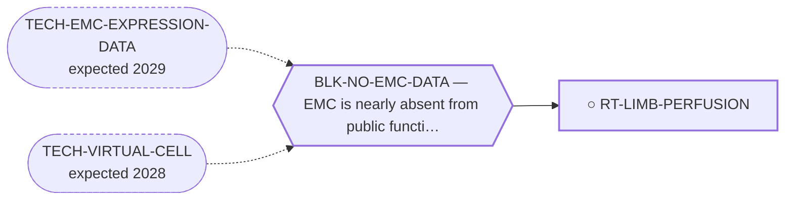

<!-- GENERATED FILE — DO NOT EDIT. Regenerate with:
     python3 systems/systems_check.py --write-views
     Source of truth: systems/graph/*.json -->

# RT-LIMB-PERFUSION — Isolated limb perfusion for extremity disease

**Family:** [ST-LOCOREGIONAL](L1-st-locoregional.md) · **state:** ○ blocked · concept · confidence low · verified 2026-08-09

**Grade** (owned by [`research/manuscripts/cancer-modality-census.md`](../../research/manuscripts/cancer-modality-census.md#35--locoregional-and-radiation)): ⭑ Registered 2026-08-09 from the modality census; the portfolio contained no physical intervention of any kind before it.

## What has to land for this route to move

**Reading it.** A solid arrow is what holds this route down today. A dashed arrow is a capability that WOULD retire a blocker — dashed because it has not landed, and the date beside it is a forecast, not a schedule.

## Scientific rationale

A regional technique with an approved agent and an established role in unresectable extremity soft-tissue sarcoma — and this disease's most common primary site is deep soft tissue of the thigh and lower limb, so the anatomical precondition is met more often here than in most sarcomas. It was invisible to every prior search, all of which looked only at molecular modalities.

## Remaining unknowns

- What fraction of patients present with extremity-confined disease, which has never been summed from the curated cohorts.
- Whether any myxoid histology appears in the published perfusion series at all.

## Required validation

| what | instrument | feasible today | blocked by |
|---|---|---|---|
| The eligibility arithmetic from the curated cohorts | ⛔ none built | yes | — |
| A clinical series in this histology, which only a collaborating centre could assemble | ⛔ none built | **no** | BLK-NO-WET-LAB |

## Blockers

| blocker | kind | what would retire it |
|---|---|---|
| **BLK-NO-EMC-DATA** | `insufficient_data` | `TECH-EMC-EXPRESSION-DATA`, `TECH-VIRTUAL-CELL` |

## Readiness — what this could become today

**`internal_note`**

Nothing has been run. This route was registered on 2026-08-09 from the modality census and is at concept maturity, so the only honest output today is the question and its cheapest next observation.

**Missing:**
- the anatomical-site arithmetic from the cohorts already curated here

## Where this route ends — the paper

**[PUB-LOCOREGIONAL](L3-publications.md)** — *Anatomical selectivity in an indolent, extremity-primary, lung-metastasising sarcoma* (unwritten)

`contributing` · ○ `unwritten` · aimed at `preprint`

**This route contributes:** One of the anatomical-selectivity strategies a disease that is extremity-primary, lung-metastasis-dominant and indolent is unusually well matched to.

**The paper would claim:** A disease that is extremity-primary, lung-metastasis-dominant and slow enough for local control to matter is unusually well matched to locoregional and radiation-based treatment, and a portfolio containing no physical intervention at all had never assessed any of it.

**It is not written because:** The eligibility arithmetic it rests on has not been extracted from the curated cohorts yet, and without it the paper would be an argument with no denominator.

## Strategic timing — the wait equation

**Recommendation: `pursue_now`**

The next step costs nothing and needs nobody's cooperation, so there is no reason to defer it; what it returns decides whether this route is worth more than a row.

| horizon | effect |
|---|---|
| Cost trend | flat |

## Claim ceiling — what this route may NOT be used to claim

*Inherited from [ST-LOCOREGIONAL](L1-st-locoregional.md), which is where these are asserted — a family limitation binds every route inside it.*

- Anatomical selectivity works only for anatomically confined disease, so every route here is limited to a subset of patients whose size has not been established in this disease.
- The portfolio contains no physical intervention of any kind, so it holds no instrument, no prior result and no reviewer competence in this family — the in-silico half of every route here is literature synthesis rather than computation.
- A modality dosed per unit volume but delivered per cell is penalised in a matrix-dominated tumour with few cells per unit volume, and that correction has already closed one route in this area.
- Nothing in this family asserts efficacy, safety, a therapeutic window or clinical readiness.

## Best next action

Pool the anatomical-site distribution across the curated EMC series to size the eligible fraction, and search the perfusion literature for myxoid histologies specifically.

*Cost:* $0

[← ST-LOCOREGIONAL](L1-st-locoregional.md) · [← L0](L0-ecosystem.md)
