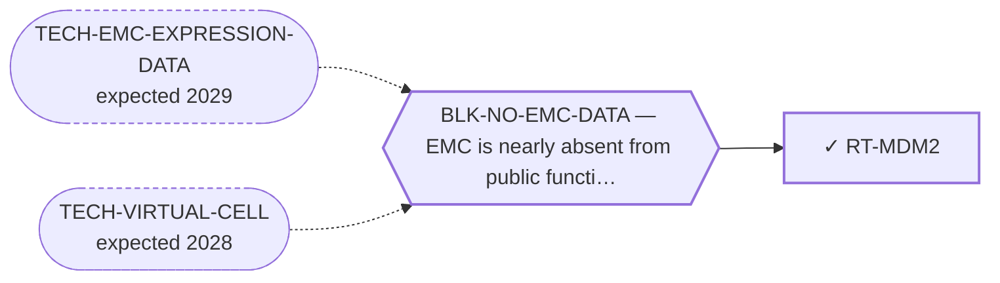

<!-- GENERATED FILE — DO NOT EDIT. Regenerate with:
     python3 systems/systems_check.py --write-views
     Source of truth: systems/graph/*.json -->

# RT-MDM2 — MDM2 antagonism (p53 reactivation in a quiet genome)

**Family:** [ST-DEPENDENCY](L1-st-dependency.md) · **state:** ✓ parked · computed · confidence moderate · verified 2026-09-19

**Grade** (owned by [`research/autonomy/bangerter-route-fidelity-20260919/NOTE.md`](../../research/autonomy/bangerter-route-fidelity-20260919/NOTE.md)): NOT SUPPORTED ON EXPRESSION; UNRESOLVED ON PHARMACOLOGY. The existing two-platform measurement of lower p53 transcriptional output and flat axis-gene expression is preserved. It does not establish antagonist inactivity. The retained HDM201 result is an unvalidated ordinal sensitivity band in one EMC model, with TP53 status unresolved; it does not establish efficacy or a mechanism.

## What has to land for this route to move

**Reading it.** A solid arrow is what holds this route down today. A dashed arrow is a capability that WOULD retire a blocker — dashed because it has not landed, and the date beside it is a forecast, not a schedule.

## Scientific rationale

The original quiet-genome rationale was a hypothesis. Neither the retained expression result nor the limited HDM201 screen establishes TP53 status or a p53-dependent response. The previously recorded hematologic-toxicity liability remains a limitation; this correction does not reassess clinical safety.

## Supporting evidence

| ref | supports | strength |
|---|---|---|
| `ART-CENSUS-ROUTE-GRADING` | The p53 transcriptional output group reads lower in EMC than comparator sarcomas on both platforms. This measured expression result is unchanged and does not determine antagonist sensitivity. | `direct` |
| `EV-BANGERTER-2023` | Direct disease context, weak pharmacologic evidence: HDM201 was reported in the good ordinal sensitivity band in USZ20-EMC1 alone. No separate HDM201 validation, compound-specific concentration anchor, normal-cell comparison or established TP53 status is supplied by the inspected main text. The venetoclax screen band did not reproduce as a monotherapy response on validation. This leaves pharmacology unresolved; it does not support efficacy or a p53-dependent mechanism. | `direct` |

## Remaining unknowns

- TP53 genotype, panel coverage and functional status in a model relevant to the drug-response question; absence of a reported variant is not proof of wild type.
- Whether the one-model ordinal HDM201 signal reproduces with an interpretable compound-specific dose-response and relevant comparison.
- Whether any response is p53-dependent and offers a therapeutic window. The authors' broad chromosome-1 gain annotation does not establish focal MDM4 amplification.

## Required validation

| what | instrument | feasible today | blocked by |
|---|---|---|---|
| The source-bound interpretation correction and original expression lookup are complete; neither measures antagonist efficacy. | ⛔ none built | yes | — |
| For a stronger claim, a specific source or measurement resolving genotype/coverage, validated drug response, mechanism or relevant comparison. No current experiment or source-fetch campaign is authorized by this correction. | ⛔ none built | **no** | — |

## Blockers

| blocker | kind | what would retire it |
|---|---|---|
| **BLK-NO-EMC-DATA** | `insufficient_data` | `TECH-EMC-EXPRESSION-DATA`, `TECH-VIRTUAL-CELL` |

## Readiness — what this could become today

**`internal_note`**

One unvalidated ordinal screen does not establish efficacy, mechanism, selectivity or a clinically relevant response.

**Missing:**
- TP53 genotype, panel coverage and functional status in a model relevant to the drug-response question; absence of a reported variant is not proof of wild type.
- Whether the one-model ordinal HDM201 signal reproduces with an interpretable compound-specific dose-response and relevant comparison.
- Whether any response is p53-dependent and offers a therapeutic window. The authors' broad chromosome-1 gain annotation does not establish focal MDM4 amplification.

## Where this route ends — the paper

**[PUB-BIOMARKER-DEP](L3-publications.md)** — [Biomarker-selected therapeutic classes in an ultra-rare sarcoma — what the available expression data excludes](../../research/manuscripts/dependency/emc-biomarker-selected-classes.md)

`contributing` · ◐ `drafted` · aimed at `preprint`

**This route contributes:** A bounded account separating the observed expression pattern from unresolved pharmacologic response; no standalone negative-efficacy claim or publication admission.

**The paper would claim:** Five therapeutic classes are selected by a molecular state rather than by a histology, every selecting feature is readable in expression data already public for this disease, and the useful output is which classes the data rules OUT rather than which it nominates. Four selecting features are absent; the fifth class survives because the instrument cannot reach its question rather than because the data was favourable. The four negatives are deliberately NOT reported as equally strong.

## Strategic timing — the wait equation

**Recommendation: `monitor`**

Retain the expression result and unresolved pharmacology. Reopen for specific source-grounded genotype/coverage or validated response evidence. The old claim that only a TP53 call could reopen the route is superseded; source-access and prior fetch restrictions remain.

| horizon | effect |
|---|---|
| Cost trend | flat |

**Revisit when:**
- **TECH-EMC-EXPRESSION-DATA** — A fetchable public EMC RNA-seq or proteomics deposit beyond the single existing model, enabling a target-regulon readout and per-a *(expected 2029, basis `speculative`)*

## Claim ceiling — what this route may NOT be used to claim

*Inherited from [ST-DEPENDENCY](L1-st-dependency.md), which is where these are asserted — a family limitation binds every route inside it.*

- The dependency transfer prior came back negative on the available data — a measured premise, revivable only by EMC-specific data.
- One route rests on class inheritance: no NR4A3 fusion has been tested for the phenotype it assumes.
- There is one EMC model in public dependency data, with no CRISPR data, so this family's in-silico half is bounded by a sample size of one.

## Best next action

Preserve the accepted distinction: not supported on expression, unresolved on pharmacology. Consider only new source-grounded evidence that answers a specific genotype, response or mechanism question. Do not repeat the RNA test, publish an inactivity inference or reopen the exhausted supplement fetch.

*Cost:* $0 for bounded evidence intake; no current experiment or retrieval dispatch

## What this route rests on — drill down

*L4 instruments and L5 objects, evidence and artifacts. Every row here is asserted by this route; the [evidence base](L5-evidence-base.md) shows the same edges from the other end.*

**L5 evidence:** [EV-BANGERTER-2023](L5-evidence-base.md#evidence--the-literature-this-program-cites)

[← ST-DEPENDENCY](L1-st-dependency.md) · [← L0](L0-ecosystem.md)
