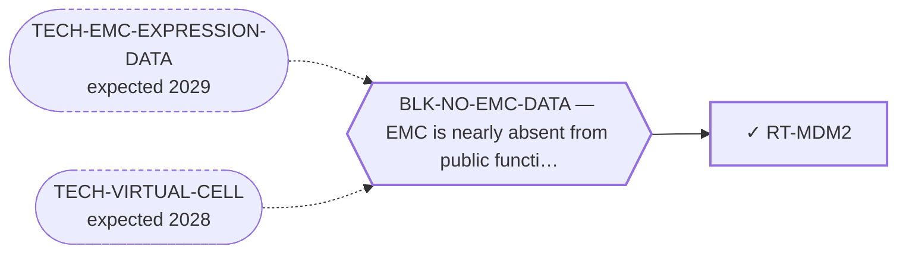

<!-- GENERATED FILE — DO NOT EDIT. Regenerate with:
     python3 systems/systems_check.py --write-views
     Source of truth: systems/graph/*.json -->

# RT-MDM2 — MDM2 antagonism (p53 reactivation in a quiet genome)

**Family:** [ST-DEPENDENCY](L1-st-dependency.md) · **state:** ✓ parked · computed · confidence moderate · verified 2026-08-09

**Grade** (owned by [`research/modalities/census-route-expression-grading.json`](../../research/modalities/census-route-expression-grading.json)): ⛔ NOT SUPPORTED (2026-08-09). The class needs a p53 axis that is intact AND LIVE. The p53 transcriptional output group reads LOWER in EMC on BOTH platforms and the axis genes themselves are flat — quiet rather than live. ⚠ The quiet-genome argument that raised this route predicted the opposite.

## What has to land for this route to move

**Reading it.** A solid arrow is what holds this route down today. A dashed arrow is a capability that WOULD retire a blocker — dashed because it has not landed, and the date beside it is a forecast, not a schedule.

## Scientific rationale

The class needs wild-type p53 and performs worst where the genome is chaotic. This disease's genome is quiet and clonal with a single founding translocation, which is an unusually good match and one that no prior sweep here named. The class's own history of dose-limiting haematological toxicity is a stated liability.

## Supporting evidence

| ref | supports | strength |
|---|---|---|
| `ART-CENSUS-ROUTE-GRADING` | the p53 transcriptional output group reads lower in EMC than in comparator sarcomas on both platforms, against the direction the class requires | `direct` |

## Remaining unknowns

- Whether TP53 is wild-type, which this reading does not establish either way — most inactivating lesions are missense and leave transcript intact.
- Whether low p53 output reflects a suppressed axis or simply an unstressed one, which archival tissue cannot distinguish.

## Required validation

| what | instrument | feasible today | blocked by |
|---|---|---|---|
| The expression or committed-artifact lookup that selects this class | ⛔ none built | yes | — |
| A measurement in a fusion-positive EMC model | ⛔ none built | **no** | BLK-NO-WET-LAB |

## Blockers

| blocker | kind | what would retire it |
|---|---|---|
| **BLK-NO-EMC-DATA** | `insufficient_data` | `TECH-EMC-EXPRESSION-DATA`, `TECH-VIRTUAL-CELL` |

## Readiness — what this could become today

**`internal_note`**

A selection question answered against the class is a negative worth one paragraph.

**Missing:**
- a direct TP53 sequence call, which no available EMC dataset supplies

## Where this route ends — the paper

**[PUB-BIOMARKER-DEP](L3-publications.md)** — *Biomarker-selected therapeutic classes in an ultra-rare sarcoma: what the available expression data excludes* (unwritten)

`contributing` · ◔ `outlined` · aimed at `preprint`

**This route contributes:** One of six biomarker-selected classes whose selecting feature is readable in expression data already public for this disease, and whose most useful output is exclusion.

**The paper would claim:** Six therapeutic classes are selected by a molecular state rather than by a growth rate, every selecting feature is readable in expression data already public for this disease, and the useful output is which classes the data rules out rather than which it nominates.

**It is not written because:** ⚠ ITS STATED BLOCKER IS RETIRED AND THE PAPER CHANGED SHAPE. Every lookup it was waiting on ran on 2026-08-09: of the five biomarker-selected classes it covers, FOUR are now graded against their own selecting feature (MOD-ARGININE-DEPRIVATION, MOD-MDM2-P53, MOD-EZH2, MOD-POLQ) and one is split between its two axes (MOD-MCL1-BCLXL). So this is now a mostly-NEGATIVE paper, which is what makes it worth writing — the field publishes almost no exclusions of this kind. What is left is drafting, not measurement. ⛔ Superseded, retained: "none of those lookups has been run — the paper is defined by results that do not exist yet." The results exist; they are negatives.

## Strategic timing — the wait equation

**Recommendation: `monitor`**

Only a sequence-level TP53 call would reopen it, and none is available.

| horizon | effect |
|---|---|
| Cost trend | flat |

**Revisit when:**
- **TECH-EMC-EXPRESSION-DATA** — A fetchable public EMC RNA-seq or proteomics deposit beyond the single existing model, enabling a target-regulon readout and per-a *(expected 2029, basis `speculative`)*

## Claim ceiling — what this route may NOT be used to claim

*Inherited from [ST-DEPENDENCY](L1-st-dependency.md), which is where these are asserted — a family limitation binds every route inside it.*

- The dependency transfer prior came back negative on the available data — a measured premise, revivable only by EMC-specific data.
- One route rests on class inheritance: no NR4A3 fusion has been tested for the phenotype it assumes.
- There is one EMC model in public dependency data, with no CRISPR data, so this family's in-silico half is bounded by a sample size of one.

## Best next action

Report the negative; the quiet-genome inference did not survive its own test.

*Cost:* $0

[← ST-DEPENDENCY](L1-st-dependency.md) · [← L0](L0-ecosystem.md)
