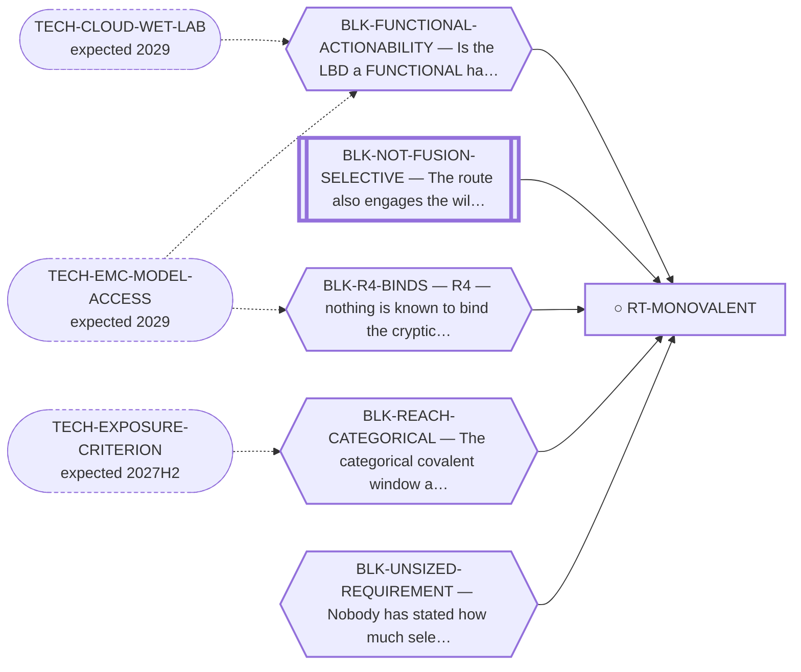

<!-- GENERATED FILE — DO NOT EDIT. Regenerate with:
     python3 systems/systems_check.py --write-views
     Source of truth: systems/graph/*.json -->

# RT-MONOVALENT — Monovalent LBD pocket modulation — a molecule that only OCCUPIES the NR4A3 LBD

**Family:** [ST-OCCUPANCY](L1-st-occupancy.md) · **state:** ○ blocked · scoped · confidence low · verified 2026-08-05

**Grade** (owned by [`research/manuscripts/nr4a3-monovalent-pocket-route.md`](../../research/manuscripts/nr4a3-monovalent-pocket-route.md#7--grade-against-the-failure-record)): REGISTERED, NOT PROMOTED — and specifically a DOWNGRADE of what the probe framing implies about a monovalent drug

## What has to land for this route to move

**Reading it.** A solid arrow is what holds this route down today. A dashed arrow is a capability that WOULD retire a blocker — dashed because it has not landed, and the date beside it is a forecast, not a schedule.

⛔ **1 of these is permanent** (`BLK-NOT-FUSION-SELECTIVE`) — a fact about the biology, drawn double-walled, with no way out by definition. No technology arrives to fix it.

⚠ **1 blocker here has no technology named at all** (`BLK-UNSIZED-REQUIREMENT`) — not *waiting*, **unaddressed**. A blocker with no named way out is the most expensive kind, because nothing is being watched for it.

✓ Already cleared by this route: `BLK-INDUCED-COMPLEX`, `BLK-TERNARY-GEOMETRY`.

## Scientific rationale

If the ligand-binding domain is a functional handle in the chimera, occupancy alone is enough and the entire ternary problem disappears. This is the cheapest possible version of the program, and it is registered explicitly as a DOWNGRADE of what the covalent-probe framing implies about a monovalent drug — the probe is a reagent, not evidence that occupancy is therapeutic.

## Remaining unknowns

- Whether the ligand-binding domain is functionally actionable in the fusion, whose other end is a strong independent activator. Nobody has run that assay.
- How much paralogue selectivity this route would actually need — the requirement has never been sized.
- Whether the covalent sub-form's negative is real: it rests on an exposure criterion that fails its own positive control.

## Required validation

| what | instrument | feasible today | blocked by |
|---|---|---|---|
| A functional cell assay showing the domain is actionable in the chimera | ⛔ none built | **no** | BLK-FUNCTIONAL-ACTIONABILITY |
| A stated selectivity requirement this route would have to meet | ⛔ none built | yes | BLK-UNSIZED-REQUIREMENT |

## Blockers

| blocker | kind | what would retire it |
|---|---|---|
| **BLK-FUNCTIONAL-ACTIONABILITY** | `requires_wet_lab` | `TECH-CLOUD-WET-LAB`, `TECH-EMC-MODEL-ACCESS` |
| **BLK-NOT-FUSION-SELECTIVE** | `fundamental_biological_limit` | *permanent* |
| **BLK-R4-BINDS** | `requires_wet_lab` | `TECH-EMC-MODEL-ACCESS` |
| **BLK-REACH-CATEGORICAL** | `scientific_uncertainty` | `TECH-EXPOSURE-CRITERION` |
| **BLK-UNSIZED-REQUIREMENT** | `scientific_uncertainty` | State the selectivity requirement the route would have to meet, with its basis. This is reasoning, not a capability: nobody has written the specification down, so nothing can be shown to meet or miss it. $0. |

## Blockers this route RETIRES

- **BLK-TERNARY-GEOMETRY** — Ternary geometry — assembly, E3, exit vector, ubiquitin transfer
- **BLK-INDUCED-COMPLEX** — An induced ternary/bivalent complex is still required (a second protein must be placed)

## Readiness — what this could become today

**`internal_note`**

Its central premise — that occupancy does something — has never been tested by anyone, and its one computed negative rests on a criterion known to produce false negatives.

**Missing:**
- a functional readout
- a sized selectivity requirement

**Experiment required:**
- a reporter assay for the domain's function inside the chimera

## Strategic timing — the wait equation

**Recommendation: `pursue_now`**

One of its two blockers is retired by writing something down: nobody has stated how much selectivity this route would need, and until someone does, the route cannot be shown to meet or miss it. That is free and it is a prerequisite for grading the route at all.

| horizon | effect |
|---|---|
| Six months | None on the biology; the specification work is available now. |
| Two years | Depends entirely on whether a functional readout becomes reachable. |
| Cost trend | flat |
| Automation outlook | The specification is reasoning, not computation. |

## Closure

`instrument_limit` — ⚠ Its covalent sub-form's negative rests on a geometry computed with an exposure cutoff that fails its own control and a site question left INCONCLUSIVE — so the result can refute the route and cannot make the closure permanent. Its functional-actionability blocker is separate and needs a bench.

## Best next action

Write down the selectivity requirement this route would have to meet, with its basis. It is $0 and it is what makes every later grade of this route meaningful.

*Cost:* $0

[← ST-OCCUPANCY](L1-st-occupancy.md) · [← L0](L0-ecosystem.md)
