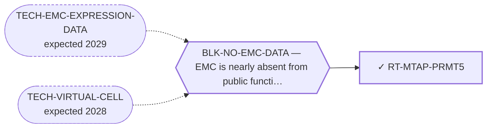

<!-- GENERATED FILE — DO NOT EDIT. Regenerate with:
     python3 systems/systems_check.py --write-views
     Source of truth: systems/graph/*.json -->

# RT-MTAP-PRMT5 — PRMT5 / MAT2A synthetic lethality (MTAP co-deletion)

**Family:** [ST-DEPENDENCY](L1-st-dependency.md) · **state:** ✓ ready · computed · confidence moderate · verified 2026-08-09

**Grade** (owned by [`research/manuscripts/emc-mtap-prmt5-hypothesis.md`](../../research/manuscripts/emc-mtap-prmt5-hypothesis.md#3-results)): ◐ ONE SUB-ROUTE STANDS BUT IS NOW CONDITIONAL; THE OTHER IS CLOSED (regraded 2026-08-09 after a day of measurements, most of which went against it). ⭐ FOR: PRMT5 itself reads t = 6.24 and 6.67 with an EXACT permutation p of 0.000142 and 0.000125 over all 1,623,160 and 8,008 labelings; it sits in the top 1.9% and 1.0% of every gene on its own array; it ranks FIRST of the readable PRMT family on both platforms; and every one of those figures is stable across four annotation bridges spanning 0.931-0.984 measured the same day. A peer-reviewed result in a second EWSR1-fusion sarcoma shows PRMT5 inhibition acting in an EWSR1::FLI1-DEPENDENT way (PMC12354397), and PRMT5's measured GRG motif is absent from the EWSR1 segment every fusion retains, with the commonest EMC and clear cell fusions each keeping 4 of 11 sites. ⛔ AGAINST, AND IT IS THE HEAVIER SIDE: adjusting PRMT5 for a twelve-gene proliferation score leaves it at 5.23 on the 35-tumour platform but takes it to 2.71 on the 16-tumour one, where proliferation is itself elevated in EMC and correlates with PRMT5 at r = 0.60 - THE PLATFORMS DISAGREE and nothing available settles it. PRMT5 is a dependency in 94.5% of the 91 screened sarcoma lines with a selectivity of 0.013, i.e. none, so the target offers almost nothing to select on. The same Ewing paper reports PRMT5/PRMT1/MEP50 elevated across MANY sarcoma types against breast and lung, so the elevation is not disease-specific on the published comparison, and depleting the fusion did NOT change PRMT transcript levels. ⛔ THE MTAP SUB-ROUTE IS CLOSED at transcript level: MTAP reads +0.05 SD where powered, -0.61 on the other platform - opposite signs - and is unremarkable genome-wide on both (top 74% and 26%). Only an MTAP stain can reopen it. ⚠ NET: this is a well-characterised MAYBE rather than a positive lead, and the manuscript states every item above including the ones against it. Superseded, retained: the 2026-08-09 morning grade that read as ROUTE 1 STANDS without the proliferation qualifier.

## What has to land for this route to move

**Reading it.** A solid arrow is what holds this route down today. A dashed arrow is a capability that WOULD retire a blocker — dashed because it has not landed, and the date beside it is a forecast, not a schedule.

## Scientific rationale

One of the few genuinely biomarker-selected synthetic-lethal classes in oncology, and its selecting feature is a copy state nobody here has ever read in this disease. The question is cheap and close to binary, and it has simply never been asked.

## Supporting evidence

| ref | supports | strength |
|---|---|---|
| `ART-CENSUS-ROUTE-GRADING` | the PRMT5 methylosome reads higher in EMC than in comparator sarcomas on both readable platforms, and the MTAP locus group reads lower on the platform where all three genes are readable | `direct` |

## Remaining unknowns

- ⛔ ANSWERED AGAINST ROUTE 2 and kept so it is not re-asked: the low locus reading IS CDKN2A alone at transcript level. Whether MTAP PROTEIN is lost in any EMC case is untouched by that and is the only thing that could reopen the route.
- Whether PRMT5's contribution in the sibling sarcoma runs through the shared 5′ partner or through fusion-driven transcription generally — the question route 1 rests on, and one no public data answers.
- Whether the methylosome elevation is specific or generic, since elevated PRMT5 is reported across many malignancies and abundance is not dependency.

## Required validation

| what | instrument | feasible today | blocked by |
|---|---|---|---|
| A clinical-stage PRMT5 inhibitor added to the functional screen already running on the two published patient-derived EMC models — the decisive test for the stronger route | ⛔ none built | **no** | BLK-NO-WET-LAB |
| MTAP immunohistochemistry on archival EMC tissue — routine, no fresh tissue, no cell line | ⛔ none built | **no** | BLK-NO-WET-LAB |
| A gene-level copy-number read of the locus in any EMC cohort | ⛔ none built | **no** | BLK-NO-EMC-DATA |

## Blockers

| blocker | kind | what would retire it |
|---|---|---|
| **BLK-NO-EMC-DATA** | `insufficient_data` | `TECH-EMC-EXPRESSION-DATA`, `TECH-VIRTUAL-CELL` |

## Readiness — what this could become today

**`preprint`**

The decisive observation is a stain on tissue this programme cannot obtain, so the deliverable is the hypothesis and its falsifier rather than the answer.

**Missing:**
- nothing for the preprint — it is written and every figure resolves to a committed artifact

## Where this route ends — the paper

**[PUB-MTAP-PRMT5](L3-publications.md)** — [PRMT5 and the MTAP locus in extraskeletal myxoid chondrosarcoma: two rationales tested against the available public data, neither supported](../../research/manuscripts/emc-mtap-prmt5-hypothesis.md)

`primary` · ◐ `drafted` · aimed at `preprint`

**This route contributes:** The route IS the paper: two independent routes into the same class, the confounds that could produce each reading without the underlying biology, and the two different cheap experiments that separate them.

**The paper would claim:** Two independent lines point at the PRMT5 methylosome in extraskeletal myxoid chondrosarcoma and neither has ever been examined in it. Tested against the only public data able to address them, NEITHER IS SUPPORTED, and the two fail differently. The MTAP-selected rationale fails a per-sample test rather than a group mean: 9p21 deletion is a subset event, so every tumour is read individually, and although five of ten EMC tumours on one platform do sit below every comparator for MTAP, none of them carries the low CDKN2A that co-deletion requires — all five sit at or above their own array's median, two further 9p21 genes agree, and neither array quality nor the two-colour reference pool explains the tail. Zero deletion-consistent tumours in sixteen BOUNDS the frequency at 17% rather than excluding the event. The fusion-class rationale is not tested by this data at all: PRMT5 reads higher in EMC on both platforms and first of the readable PRMT family on both, at a family-wise adjusted p of 0.21 and 0.24 that clears no conventional threshold and that ranges from 0.0001 to 0.24 across defensible families; one platform confounds disease class with submission block, reference pool and platform assignment; and no EMC cell line exists in any dependency dataset. The sequence analysis contributes one durable observation — PRMT5's measured substrate motif is absent from the half of EWSR1 every fusion retains — and WITHDRAWS another: the shared retained-site count between two diseases' commonest junctions is what the cluster structure returns for any breakpoint across a 142-residue plateau, so it carried no information. Each rationale ends at a different inexpensive experiment, a stain and a fusion-output readout in a published model, and the negative branch of each is worth publishing. ⚠ Superseded, retained: the previous claim that 'the other survives as a hypothesis and is argued rather than assumed', and that 'the commonest EMC fusion and two of the three reported clear cell junctions keep the same number of sites' carried quantitative content. Both were retired by the 2026-08-10 round-two adversarial review.

## Strategic timing — the wait equation

**Recommendation: `pursue_now`**

The preprint is complete and needs nobody's cooperation, and the experiment it specifies is the cheapest decisive one anywhere in this portfolio — a routine stain on archival blocks that already exist.

| horizon | effect |
|---|---|
| Cost trend | flat |

## Claim ceiling — what this route may NOT be used to claim

*Inherited from [ST-DEPENDENCY](L1-st-dependency.md), which is where these are asserted — a family limitation binds every route inside it.*

- The dependency transfer prior came back negative on the available data — a measured premise, revivable only by EMC-specific data.
- One route rests on class inheritance: no NR4A3 fusion has been tested for the phenotype it assumes.
- There is one EMC model in public dependency data, with no CRISPR data, so this family's in-silico half is bounded by a sample size of one.

## Best next action

Post the preprint and put the MTAP stain in front of a group holding EMC archival material.

*Cost:* $0

[← ST-DEPENDENCY](L1-st-dependency.md) · [← L0](L0-ecosystem.md)
