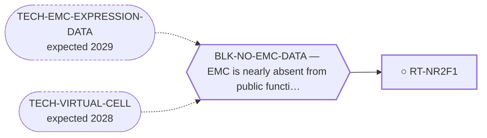

<!-- GENERATED FILE — DO NOT EDIT. Regenerate with:
     python3 systems/systems_check.py --write-views
     Source of truth: systems/graph/*.json -->

# RT-NR2F1 — Orphan nuclear-receptor agonism against dormancy escape

**Family:** [ST-OCCUPANCY](L1-st-occupancy.md) · **state:** ○ blocked · scoped · confidence unknown · verified 2026-08-09

**Grade** (owned by [`research/modalities/census-route-expression-grading.json`](../../research/modalities/census-route-expression-grading.json)): ⚠ UNREAD (2026-08-09). NR2F1 has no probe on either readable platform, so the route's precondition cannot be answered from this data at all. ⛔ An absent reading is not a reading of absence. A curated dormancy-associated context set is separately HIGHER in EMC on both platforms.

## What has to land for this route to move

**Reading it.** A solid arrow is what holds this route down today. A dashed arrow is a capability that WOULD retire a blocker — dashed because it has not landed, and the date beside it is a forecast, not a schedule.

## Scientific rationale

A registered lane with no route. It targets this disease's actual clinical problem rather than its driver, and it repoints the orphan-nuclear-receptor modelling stack built for NR4A3 onto a receptor that has a published tool compound — which is the known-answer control the program's own receptor never had, and is worth as much methodologically as the biology is clinically.

## Supporting evidence

| ref | supports | strength |
|---|---|---|
| `ART-CENSUS-ROUTE-GRADING` | a curated dormancy-associated context set scores higher in EMC than in comparator sarcomas on both platforms, while the receptor itself is unreadable on both | `surrogate` |

## Remaining unknowns

- Whether the receptor is expressed in EMC at all — unchanged by this pass, because no probe on either platform maps to it.
- Whether an elevated dormancy-associated context implies anything about the receptor that programme is named for, which it does not on its own.
- Whether a dormancy-maintenance strategy has any measurable endpoint in a disease whose response endpoint is itself contested here.

## Required validation

| what | instrument | feasible today | blocked by |
|---|---|---|---|
| A read of the receptor in the targeted expression panel already committed here | ⛔ none built | yes | — |
| A demonstration that the existing pocket-modelling pipeline runs on its ligand-binding domain | ⛔ none built | yes | — |

## Blockers

| blocker | kind | what would retire it |
|---|---|---|
| **BLK-NO-EMC-DATA** | `insufficient_data` | `TECH-EMC-EXPRESSION-DATA`, `TECH-VIRTUAL-CELL` |

## Readiness — what this could become today

**`internal_note`**

The precondition is unread, and reporting an unreadable gene as absent is the specific failure the source artifact forbids.

**Missing:**
- a platform that carries a probe for the receptor — the two readable array series do not

## Where this route ends — the paper

**[PUB-NR-OUTSIDE-NR4A3](L3-publications.md)** — *Nuclear-receptor pharmacology outside NR4A3 in a NR4A3-driven sarcoma* (unwritten)

`primary` · ○ `unwritten` · aimed at `preprint`

**This route contributes:** The half of the paper that targets the disease's clinical problem — late metastasis — through a receptor that has the tool compound this program's own receptor never had.

**The paper would claim:** Two nuclear-receptor routes exist in this disease that do not act on its own receptor — one where a 5′ fusion partner imports a druggable transcriptional input, and one targeting dormancy through a receptor that has the published tool compound this program's own receptor never had.

**It is not written because:** Both routes it would cover were surfaced as lanes on 2026-08-07 and neither has had its expression lookup run.

## Strategic timing — the wait equation

**Recommendation: `wait`**

The observation this route needs cannot be taken on the platforms available; it waits on a dataset that carries the gene.

| horizon | effect |
|---|---|
| Cost trend | falling |

**Revisit when:**
- **TECH-EMC-EXPRESSION-DATA** — A fetchable public EMC RNA-seq or proteomics deposit beyond the single existing model, enabling a target-regulon readout and per-a *(expected 2029, basis `speculative`)*

## Claim ceiling — what this route may NOT be used to claim

*Inherited from [ST-OCCUPANCY](L1-st-occupancy.md), which is where these are asserted — a family limitation binds every route inside it.*

- Whether the ligand-binding domain is a functional handle in the fusion — whose other end is a strong independent activator — has never been tested by anyone.
- Nobody has stated how much paralogue selectivity this family would need, so 'the requirement is smaller here' is not a claim this repository can make.
- The covalent sub-form's negative result rests on an exposure criterion that fails its own positive control, so it is a rank and not a verdict.

## Best next action

Check whether the fourth public cohort carries the receptor at all.

*Cost:* $0

[← ST-OCCUPANCY](L1-st-occupancy.md) · [← L0](L0-ecosystem.md)
