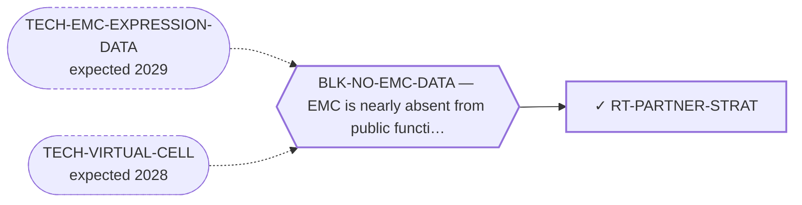

<!-- GENERATED FILE — DO NOT EDIT. Regenerate with:
     python3 systems/systems_check.py --write-views
     Source of truth: systems/graph/*.json -->

# RT-PARTNER-STRAT — NR4A3 5' fusion partner as a treatment-stratification variable

**Family:** [ST-REPURPOSING](L1-st-repurposing.md) · **state:** ✓ ready · computed · confidence low · verified 2026-08-08

**Grade** (owned by [`research/manuscripts/fusion-partner/emc-fusion-partner-stratification.md`](../../research/manuscripts/fusion-partner/emc-fusion-partner-stratification.md#5--what-this-synthesis-claims-and-what-it-does-not)): The portfolio's only patient-SELECTION route: it proposes no new agent and no new modality, and asks instead which existing patients the one active drug class is reported to work in. Its finding is a DIRECTION with no established magnitude, and its deliverable - a pooled synthesis plus a costless ask of the field - is complete and unblocked.

## What has to land for this route to move

**Reading it.** A solid arrow is what holds this route down today. A dashed arrow is a capability that WOULD retire a blocker — dashed because it has not landed, and the date beside it is a forecast, not a schedule.

## Scientific rationale

EMC has one systemic class with reproducible activity - the antiangiogenic TKIs - and four separate literatures each report that the two principal fusion variants behave differently under it, in outcome, in prevalence and in transcriptional programme. None of the four had been combined with any other, and no source pools the response data at all, so the belief was stronger in the field's prose than in the field's counts and nobody could say by how much. A stratification variable is also the cheapest kind of clinical result to act on: it needs no new molecule, no new modality and no wet lab, only that the variable be reported. This route is the reading that says how much the published record carries - and its answer is a direction with no established magnitude, which is a different and more useful statement than the qualitative claim it replaces.

## Supporting evidence

| ref | supports | strength |
|---|---|---|
| `ART-FUSION-PARTNER-POOLING` | Every pooled figure the route rests on: TKI objective response by partner under both the POLICY-conformant primary and the assume-independent secondary analysis, the single-cohort outcome intervals, the four-series prevalence pool, and the inclusion verdict and reason for every cohort considered. | `direct` |
| `EV-PMC4015728` | The SMALLER of the two published EMC cohorts reporting outcome EVENT COUNTS by NR4A3 partner (23 partner-assigned patients against Huang 2023's 50), and one of the two contributing to the pooled disease-specific-death contrast. ⚠ Superseded, retained: 'The only published EMC cohort reporting outcome EVENT COUNTS by NR4A3 partner - and therefore the only source of the disease-specific-death contrast and of the distant-recurrence reversal.' True until 2026-08-08; the reversal is this cohort's alone and the second cohort runs the other way. NOTE for whoever applies this: the evidence row's own `what_it_supports` currently describes a DIFFERENT use of the same paper (its RT-PCR primer design, corroborating the exon-level junctions). Both uses are real; the row's field is worth extending rather than replacing. | `direct` |
| `EV-PMC6766969` | The transcriptional mechanism that separates the two variants - the axon-guidance switch, and the chromatin-affinity result that the EWSR1 chimera retains SEMA3C promoter binding while the TAF15 chimera is impaired. Carried as CONTEXT, not as corroboration: it shares its senior investigators and consortium with both TKI reports, so it is the same investigators explaining their own clinical observation. | `transferred` |
| `EV-BANGERTER-2023` | The only matched EWSR1/TAF15 patient-derived model pair in existence, and it reads AGAINST this route's hypothesis rather than with it: the authors' finding is partner-INDEPENDENT drug response, and neither model was tested against an antiangiogenic TKI. It bounds the biomarker's scope to the class in which the correlation was observed. Listed as supporting evidence because a bound on a claim is part of what the claim rests on. | `transferred` |

## Remaining unknowns

- Whether the response contrast is real at all. Zero of three to five TAF15 patients is consistent with a TAF15 response rate equal to the EWSR1 one - the 95% Wilson upper bound sits above the comparator arm's own point estimate in both analyses.
- Whether the two published TKI cohorts share patients. The overlap cannot be excluded from any accessible source, which is why the headline denominator is a range rather than a number.
- Whether the pazopanib trial's comparator arm is EWSR1 at all - it is `non-TAF15`, and no accessible source gives the trial's full partner distribution.
- Whether the partner is an independent prognostic factor. This is now the sharpest open question on the route rather than a background caveat: the crude two-cohort magnitude that landed 2026-08-08 (disease-specific death 46.7% TAF15 vs 10.3% EWSR1) is unadjusted, and the larger of its own two cohorts publishes the multivariable model in which TAF15::NR4A3 loses significance while size >10 cm (HR 30.60) and metastasis at presentation (HR 8.14) survive - with 78% of that cohort's TAF15 tumours >10 cm. Paioli 2021 cannot reach significance on the partner at all. Nothing published separates 'partner biology' from 'marker for a big tumour'.
- Whether the review literature's metastasis claim is true in either direction. The two count-bearing cohorts disagree on sign (Agaram runs EWSR1-higher, Huang runs TAF15-higher), the pooled gap is 9.2 points with overlapping intervals, and the largest series to test it directly reports P = .728.
- Whether partner assignment is comparable across series. The four prevalence cohorts did not use one assay, and each carries a partner-unassigned residue excluded from both numerator and denominator - an assumption of missing-at-random that no report supports.
- Whether the mechanism has anything to do with the clinical observation. The one matched model pair says drug response is partner-independent for the class it tested, and the mechanism paper shares a consortium with the clinical reports.

## Required validation

| what | instrument | feasible today | blocked by |
|---|---|---|---|
| Partner-stratified event counts from the largest outcome series. ✅ HALF DONE 2026-08-08: Huang 2023 (Mod Pathol, n = 58) was obtained - a human read Table 1 from the publisher's designated-free PDF, which returns HTTP 403 to every automated fetcher, so this was a bot block and not a paywall. Paioli 2021 (Ann Surg Oncol, n = 67) remains genuinely closed: oa_status closed, zero OA locations, both institutional-repository records metadata-only. ⚠ Superseded, retained: 'which exist today inside their paywalled full texts (Mod Pathol 2023, Ann Surg Oncol 2021)' - only one of the two was ever paywalled. | ⛔ none built | **no** | BLK-NO-EMC-DATA |
| The pazopanib trial's full fusion-partner distribution and its prior-therapy table, which together close both the overlap question and the composition of the comparator arm | ⛔ none built | **no** | BLK-NO-EMC-DATA |
| A partner-stratified reanalysis of any registry with size and stage adjusted for - the test the two larger series already point at and neither could complete | ⛔ none built | **no** | BLK-NO-EMC-DATA |
| Re-running the generator and reproducing the committed artifact, which is what makes every figure in the paper checkable by a reader with no network and no dependencies | ⛔ none built | yes | — |

## Blockers

| blocker | kind | what would retire it |
|---|---|---|
| **BLK-NO-EMC-DATA** | `insufficient_data` | `TECH-EMC-EXPRESSION-DATA`, `TECH-VIRTUAL-CELL` |

## Not to be confused with

| route | the axis it turns on | blockers the distinction turns on | why |
|---|---|---|---|
| [RT-ICI-TKI](L2-rt-ici-tki.md) | what the route proposes | — | RT-ICI-TKI proposes a COMBINATION - it asks whether adding a checkpoint inhibitor to an anti-angiogenic TKI has an EMC signal, and it is landscape context rather than this program's contribution. This route proposes no combination and no agent at all: it asks WHICH PATIENTS the antiangiogenic class is reported to work in, and its contribution is a pooled reading of the published record under a stated method. The two share one drug class and nothing else - a result here would change who is enrolled, not what is given. |
| [RT-CARFILZOMIB](L2-rt-carfilzomib.md) | what the matched USZ model pair is evidence FOR | — | Both routes read Bangerter's two patient-derived EMC models, and they read them for opposite purposes: RT-CARFILZOMIB takes the models' drug sensitivity as evidence about an AGENT, while this route takes them as evidence about the PARTNER - and finds partner-INDEPENDENCE, which bounds this route's own biomarker rather than supporting it. Conflating the two readings is how a source that argues against a hypothesis gets cited for it. |
| [RT-TRABECTEDIN](L2-rt-trabectedin.md) | which existing agent's EMC record is being re-read | — | Both are clinical-evidence re-readings of an approved agent already used in EMC, and both are the kind of route that can only ever produce a paper. They differ in the axis: RT-TRABECTEDIN re-reads a single arm's denominator and outcome attribution; this route re-reads response and outcome STRATIFIED by a molecular variable, across every report that gives one. |

## Readiness — what this could become today

**`preprint`**

The synthesis is complete and reproducible, and nothing blocks posting it. What holds it below a journal submission is not the writing but the evidence base: the RESPONSE analysis rests on a single trial's three-patient stratum with zero events, and the per-arm denominators for both TKI cohorts were read from secondary sources because neither primary full text is open access. ⚠ Superseded, retained: 'and the outcome analysis is one cohort of 23. A reviewer would be right to ask for the three paywalled tables' - the outcome analysis became two non-overlapping cohorts and 73 patients on 2026-08-08 when Huang 2023's Table 1 was read, and one of the three tables is off the list because it was never paywalled. The prognostic half is materially stronger than it was; the response half is where it was, and that is what still caps this at a preprint. Two items that used to sit in `missing` were resolved on 2026-08-08 and are recorded where they belong rather than restated here: `resolved_2026_08_08` in research/manuscripts/fusion-partner/emc-fusion-partner-pooling.json, and research/manuscripts/fusion-partner/partner-event-counts-2026-08-08.md s0.

**Missing:**
- a non-zero TAF15 event count on the RESPONSE endpoint - the entire published TAF15::NR4A3 antiangiogenic-TKI experience is 3-5 patients with ZERO responses, and a zero-event arm yields no magnitude at any denominator. This is now the route's ONLY hard evidence gap and no re-reading of an existing report can close it
- per-partner event counts from Paioli 2021 (Ann Surg Oncol, n = 67) - genuinely closed, oa_status closed with zero OA locations and metadata-only repository records
- the pazopanib trial's full partner distribution (Lancet Oncol 2019) - genuinely closed on the same profile
- any size-ADJUSTED partner analysis. The prognostic magnitude that landed 2026-08-08 is crude, and the larger of its two cohorts publishes the multivariable model that says the partner is not independent of tumour size

**Evidence required:**
- at least one further cohort reporting objective response by NR4A3 partner with integer counts

## Where this route ends — the paper

**[PUB-FUSION-PARTNER](L3-publications.md)** — [Fusion-variant stratification in EMC (EWSR1::NR4A3 vs TAF15::NR4A3) — a partner-stratified pooled synthesis](../../research/manuscripts/fusion-partner/emc-fusion-partner-stratification.md)

`primary` · ◐ `drafted` · aimed at `preprint`

**This route contributes:** The whole paper: the pooled partner-stratified response, outcome and prevalence figures under one pre-committed method; the separation of the PROGNOSIS question, which now has a crude two-cohort magnitude, from the RESPONSE question, which has a zero-event arm and therefore no magnitude at any denominator; the size-adjustment result printed inseparably from the magnitude it defeats; the finding that the review literature's metastasis claim is unestablished in either direction once both count-bearing cohorts are in; the attribution correction on the field's most-quoted caveat; and the zero-patient-cost ask that follows. ⚠ Superseded, retained: 'the metastasis reversal in the only cohort with event counts' - that reversal was a single-cohort property and the second cohort does not reproduce it (2026-08-08).

**The paper would claim:** The NR4A3 5' fusion partner is a candidate - not established - treatment-stratification variable in EMC, and its two halves are in different states. On PROGNOSIS, pooling the two cohorts that publish event counts by partner (73 patients, two continents, no shared authors) gives a crude disease-specific death rate of 7/15 = 46.7% (95% CI 24.8-69.9) with TAF15::NR4A3 against 6/58 = 10.3% (4.8-20.8) with EWSR1::NR4A3 - a magnitude this contrast has never had - reported inseparably from the multivariable analysis in the larger of those cohorts, in which the partner is NOT independent of tumour size and 78% of TAF15 tumours exceed 10 cm, so the partner may be a marker for a big tumour rather than for a biology. On TREATMENT RESPONSE the record supports a DIRECTION and no magnitude at all, because the entire published TAF15::NR4A3 antiangiogenic-TKI experience is three to five patients with no reported responses and a 95% upper bound lying above the comparator arm's own point estimate; a zero-event arm yields no magnitude at any denominator, and nothing in the prognostic result bears on it. The review literature's metastasis claim is supported by neither count-bearing cohort in either direction. It makes no treatment recommendation and asserts no efficacy, safety, therapeutic window or clinical readiness for any agent.

## Strategic timing — the wait equation

**Recommendation: `pursue_now`**

The analysis is done, the artifact is committed and reproducible, and the deliverable is unblocked. Waiting does not improve it: no new EMC cohort is expected, the three tables that would move it are already written and simply not public, and the ask this paper makes - report the partner alongside response - only starts working once it is published. A synthesis that names the missing tables is also the cheapest instrument for getting them released.

| horizon | effect |
|---|---|
| Six months | Little, unless a new case report or a partner-stratified registry reanalysis appears. One published TAF15 response would change the conclusion outright, and that is a single case report away. |
| Two years | Materially more if the paywalled tables are published or a registry reanalysis is run - both are decisions by other people rather than capabilities that must arrive. |
| Cost trend | flat |
| Automation outlook | Retrieval, pooling and interval arithmetic are fully automated here and cost $0. Deciding which cohorts may be pooled at all - the overlap judgement in particular - is not automatable and is where the analysis actually lives. |

## Claim ceiling — what this route may NOT be used to claim

*Inherited from [ST-REPURPOSING](L1-st-repurposing.md), which is where these are asserted — a family limitation binds every route inside it.*

- EMC is nearly absent from public functional-genomics data, so mechanism fit is argued from class membership rather than measured in this disease.
- Several routes here rest on a direction of effect that has never been read in EMC tissue; an expression readout would settle them cheaply and does not exist.
- A repurposing hypothesis is a hypothesis. Nothing here asserts efficacy in EMC.

## Best next action

Post the preprint at research/manuscripts/fusion-partner/emc-fusion-partner-stratification.md, and in the same pass send the three paywalled-table requests named in its section 6 to the corresponding authors.

*Cost:* $0

## What this route rests on — drill down

*L4 instruments and L5 objects, evidence and artifacts. Every row here is asserted by this route; the [evidence base](L5-evidence-base.md) shows the same edges from the other end.*

**L5 objects:** [OBJ-FUS-FUSNR4A3](L5-evidence-base.md#objects--the-biological-and-molecular-entities-the-program-reasons-about), [OBJ-FUS-T1](L5-evidence-base.md#objects--the-biological-and-molecular-entities-the-program-reasons-about), [OBJ-FUS-TAF15](L5-evidence-base.md#objects--the-biological-and-molecular-entities-the-program-reasons-about), [OBJ-FUS-TCF12](L5-evidence-base.md#objects--the-biological-and-molecular-entities-the-program-reasons-about)

**L5 evidence:** [EV-BANGERTER-2023](L5-evidence-base.md#evidence--the-literature-this-program-cites), [EV-PMC4015728](L5-evidence-base.md#evidence--the-literature-this-program-cites), [EV-PMC6766969](L5-evidence-base.md#evidence--the-literature-this-program-cites)

**L5 artifacts:** [ART-EMC-CLINICAL-REGISTRY](L5-evidence-base.md#artifacts--the-files-a-claim-can-be-checked-against), [ART-FUSION-PARTNER-POOLING](L5-evidence-base.md#artifacts--the-files-a-claim-can-be-checked-against)

[← ST-REPURPOSING](L1-st-repurposing.md) · [← L0](L0-ecosystem.md)
