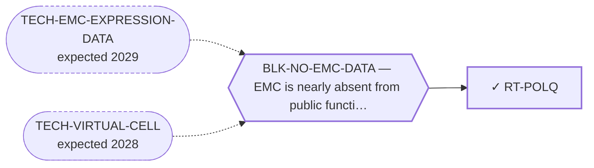

<!-- GENERATED FILE — DO NOT EDIT. Regenerate with:
     python3 systems/systems_check.py --write-views
     Source of truth: systems/graph/*.json -->

# RT-POLQ — POLθ inhibition (microhomology-mediated end joining)

**Family:** [ST-DEPENDENCY](L1-st-dependency.md) · **state:** ✓ parked · computed · confidence moderate · verified 2026-08-09

**Grade** (owned by [`research/modalities/census-route-expression-grading.json`](../../research/modalities/census-route-expression-grading.json)): ⛔ NOT SUPPORTED (2026-08-09). The class needs a COMBINATION — alt-EJ up with homologous recombination down — and neither half is present: POLQ is flat and low on its array, and the HR genes are flat to mildly higher rather than down.

## What has to land for this route to move

**Reading it.** A solid arrow is what holds this route down today. A dashed arrow is a capability that WOULD retire a blocker — dashed because it has not landed, and the date beside it is a forecast, not a schedule.

## Scientific rationale

The newest DNA-damage-response class and the one the existing class-inheritance argument was never extended to. If the FET-rearrangement replication-stress premise holds at all it is a premise about a repair state, and this class exploits a different arm of the same state — so it is testable with the instrument already built rather than with a new one.

## Supporting evidence

| ref | supports | strength |
|---|---|---|
| `ART-CENSUS-ROUTE-GRADING` | neither half of the alt-EJ-up / HR-down combination this class requires is present in EMC | `direct` |

## Remaining unknowns

- Whether the replication-stress premise the neighbouring DDR route rests on survives its own WEAK grade — this route inherits that uncertainty and does not resolve it.
- Whether a repair DEFECT, which is usually a mutation, would be visible in transcript at all; it would generally not be.

## Required validation

| what | instrument | feasible today | blocked by |
|---|---|---|---|
| The expression or committed-artifact lookup that selects this class | ⛔ none built | yes | — |
| A measurement in a fusion-positive EMC model | ⛔ none built | **no** | BLK-NO-WET-LAB |

## Blockers

| blocker | kind | what would retire it |
|---|---|---|
| **BLK-NO-EMC-DATA** | `insufficient_data` | `TECH-EMC-EXPRESSION-DATA`, `TECH-VIRTUAL-CELL` |

## Readiness — what this could become today

**`internal_note`**

The route was registered as an extension of a WEAK-graded argument and the extension does not hold.

**Missing:**
- nothing at the expression level — the class selects on a lesion this data cannot see, and on what it CAN see the answer is negative

## Where this route ends — the paper

**[PUB-BIOMARKER-DEP](L3-publications.md)** — *Biomarker-selected therapeutic classes in an ultra-rare sarcoma: what the available expression data excludes* (unwritten)

`contributing` · ◔ `outlined` · aimed at `preprint`

**This route contributes:** One of six biomarker-selected classes whose selecting feature is readable in expression data already public for this disease, and whose most useful output is exclusion.

**The paper would claim:** Six therapeutic classes are selected by a molecular state rather than by a growth rate, every selecting feature is readable in expression data already public for this disease, and the useful output is which classes the data rules out rather than which it nominates.

**It is not written because:** ⚠ ITS STATED BLOCKER IS RETIRED AND THE PAPER CHANGED SHAPE. Every lookup it was waiting on ran on 2026-08-09: of the five biomarker-selected classes it covers, FOUR are now graded against their own selecting feature (MOD-ARGININE-DEPRIVATION, MOD-MDM2-P53, MOD-EZH2, MOD-POLQ) and one is split between its two axes (MOD-MCL1-BCLXL). So this is now a mostly-NEGATIVE paper, which is what makes it worth writing — the field publishes almost no exclusions of this kind. What is left is drafting, not measurement. ⛔ Superseded, retained: "none of those lookups has been run — the paper is defined by results that do not exist yet." The results exist; they are negatives.

## Strategic timing — the wait equation

**Recommendation: `monitor`**

It would take a mutational read of the repair genes, which no EMC cohort supplies.

| horizon | effect |
|---|---|
| Cost trend | flat |

**Revisit when:**
- **TECH-EMC-EXPRESSION-DATA** — A fetchable public EMC RNA-seq or proteomics deposit beyond the single existing model, enabling a target-regulon readout and per-a *(expected 2029, basis `speculative`)*

## Claim ceiling — what this route may NOT be used to claim

*Inherited from [ST-DEPENDENCY](L1-st-dependency.md), which is where these are asserted — a family limitation binds every route inside it.*

- The dependency transfer prior came back negative on the available data — a measured premise, revivable only by EMC-specific data.
- One route rests on class inheritance: no NR4A3 fusion has been tested for the phenotype it assumes.
- There is one EMC model in public dependency data, with no CRISPR data, so this family's in-silico half is bounded by a sample size of one.

## Best next action

Report it beside the DDR assessment's existing weak grade, not apart from it.

*Cost:* $0

[← ST-DEPENDENCY](L1-st-dependency.md) · [← L0](L0-ecosystem.md)
