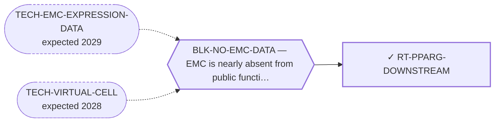

<!-- GENERATED FILE — DO NOT EDIT. Regenerate with:
     python3 systems/systems_check.py --write-views
     Source of truth: systems/graph/*.json -->

# RT-PPARG-DOWNSTREAM — PPARG downstream-effector (repurpose TZDs)

**Family:** [ST-REPURPOSING](L1-st-repurposing.md) · **state:** ✓ blocked · computed · confidence low · verified 2026-08-05

**Grade** (owned by [`research/manuscripts/target-route-options.md`](../../research/manuscripts/target-route-options.md#route-5--downstream-of-the-fusion-pparg-and-the-transactivated-nodes)): ★ keep; direction unresolved

## What has to land for this route to move

**Reading it.** A solid arrow is what holds this route down today. A dashed arrow is a capability that WOULD retire a blocker — dashed because it has not landed, and the date beside it is a forecast, not a schedule.

✓ Already cleared by this route: `BLK-PARALOGUE-DDG`, `BLK-R4-BINDS`, `BLK-TERNARY-GEOMETRY`.

## Scientific rationale

If the fusion drives its phenotype partly through PPARγ signalling, then an approved agent acting on that axis reaches the driver's output without touching the driver. Repurposing a well-characterised drug class is far cheaper than any new modality.

## Remaining unknowns

- The direction is unresolved rather than refuted: in EMC the fusion appears to turn PPARγ on, so an agonist may be redundant. Nobody has read the direction in EMC tissue.

## Required validation

| what | instrument | feasible today | blocked by |
|---|---|---|---|
| An EMC expression readout of the PPARγ axis | ⛔ none built | **no** | BLK-NO-EMC-DATA |

## Blockers

| blocker | kind | what would retire it |
|---|---|---|
| **BLK-NO-EMC-DATA** | `insufficient_data` | `TECH-EMC-EXPRESSION-DATA`, `TECH-VIRTUAL-CELL` |

## Blockers this route RETIRES

- **BLK-PARALOGUE-DDG** — The paralogue ΔΔG margin — selectivity that reduces to exp(−ΔΔG/RT)
- **BLK-TERNARY-GEOMETRY** — Ternary geometry — assembly, E3, exit vector, ubiquitin transfer
- **BLK-R4-BINDS** — R4 — nothing is known to bind the cryptic pocket at all

## Readiness — what this could become today

**`internal_note`**

Its central premise is directionally unresolved. Publishing a repurposing hypothesis whose sign is unknown would be exactly the over-claim the language rules exist to prevent.

**Missing:**
- a directional read of the PPARγ axis in EMC

## Where this route ends — the paper

**[PUB-REPURPOSING](L3-publications.md)** — [Mechanism-based drug-repurposing hypotheses for extraskeletal myxoid chondrosarcoma](../../research/manuscripts/repurposing-hypotheses.md)

`contributing` · ◐ `drafted` · aimed at `preprint`

**This route contributes:** The downstream-effector axis, carried with its direction flagged unresolved — scoped as unresolved and NOT refuted, which the paper must not conflate.

**The paper would claim:** Existing agents not yet reported in EMC can be mapped to EMC's molecular and microenvironmental axes by three independent methods, each candidate graded by an explicit evidence tier — a hypothesis-generating menu that asserts no efficacy for any agent it names.

## Strategic timing — the wait equation

**Recommendation: `wait`**

One cheap measurement settles it, and no amount of reasoning substitutes for the sign of an effect. Working further on a hypothesis whose direction is unknown is effort that a single dataset would render moot.

| horizon | effect |
|---|---|
| Six months | None unless data lands. |
| Two years | Settled either way by an EMC dataset. |
| Cost trend | flat |
| Automation outlook | Automatic re-grade on new data. |

**Revisit when:**
- **TECH-EMC-EXPRESSION-DATA** — A fetchable public EMC RNA-seq or proteomics deposit beyond the single existing model, enabling a target-regulon readout and per-a *(expected 2029, basis `speculative`)*

## Claim ceiling — what this route may NOT be used to claim

*Inherited from [ST-REPURPOSING](L1-st-repurposing.md), which is where these are asserted — a family limitation binds every route inside it.*

- EMC is nearly absent from public functional-genomics data, so mechanism fit is argued from class membership rather than measured in this disease.
- Several routes here rest on a direction of effect that has never been read in EMC tissue; an expression readout would settle them cheaply and does not exist.
- A repurposing hypothesis is a hypothesis. Nothing here asserts efficacy in EMC.

## Closure

`premise_false` — ⚠ Scoped: the DIRECTION is unresolved, not refuted — in EMC the fusion turns PPARG on, so an agonist may be redundant. An EMC expression read settles it either way.

## Best next action

Keep with the direction flagged as unresolved — the premise is scoped as unresolved, NOT refuted, and those must not be conflated.

*Cost:* $0

## What this route rests on — drill down

*L4 instruments and L5 objects, evidence and artifacts. Every row here is asserted by this route; the [evidence base](L5-evidence-base.md) shows the same edges from the other end.*

**L5 objects:** [OBJ-FUS-T1](L5-evidence-base.md#objects--the-biological-and-molecular-entities-the-program-reasons-about)

**L5 evidence:** [EV-FILION-2009](L5-evidence-base.md#evidence--the-literature-this-program-cites)

[← ST-REPURPOSING](L1-st-repurposing.md) · [← L0](L0-ecosystem.md)
