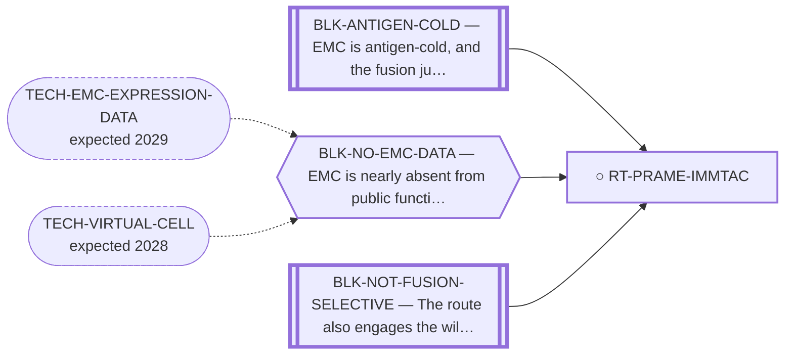

<!-- GENERATED FILE — DO NOT EDIT. Regenerate with:
     python3 systems/systems_check.py --write-views
     Source of truth: systems/graph/*.json -->

# RT-PRAME-IMMTAC — PRAME-directed brenetafusp (ImmTAC) / PRAME CAR-TCR

**Family:** [ST-IMMUNO](L1-st-immuno.md) · **state:** ○ parked · computed · confidence low · verified 2026-08-28

**Grade** (owned by [`research/IDEAS.md`](../../research/IDEAS.md)): DOWNGRADED 2026-08-28 — the owed EMC-tissue expression confirm had already been taken and PRAME reads at the floor of every readable cohort, flat against comparator sarcomas on both array platforms. The DepMap sarcoma-class ordering that raised this row survives as a surrogate; what it predicted for EMC tissue did not hold.

## What has to land for this route to move

**Reading it.** A solid arrow is what holds this route down today. A dashed arrow is a capability that WOULD retire a blocker — dashed because it has not landed, and the date beside it is a forecast, not a schedule.

⛔ **2 of these are permanent** (`BLK-ANTIGEN-COLD`, `BLK-NOT-FUSION-SELECTIVE`) — a fact about the biology, drawn double-walled, with no way out by definition. No technology arrives to fix it.

✓ Already cleared by this route: `BLK-PARALOGUE-DDG`, `BLK-TERNARY-GEOMETRY`.

## Scientific rationale

This uses an antigen with an existing clinical-stage agent, so the reagent problem is not ours to solve. ⚠ Whether EMC expresses AND PRESENTS the antigen is unanswered, and expression alone would not establish applicability — brenetafusp reads a specific peptide-HLA (SLLQHLIGL/HLA-A*02:01), and the agent is INVESTIGATIONAL, not approved. No efficacy, safety or eligibility claim is made for EMC.

## Supporting evidence

| ref | supports | strength |
|---|---|---|
| `ART-CTA-EXPRESSION` | surrogate expression came back favourable, unlike every other cancer-testis antigen examined | `surrogate` |
| `ART-EMC-EXPRESSION-PANELS` | The owed EMC-tissue expression read, and it points against this route rather than for it: EMC tumour tissue on two archival array platforms and one sequencing cohort: GPL6244 (GSE24369, 6 EMC vs 29 comparator sarcomas) delta = -0.004 (t = -0.05) at the 30th array percentile; GPL3290 (GSE4303, 10 EMC vs 5 comparator) delta = +0.868 (t = +1.43) at the 11th percentile of log-ratios; sequencing EMC median 0.102 against an other-sarcoma median 0.194 on a single peak. Flat on both arrays and at the floor of every readable cohort. | `direct` |

## Remaining unknowns

- Whether PRAME protein is present on EMC tumour cells. The transcript question is answered and came back flat (ART-EMC-EXPRESSION-PANELS); a flat or single-platform transcript row does not demonstrate that an antigen is absent, and no EMC PRAME immunohistochemistry series exists.
- Whether the SLLQHLIGL peptide is presented at all in EMC — unmeasured, and separate from expression.
- HLA restriction limits which patients are eligible.

## Required validation

| what | instrument | feasible today | blocked by |
|---|---|---|---|
| Expression confirmation on EMC tissue — ANSWERED at transcript level, see supporting_evidence ART-EMC-EXPRESSION-PANELS | ⛔ none built | yes | — |
| A protein-level read (immunohistochemistry on an EMC series), because a flat transcript row does not demonstrate that an antigen is absent and brenetafusp reads a peptide-HLA rather than a transcript | ⛔ none built | **no** | BLK-NO-WET-LAB |
| Measured presentation of SLLQHLIGL on HLA-A*02:01 in EMC tissue, which no expression read of any kind can establish | ⛔ none built | **no** | BLK-NO-WET-LAB, BLK-ANTIGEN-COLD |

## Blockers

| blocker | kind | what would retire it |
|---|---|---|
| **BLK-ANTIGEN-COLD** | `fundamental_biological_limit` | *permanent* |
| **BLK-NO-EMC-DATA** | `insufficient_data` | `TECH-EMC-EXPRESSION-DATA`, `TECH-VIRTUAL-CELL` |
| **BLK-NOT-FUSION-SELECTIVE** | `fundamental_biological_limit` | *permanent* |

## Blockers this route RETIRES

- **BLK-PARALOGUE-DDG** — The paralogue ΔΔG margin — selectivity that reduces to exp(−ΔΔG/RT)
- **BLK-TERNARY-GEOMETRY** — Ternary geometry — assembly, E3, exit vector, ubiquitin transfer

## Not to be confused with

| route | the axis it turns on | blockers the distinction turns on | why |
|---|---|---|---|
| [RT-TCR-IMMTAC](L2-rt-tcr-immtac.md) | which peptide the TCR sees | `BLK-NOT-FUSION-SELECTIVE` | a cancer-testis antigen, not the junction; its access route is an existing basket trial rather than a bespoke product, and it sacrifices fusion-exclusivity |
| [RT-TCRT-CTA](L2-rt-tcrt-cta.md) | which CTA | `BLK-ANTIGEN-COLD` | NY-ESO-1/MAGE-A4 TCR-T is DOWNGRADED on measured EMC CTA-low data; PRAME is the one CTA whose surrogate expression read came back favourable |

## Readiness — what this could become today

**`experimental_proposal`**

The transcript-level confirm this route owed has been taken and is flat at the floor of every readable EMC cohort, so the surrogate read that raised the row is not corroborated in the disease. What would revive it is a protein or presentation measurement, and both are bench acts we cannot run.

**Missing:**
- a protein-level PRAME read on an EMC series
- any measurement of peptide-HLA presentation in EMC

**Experiment required:**
- immunohistochemistry or expression readout on EMC tissue

## Where this route ends — the paper

**[PUB-SURFACE-TARGETS](L3-publications.md)** — [Fixed-panel tissue RNA prioritization in extraskeletal myxoid chondrosarcoma](../../research/manuscripts/surface-targets/emc-tissue-rna-prioritization.md)

`contributing` · ◐ `drafted` · aimed at `preprint`

**This route contributes:** The one antigen on the list whose therapeutic already exists clinically, which turns its row from a discovery into a check.

**The paper would claim:** A fixed panel of 11 therapeutic-address genes, with CHRNA6 as a separate established RNA-marker control, can be assessed using within-cohort tissue RNA ranks and prespecified sarcoma comparators. In the overlap-reduced Hofvander cohort of nine primary EMC specimens, CSPG4 alone meets the frozen tissue-validation allocation rule; its LGFMS contrast agrees with the original GSE24369 array contrast, but year-deletion sensitivity and DFSP context limit generalization. This supports a qualified rationale for EMC tissue protein and compartment validation, not validated surface expression, normal sparing, treatment selection or efficacy. All other fixed-panel results and discordant protein/normal-context evidence are retained.

## Strategic timing — the wait equation

**Recommendation: `monitor`**

The small confirm that made asking worthwhile has been done at no cost and returned flat, so a collaborator ask on transcript grounds no longer has a premise. The remaining question is protein and presentation, which is a bench act with no taker.

| horizon | effect |
|---|---|
| Six months | None on our side. |
| Two years | An EMC PRAME immunohistochemistry series, or EMC immunopeptidomics, would settle it. ⚠ SUPERSEDED, RETAINED: 'An EMC expression dataset would settle it without anyone running anything' — an EMC expression dataset arrived and did not settle it in this route's favour. |
| Cost trend | flat |
| Automation outlook | The confirm is a bench readout, not computation. |

**Revisit when:**
- **TECH-EMC-EXPRESSION-DATA** — A fetchable public EMC RNA-seq or proteomics deposit beyond the single existing model, enabling a target-regulon readout and per-a *(expected 2029, basis `speculative`)*

## Claim ceiling — what this route may NOT be used to claim

*Inherited from [ST-IMMUNO](L1-st-immuno.md), which is where these are asserted — a family limitation binds every route inside it.*

- EMC is antigen-cold and the fusion junction is a weak peptide-HLA — a property of this tumour and this junction, not of any modality here.
- Surface-antigen selectivity was measured on cell-line surrogates rather than on EMC tissue, so the negatives are as provisional as the positives would have been.
- One route's predicted binders span junction seams that a corrected exon index says do not exist; that result is void and the question is open.

## Best next action

Include in the collaborator ask: an expression confirm on EMC tissue is small, and the therapeutic already exists.

*Cost:* $0

## What this route rests on — drill down

*L4 instruments and L5 objects, evidence and artifacts. Every row here is asserted by this route; the [evidence base](L5-evidence-base.md) shows the same edges from the other end.*

**L5 artifacts:** [ART-EMC-EXPRESSION-PANELS](L5-evidence-base.md#artifacts--the-files-a-claim-can-be-checked-against)

[← ST-IMMUNO](L1-st-immuno.md) · [← L0](L0-ecosystem.md)
