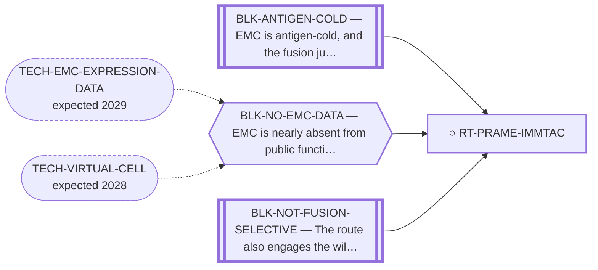

<!-- GENERATED FILE — DO NOT EDIT. Regenerate with:
     python3 systems/systems_check.py --write-views
     Source of truth: systems/graph/*.json -->

# RT-PRAME-IMMTAC — PRAME-directed brenetafusp (ImmTAC) / PRAME CAR-TCR

**Family:** [ST-IMMUNO](L1-st-immuno.md) · **state:** ○ blocked · computed · confidence moderate · verified 2026-08-05

**Grade** (owned by [`research/IDEAS.md`](../../research/IDEAS.md)): NEW antigen-directed lead — best of the CTAs

## What has to land for this route to move

**Reading it.** A solid arrow is what holds this route down today. A dashed arrow is a capability that WOULD retire a blocker — dashed because it has not landed, and the date beside it is a forecast, not a schedule.

⛔ **2 of these are permanent** (`BLK-ANTIGEN-COLD`, `BLK-NOT-FUSION-SELECTIVE`) — a fact about the biology, drawn double-walled, with no way out by definition. No technology arrives to fix it.

✓ Already cleared by this route: `BLK-PARALOGUE-DDG`, `BLK-TERNARY-GEOMETRY`.

## Scientific rationale

This uses an antigen with an existing clinical-stage agent, so the reagent problem is not ours to solve. ⚠ Whether EMC expresses AND PRESENTS the antigen is unanswered, and expression alone would not establish applicability — brenetafusp reads a specific peptide-HLA (SLLQHLIGL/HLA-A*02:01), and the agent is INVESTIGATIONAL, not approved. No efficacy, safety or eligibility claim is made for EMC.

## Supporting evidence

| ref | supports | strength |
|---|---|---|
| `ART-CTA-EXPRESSION` | surrogate expression came back favourable, unlike every other cancer-testis antigen examined | `surrogate` |

## Remaining unknowns

- Whether the surrogate expression holds on real EMC tissue — the measurement was on cell-line surrogates.
- HLA restriction limits which patients are eligible.

## Required validation

| what | instrument | feasible today | blocked by |
|---|---|---|---|
| Expression confirmation on EMC tissue | ⛔ none built | **no** | BLK-NO-EMC-DATA |

## Blockers

| blocker | kind | what would retire it |
|---|---|---|
| **BLK-ANTIGEN-COLD** | `fundamental_biological_limit` | *permanent* |
| **BLK-NO-EMC-DATA** | `insufficient_data` | `TECH-EMC-EXPRESSION-DATA`, `TECH-VIRTUAL-CELL` |
| **BLK-NOT-FUSION-SELECTIVE** | `fundamental_biological_limit` | *permanent* |

## Blockers this route RETIRES

- **BLK-PARALOGUE-DDG** — The paralogue ΔΔG margin — selectivity that reduces to exp(−ΔΔG/RT)
- **BLK-TERNARY-GEOMETRY** — Ternary geometry — assembly, E3, exit vector, ubiquitin transfer

## Not to be confused with

| route | the axis it turns on | blockers the distinction turns on | why |
|---|---|---|---|
| [RT-TCR-IMMTAC](L2-rt-tcr-immtac.md) | which peptide the TCR sees | `BLK-NOT-FUSION-SELECTIVE` | a cancer-testis antigen, not the junction; its access route is an existing basket trial rather than a bespoke product, and it sacrifices fusion-exclusivity |
| [RT-TCRT-CTA](L2-rt-tcrt-cta.md) | which CTA | `BLK-ANTIGEN-COLD` | NY-ESO-1/MAGE-A4 TCR-T is DOWNGRADED on measured EMC CTA-low data; PRAME is the one CTA whose surrogate expression read came back favourable |

## Readiness — what this could become today

**`experimental_proposal`**

The reagent exists clinically and an expression read on EMC tissue is owed; presentation on HLA-A*02:01 is a separate and unaddressed question. That makes it a proposal rather than a paper.

**Missing:**
- expression confirmation on EMC tissue

**Experiment required:**
- immunohistochemistry or expression readout on EMC tissue

## Where this route ends — the paper

**[PUB-SURFACE-TARGETS](L3-publications.md)** — [Surface-antigen prioritisation in extraskeletal myxoid chondrosarcoma: a lineage-surrogate ranking tested against three tumour-tissue cohorts](../../research/manuscripts/emc-surface-target-landscape.md)

`contributing` · ◐ `drafted` · aimed at `preprint`

**This route contributes:** The one antigen on the list whose therapeutic already exists clinically, which turns its row from a discovery into a check.

**The paper would claim:** Surface and stromal antigens can be prioritised for EMC in silico, and the honest limit of the prioritisation is set by what the comparator basis can see. ⚠ SUPERSEDED 2026-08-07, RETAINED: the prior claim was that every negative is "bounded by that surrogate basis rather than by an EMC tissue measurement", from "one cell line and a translocation-sarcoma comparison set". THREE EMC TISSUE COHORTS ARE NOW READ (GSE24369/GPL6244, GSE4303/GPL3290, GSE28866/3SEQ), the third carrying 27 normal-organ libraries — the first on-target/off-tumour exposure axis this repository has had. The surrogate-basis framing is therefore no longer the binding limit and the paper needs rewriting rather than re-verifying. ⛔ The rewrite is a DEMOTION, not a gain: ALCAM, its lead antigen, reads 0.578 in EMC against 0.631 in normal tissue and loses the exposure axis while keeping the lineage half; CSPG4 is the largest row in the new deposit and is discordant across cohorts (+0.885 GPL6244, -0.189 GPL3290).

## Strategic timing — the wait equation

**Recommendation: `pursue_now`**

The best-supported antigen-directed row on the board and the one where someone else has already solved the hard part. The confirm is small and the agent already exists, so the value of asking now is high.

| horizon | effect |
|---|---|
| Six months | None on our side. |
| Two years | An EMC expression dataset would settle it without anyone running anything. |
| Cost trend | flat |
| Automation outlook | The confirm is a bench readout, not computation. |

**Revisit when:**
- **TECH-EMC-EXPRESSION-DATA** — A fetchable public EMC RNA-seq or proteomics deposit beyond the single existing model, enabling a target-regulon readout and per-a *(expected 2029, basis `speculative`)*

## Claim ceiling — what this route may NOT be used to claim

*Inherited from [ST-IMMUNO](L1-st-immuno.md), which is where these are asserted — a family limitation binds every route inside it.*

- EMC is antigen-cold and the fusion junction is a weak peptide-HLA — a property of this tumour and this junction, not of any modality here.
- Surface-antigen selectivity was measured on cell-line surrogates rather than on EMC tissue, so the negatives are as provisional as the positives would have been.
- One route's predicted binders span junction seams that a corrected exon index says do not exist; that result is void and the question is open.

## Best next action

Include in the collaborator ask: an expression confirm on EMC tissue is small, and the therapeutic already exists.

*Cost:* $0

[← ST-IMMUNO](L1-st-immuno.md) · [← L0](L0-ecosystem.md)
