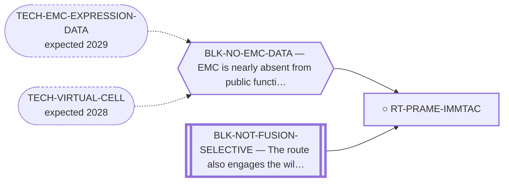

<!-- GENERATED FILE — DO NOT EDIT. Regenerate with:
     python3 systems/systems_check.py --write-views
     Source of truth: systems/graph/*.json -->

# RT-PRAME-IMMTAC — PRAME-directed brenetafusp (ImmTAC) / PRAME CAR-TCR

**Family:** [ST-IMMUNO](L1-st-immuno.md) · **state:** ○ blocked · computed · confidence moderate · verified 2026-08-05

**Grade** (owned by [`research/IDEAS.md`](../../research/IDEAS.md)): NEW antigen-directed lead — best of the CTAs

## What has to land for this route to move

**Reading it.** A solid arrow is what holds this route down today. A dashed arrow is a capability that WOULD retire a blocker — dashed because it has not landed, and the date beside it is a forecast, not a schedule.

⛔ **1 of these is permanent** (`BLK-NOT-FUSION-SELECTIVE`) — a fact about the biology, drawn double-walled, with no way out by definition. No technology arrives to fix it.

✓ Already cleared by this route: `BLK-PARALOGUE-DDG`, `BLK-TERNARY-GEOMETRY`.

## Scientific rationale

Unlike the junction neoantigen, this uses an antigen with an existing clinical-stage agent — so the reagent problem is already solved by someone else, and the only question is whether EMC expresses the antigen. That makes it the cheapest antigen-directed route to test.

## Supporting evidence

| ref | supports | strength |
|---|---|---|
| `ART-SURFACE-EXPRESSION` | surrogate expression came back favourable, unlike every other cancer-testis antigen examined | `surrogate` |

## Remaining unknowns

- Whether the surrogate expression holds on real EMC tissue — the measurement was on cell-line surrogates.
- HLA restriction limits which patients are eligible.

## Required validation

| what | instrument | feasible today | blocked by |
|---|---|---|---|
| Expression confirmation on EMC tissue | ⛔ none built | **no** | BLK-NO-EMC-DATA |

## Blockers

| blocker | kind | what would retire it |
|---|---|---|
| **BLK-NO-EMC-DATA** | `insufficient_data` | `TECH-EMC-EXPRESSION-DATA`, `TECH-VIRTUAL-CELL` |
| **BLK-NOT-FUSION-SELECTIVE** | `fundamental_biological_limit` | *permanent* |

## Blockers this route RETIRES

- **BLK-PARALOGUE-DDG** — The paralogue ΔΔG margin — selectivity that reduces to exp(−ΔΔG/RT)
- **BLK-TERNARY-GEOMETRY** — Ternary geometry — assembly, E3, exit vector, ubiquitin transfer

## Readiness — what this could become today

**`experimental_proposal`**

The reagent exists clinically and the computational case is made, so what remains is a confirmation, not a discovery. That makes it a proposal rather than a paper.

**Missing:**
- expression confirmation on EMC tissue

**Experiment required:**
- immunohistochemistry or expression readout on EMC tissue

## Strategic timing — the wait equation

**Recommendation: `pursue_now`**

The best-supported antigen-directed row on the board and the one where someone else has already solved the hard part. The confirm is small and the agent already exists, so the value of asking now is high.

| horizon | effect |
|---|---|
| Six months | None on our side. |
| Two years | An EMC expression dataset would settle it without anyone running anything. |
| Cost trend | flat |
| Automation outlook | The confirm is a bench readout, not computation. |

**Revisit when:**
- **TECH-EMC-EXPRESSION-DATA** — A fetchable public EMC RNA-seq or proteomics deposit beyond the single existing model, enabling a target-regulon readout and per-a *(expected 2029, basis `speculative`)*

## Best next action

Include in the collaborator ask: an expression confirm on EMC tissue is small, and the therapeutic already exists.

*Cost:* $0

[← ST-IMMUNO](L1-st-immuno.md) · [← L0](L0-ecosystem.md)
