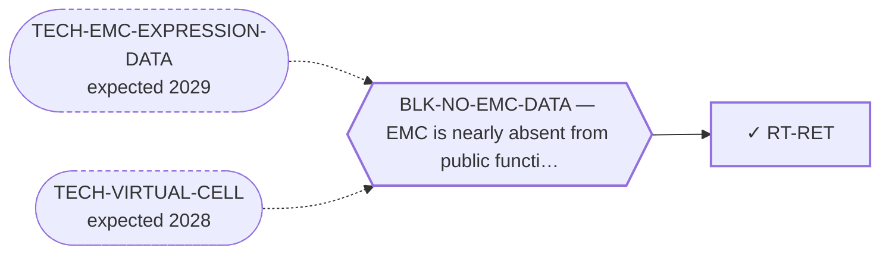

<!-- GENERATED FILE — DO NOT EDIT. Regenerate with:
     python3 systems/systems_check.py --write-views
     Source of truth: systems/graph/*.json -->

# RT-RET — RET-selective inhibitors

**Family:** [ST-REPURPOSING](L1-st-repurposing.md) · **state:** ✓ blocked · computed · confidence low · verified 2026-08-09

**Grade** (owned by [`research/modalities/census-route-expression-grading.json`](../../research/modalities/census-route-expression-grading.json)): ◐ SPLIT (2026-08-09). RET itself is higher in EMC on both platforms, so the receptor half of the lane holds. ⛔ But the GFRα co-receptors are LOWER on both and strongly so, and the GDNF-family ligands are LOWER on both — so the module that switches RET on is depleted relative to comparator sarcomas.

## What has to land for this route to move

**Reading it.** A solid arrow is what holds this route down today. A dashed arrow is a capability that WOULD retire a blocker — dashed because it has not landed, and the date beside it is a forecast, not a schedule.

## Scientific rationale

The highest-ranked lane of the 2026-08-07 sweep and still not a route. It is the only kinase reported as both expressed and activated in this disease, the observation comes from independent groups, selective inhibitors are approved in other indications, and the finding has stood without follow-up for over a decade.

## Supporting evidence

| ref | supports | strength |
|---|---|---|
| `ART-CENSUS-ROUTE-GRADING` | RET transcript is higher in EMC than in comparator sarcomas on both readable platforms | `direct` |
| `ART-CENSUS-ROUTE-GRADING` | the GFRα co-receptor and GDNF-family ligand modules are LOWER in EMC on both platforms, which weakens a ligand-dependent activation route for the receptor | `direct` |

## Remaining unknowns

- Whether the historical 'expressed and activated' report survives, since this reading corroborates expression and cannot corroborate activation.
- Whether RET could be engaged without the canonical ligand and co-receptor — no RET rearrangement is reported in this disease either way.
- Whether a co-receptor supply from stroma or nerve would be visible in bulk tumour transcript at all, which bounds how much this reading can be asked to carry.

## Required validation

| what | instrument | feasible today | blocked by |
|---|---|---|---|
| The $0 corroboration named in this route's next action | ⛔ none built | yes | — |
| A response measurement in a fusion-positive EMC model | ⛔ none built | **no** | BLK-NO-WET-LAB |

## Blockers

| blocker | kind | what would retire it |
|---|---|---|
| **BLK-NO-EMC-DATA** | `insufficient_data` | `TECH-EMC-EXPRESSION-DATA`, `TECH-VIRTUAL-CELL` |

## Readiness — what this could become today

**`internal_note`**

The lane's headline claim is activation, and this reading reaches expression and the activation MACHINERY but not activation.

**Missing:**
- a full read of the original activation report, to establish what was measured and in how many tumours

## Where this route ends — the paper

**[PUB-KINASE-LEADS](L3-publications.md)** — *Four kinase observations in extraskeletal myxoid chondrosarcoma that nobody followed up* (unwritten)

`contributing` · ○ `unwritten` · aimed at `preprint`

**This route contributes:** One of four kinase observations specific to this disease that exist in the published or curated record and that nobody has followed up.

**The paper would claim:** Four kinase-directed observations specific to this disease exist in the published and curated record — one reported as expressed and activated, one positive across a small series with an internal control, one an interaction curated on the driver protein itself, one an ex-vivo screen hit — and none has been followed up by anyone, in a disease with no targeted agent.

**It is not written because:** Its purpose is to consolidate four leads that are each individually thin, and the consolidation has not been done — three of the four were surfaced two days before this endpoint was registered.

## Strategic timing — the wait equation

**Recommendation: `pursue_now`**

The remaining $0 step is a literature read, and it is now sharper than when the route was registered: the question is specifically whether the original report measured activation directly or inferred it.

| horizon | effect |
|---|---|
| Cost trend | flat |

## Claim ceiling — what this route may NOT be used to claim

*Inherited from [ST-REPURPOSING](L1-st-repurposing.md), which is where these are asserted — a family limitation binds every route inside it.*

- EMC is nearly absent from public functional-genomics data, so mechanism fit is argued from class membership rather than measured in this disease.
- Several routes here rest on a direction of effect that has never been read in EMC tissue; an expression readout would settle them cheaply and does not exist.
- A repurposing hypothesis is a hypothesis. Nothing here asserts efficacy in EMC.

## Best next action

Read the original RET activation report in full and establish whether activation was measured or inferred, and in how many tumours.

*Cost:* $0

[← ST-REPURPOSING](L1-st-repurposing.md) · [← L0](L0-ecosystem.md)
